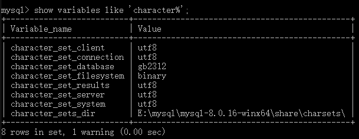

---
<!-- truncate -->
<!-- truncate -->
<!-- truncate -->
slug: product-DML
title: DML数据操纵语言
authors: [jiguanchen]
tags: [shujuku, mysql]
---

*mysql表数据的插入、删除、修改以及中文编码问题*<!--more-->

#### 1、mysql新增表数据

普通的**插入表数据**

```mysql
insert into 表名（字段名） values（字段对应值）;

insert into employee (empno,ename,job,mgr,hiredate,sal,deptnu) values ('1000','小明','经理','10001','2019-03-03','12345.23','10');
insert into 表名 values（所有字段对应值）;

# 一次性插入多个数据
insert into employee  values ('1001','小明','经理','10001','2019-03-03','12345.23','10');
```

**蠕虫复制**（将一张表的数据复制到另一张表中）

```mysql
insert into 表名1 select * from 表名2;

insert into 表名1（字段名1，字段名2） select 字段名1，字段名2 from 表名2;

insert into emp (empno,ename) select empno,ename from employee;
```

**建表复制**

```mysql
create table 表名1 as select 字段名1，字段名2 from 表名2;

create table emp as select empno ,ename from employee;
```

创建sql

```
某个公司的员工表
CREATE TABLE employee(
empno INT PRIMARY KEY comment '雇员编号',
ename VARCHAR(20) comment '雇员姓名',
job VARCHAR(20) comment '雇员职位',
mgr INT comment '雇员上级编号',
hiredate DATE comment '雇佣日期',
sal DECIMAL(7,2) comment '薪资',
deptnu INT comment '部门编号'
);
```

#### 2、mysql表数据的修改和删除

表数据的**修改/更新**：

```mysql
update 表名 set 字段名1=值1 where 字段名=值;

update 表名 set 字段名1=值1,字段名2=值2 where 字段名=值;
```

**删除**：

```mysql
delete from 表名 where 字段名=值;
 truncate table 表名;
 delete from 表名;
 drop table 表名;
 
面试时：面试官问在删改数据之前，你会怎么做？
答案：会对数据进行备份操作，以防万一，可以进行数据回退

面试时：面试官会问，delete与truncate与drop 这三种删除数据的共同点都是删除数据，他们的不同点是什么?
delele 会把删除的操作记录给记录起来，以便数据回退，不会释放空间，而且不会删除定义。
truncate不会记录删除操作，会把表占用的空间恢复到最初，不会删除定义
drop会删除整张表，释放表占用的空间。

删除速度：
drop > truncate > delete
```

#### 3、乱码问题

查看当前mysql使用的字符集：show variables like 'character%';

character_set_client：客户端请求数据的字符集
character_set_connection：客户端与服务器连接的字符集
character_set_database：数据库服务器中某个库使用的字符集设定，如果建库时没有指明，将默认使用配置
上的字符集
character_set_results：返回给客户端的字符集(从数据库读取到的数据是什么编码的)
character_set_server：为服务器安装时指定的默认字符集设定。
character_set_system：系统字符集(修改不了的，就是utf8)
character_sets_dir：mysql字符集文件的保存路径

临时：set names gbk;

永久：修改配置文件my.cnf里边的

```mysql
[client]
default-character-set=gbk
作用于外部的显示
[mysqld]
character_set_server=gbk
作用于内部，会作用于创建库表时默认字符集
```

修改库的字符集编码

```mysql
alter database xiaoxiao default character set gbk;
```

修改表的字符集编码

```mysql
alter table employee default character set utf8;
```

