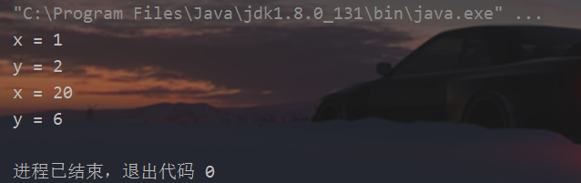
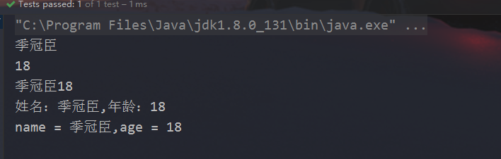
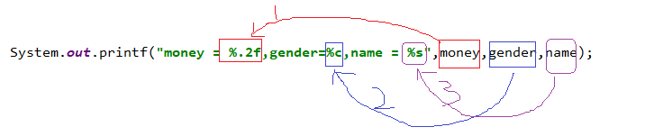
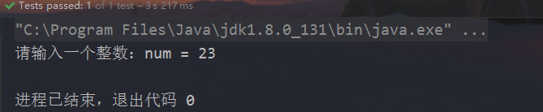
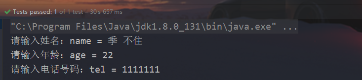
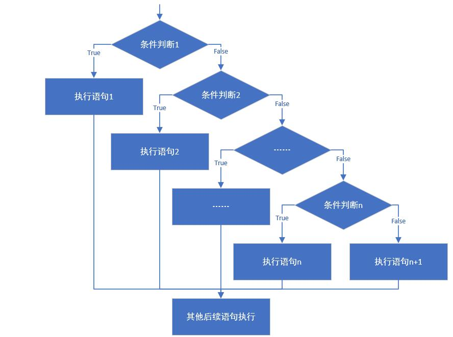
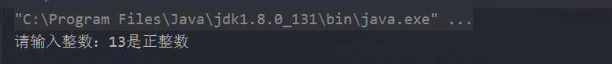

*程序设计需要有流程控制语句来完成用户的要求，根据用户的输入决定程序要进入什么流程，即“做什么”以及“怎么做”等。*<!--more-->从结构化程序设计角度出发，程序有 3 种结构：顺序结构、选择结构和循环结构。

## 一、表达式和语句

### 1、表达式：

1、变量或常量 + 运算符 构成的计算表达式
		2、new 表达式，结果是一个数组或类的对象。
		3、方法调用表达式，结果是方法返回值或void（无返回值）。

### 2、语句：

程序的功能是由语句来完成的，语句分为单语句和复合语句。

单语句：
		1、空语句，什么功能都没有。它就是单独的一个分号；(需避免)
		2、表达式语句，就是表达式后面加分号;

**不是所有表达式加分号都能称为一个独立的语句的，只有以下三种表达式加上分号才能构成一个独立的语句：**

- 计算表达式中的赋值表达式、自增自减表达式

- new表达式

- 方法调用表达式

  ```java
  //空语句
  ;
  
  //表达式语句
  i++; //自增表达式 + ;
  System.out.println("hello");  //方法调用表达式 + ;
  ```

  复合语句分为：

  （1）分支语句：if...else，switch...case

  （2）循环语句：for,while,do...while

  （3）跳转语句：break,continue,return,throw

  （4）try语句：try...catch...finally

  （5）同步语句：synchronized

------

## 二、顺序结构

顺序结构就是程序从上到下逐行地执行。表达式语句都是顺序执行的。并且上一行对某个变量的修改对下一行会产生影响。

```java
    public void test1() {
        int x = 1;
        int y = 2;
        System.out.println("x = " + x);
        System.out.println("y = " + y);
        //对x、y的值进行修改
        x++;
        y = 2 * x + y;
        x = x * 10;
        System.out.println("x = " + x);
        System.out.println("y = " + y);
    }
```



------

## 三、输入输出语句

### 3.1、输出语句

#### 1、两种常见的输出语句

**换行输出语句**：输出内容后进行换行，格式如下：

```java
System.out.println(输出内容);//输出内容之后，紧接着换行
```

**不换行输出语句**：输出内容后不换行，格式如下

System.out.print(输出内容);////输出内容之后不换行

```java
public void test2() {
        String name = "季冠臣";
        int age = 18;

        //对比如下两组代码：
        System.out.println(name);
        System.out.println(age);

        System.out.print(name);
        System.out.print(age);
        System.out.println(); //()里面为空，效果等同于换行，输出一个换行符
        //等价于 System.out.print("\n"); 或  System.out.print('\n');
        //System.out.print();//错误，()里面不能为空   核心类库PrintStream类中没有提供print()这样的方法

        //对比如下两组代码：
        System.out.print("姓名：" + name +",");//""中的内容会原样显示
        System.out.println("年龄：" + age);//""中的内容会原样显示

        System.out.print("name = " + name + ",");
        System.out.println("age = " + age);
    }
```



>注意事项：
>
>​	换行输出语句，括号内可以什么都不写，只做换行处理
>
>​	不换行输出语句，括号内什么都不写的话，编译报错
>
>​	如果()中有多项内容，那么必须使用 + 连接起来
>
>​	如果某些内容想要原样输出，就用""引起来，而要输出变量中的内容，则不要把变量名用""引起来

#### 2、格式化输出（选讲）

- %d：十进制整数

- %f：浮点数

- %c：单个字符

- %b：boolean值

- %s：字符串

- ....

  ```java
  public void test3() {
          byte b = 127;
          int age = 18;
          long bigNum = 123456789L;
          float weight = 123.4567F;
          double money = 589756122.22552;
          char gender = '男';
          boolean marry = true;
          String name = "张三";
          System.out.printf("byte整数：%d，年龄：%d，" +
                  "大整数：%d，身高：%f，身高：%.1f，钱：%f，" +
                  "钱：%.2f，性别：%c，婚否：%b，姓名：%s",
                  b,age,bigNum,weight,weight,money,money,
                  gender,marry,name);
      }
  ```

  

  

#### 3、关于几个转义字符的输出效果说明

```java
public void test4() {
        System.out.println("hello\tjava");
        System.out.println("hello\rjava");
        System.out.println("hello\njava");
    }
```

```java
public void test5() {
        System.out.println("hello\tworld\tjava.");
        System.out.println("chailinyan\tis\tbeautiful.");
        System.out.println("姓名\t基本工资\t年龄");
        System.out.println("张三\t10000.0\t23");
    }
```

### 3.2、输入语句

键盘输入代码的四个步骤：

1、申请资源，创建Scanner类型的对象
	   2、提示输入xx
	   3、接收输入内容
       4、全部输入完成之后，释放资源，归还资源

#### 1、各种类型的数据输入

示例代码：

```java
//如果在.java源文件上面没有这句import语句，
//那么在代码中每次使用Scanner就要用java.util.Scanner的全名称，比较麻烦

/*
键盘输入代码的四个步骤：
1、申请资源，创建Scanner类型的对象
2、提示输入xx
3、接收输入内容
4、全部输入完成之后，释放资源，归还资源

如果你在键盘输入过程中，遇到java.util.InputMismatchException异常，
说明你输入的数据，其类型与接收数据的变量的类型不匹配。
 */
     public void test6() {
        //1、准备Scanner类型的对象
        //Scanner是一个引用数据类型，它的全名称是java.util.Scanner
        //input就是一个引用数据类型的变量了，赋给它的值是一个对象（对象的概念我们后面学习，暂时先这么叫）
        //new Scanner(System.in)是一个new表达式，该表达式的结果是一个对象
        //引用数据类型  变量 = 对象;
        //这个等式的意思可以理解为用一个引用数据类型的变量代表一个对象，所以这个变量的名称又称为对象名
        //我们也把input变量叫做input对象
        Scanner input = new Scanner(System.in);//System.in默认代表键盘输入
        //这里变量名是input，下面就用input

        //2、提示输入xx
        System.out.print("请输入一个整数：");

        //3、接收输入内容
        int num = input.nextInt();
        System.out.println("num = " + num);

        //列出其他常用数据类型的输入
        /*
        long bigNum = input.nextLong();
        double d = input.nextDouble();
        boolean b = input.nextBoolean();
        String s = input.next();
        char c = input.next().charAt(0);//先按照字符串接收，然后再取字符串的第一个字符（下标为0）
        */

        //释放资源
        input.close();
    }
```



#### 2、next()与nextLine()

```java
/*
next()方法：
	遇到空格等空白符，就认为输入结束
nextLine()方法：
	遇到回车换行，才认为输入结束
 */
    public void test7() {
        //申请资源
        Scanner input = new Scanner(System.in);

        System.out.print("请输入姓名：");
        //String name = input.next();//张 三  只能接收张，后面的空格和三无法接收，被下面的输入接收
        String name = input.nextLine();
        System.out.println("name = " + name);

        System.out.print("请输入年龄：");
        int age = input.nextInt();	//23回车换行  这里只接收23，回车换行被下面的输入接收
        input.nextLine();//读取23后面的回车换行，但是这个不需要接收，只有下面一个输入是nextLine()情况下才需要这样，如果下面的输入是next()或者是nextInt(),nextDouble()等就不需要这么干
        System.out.println("age = " + age);

        System.out.print("请输入电话号码：");
        String tel = input.nextLine();
        System.out.println("tel = " + tel);

        //释放资源
        input.close();
    }
```



## 四、分支语句

### 4.1、单分支条件判断

**if语句第一种格式：** if

```java
if(条件表达式)｛
  	语句体;
｝
```

**执行流程**

- 首先判断条件表达式看其结果是true还是false
- 如果是true就执行语句体
- 如果是false就不执行语句体


案例：从键盘第一个小的整数赋值给small，第二个大的整数赋值给big，如果输入的第一个整数大于第二个整数，就交换。输出显示small和big变量的值。

```java
    public void test8() {
        Scanner input = new Scanner(System.in);

        System.out.print("请输入第一个整数：");
        int small = input.nextInt();

        System.out.print("请输入第二个整数：");
        int big = input.nextInt();

        if (small > big) {
            int temp = small;
            small = big;
            big = temp;
        }
        System.out.println("small=" + small + ",big=" + big);

        input.close();
    }
```

### 4.2、双分支条件判断

**if语句第二种格式：** if...else

```java
if(关系表达式) { 
  	语句体1;
}else {
  	语句体2;
}
```

执行流程

- 首先判断关系表达式看其结果是true还是false

- 如果是true就执行语句体1

- 如果是false就执行语句体2


 案例：从键盘输入一个整数，判定是偶数还是奇数 

```java
    public void test9() {
        // 判断给定的数据是奇数还是偶数
        Scanner input = new Scanner(System.in);

        System.out.print("请输入整数：");
        int a = input.nextInt();

        if(a % 2 == 0) {
            System.out.println(a + "是偶数");
        } else{
            System.out.println(a + "是奇数");
        }
        input.close();
    }
```


### 4.3、多分支条件判断

```java
if (判断条件1) {
  	执行语句1;
} else if (判断条件2) {
  	执行语句2;
}
...
}else if (判断条件n) {
 	执行语句n;
} else {
  	执行语句n+1;
}
```

**执行流程**

- 首先判断关系表达式1看其结果是true还是false
- 如果是true就执行语句体1，然后结束当前多分支
- 如果是false就继续判断关系表达式2看其结果是true还是false
- 如果是true就执行语句体2，然后结束当前多分支
- 如果是false就继续判断关系表达式…看其结果是true还是false
- …
- 如果没有任何关系表达式为true，就执行语句体n+1，然后结束当前多分支。



案例：通过指定考试成绩，判断学生等级，成绩范围[0,100]

- 90-100      优秀
- 80-89        好
- 70-79        良
- 60-69        及格
- 60以下    不及格

```java
    public void test10() {
        Scanner input = new Scanner(System.in);
        System.out.print("请输入成绩[0,100]：");
        int score = input.nextInt();

        if(score<0 || score>100){
            System.out.println("你的成绩是错误的");
        }else if(score>=90 && score<=100){
            System.out.println("你的成绩属于优秀");
        }else if(score>=80 && score<90){
            System.out.println("你的成绩属于好");
        }else if(score>=70 && score<80){
            System.out.println("你的成绩属于良");
        }else if(score>=60 && score<70){
            System.out.println("你的成绩属于及格");
        }else {
            System.out.println("你的成绩属于不及格");
        }
        input.close();
    }
```


### 4.4、if...else嵌套

在if的语句块中，或者是在else语句块中，
又包含了另外一个条件判断（可以是单分支、双分支、多分支）

执行的特点：

- 如果是嵌套在if语句块中的
  只有当外部的if条件满足，才会去判断内部的条件
- 如果是嵌套在else语句块中的
  只有当外部的if条件不满足，进入else后，才会去判断内部的条件

案例：从键盘输入一个年份值和月份值，输出该月的总天数

要求：年份为正数，月份1-12。

例如：输入2022年5月，总天数是31天。

​          输入2022年2月，总天数是28天。

​		 输入2020年2月，总天数是29天。

```java
   public void test11() {
        //从键盘输入一个年份和月份
        Scanner input = new Scanner(System.in);

        System.out.print("年份：");
        int year = input.nextInt();
//        input.nextLine();

        System.out.print("月份：");
        int month = input.nextInt();
//        input.nextLine();

        if(year>0){
            if(month>=1 && month<=12){
                //合法的情况
                int days;
                if(month==2){
                    if(year%4==0 && year%100!=0 || year%400==0){
                        days = 29;
                    }else{
                        days = 28;
                    }
                }else if(month==4 || month==6  || month==9 || month==11){
                    days = 30;
                }else{
                    days = 31;
                }
                System.out.println(year+"年" + month + "月有" + days +"天");
            }else{
                System.out.println("月份输入不合法");
            }
        }else{
            System.out.println("年份输入不合法");
        }

        input.close();
    }
```


### 4.5、switch...case多分支结构

语法格式：

```java
switch(表达式){
    case 常量值1:
        语句块1;
        【break;】
    case 常量值2:
        语句块2;
        【break;】   
    。。。
   【default:
        语句块n+1;
        【break;】
     】
}
```

执行过程：

（1）入口

①当switch(表达式)的值与case后面的某个常量值匹配，就从这个case进入；

②当switch(表达式)的值与case后面的所有常量值都不匹配，寻找default分支进入;不管default在哪里

（2）一旦从“入口”进入switch，就会顺序往下执行，直到遇到“出口”，即可能发生贯穿

（3）出口

①自然出口：遇到了switch的结束}

②中断出口：遇到了break等

> 注意：
>
> （1）switch(表达式)的值的类型，只能是：4种基本数据类型（byte,short,int,char），两种引用数据类型（JDK1.5之后枚举、JDK1.7之后String）
>
> （2）case后面必须是常量值，而且不能重复

#### 1、如何避免case穿透

案例：从键盘输入星期的整数值，输出星期的英文单词

```java
  public void test12() {
        //定义指定的星期
        Scanner input = new Scanner(System.in);
        System.out.print("请输入星期值：");
        int weekday = input.nextInt();

        //switch语句实现选择
        switch(weekday) {
            case 1:
                System.out.println("Monday");
                break;
            case 2:
                System.out.println("Tuesday");
                break;
            case 3:
                System.out.println("Wednesday");
                break;
            case 4:
                System.out.println("Thursday");
                break;
            case 5:
                System.out.println("Friday");
                break;
            case 6:
                System.out.println("Saturday");
                break;
            case 7:
                System.out.println("Sunday");
                break;
            default:
                System.out.println("你输入的星期值有误！");
                break;
        }

        input.close();
    }
```

#### 2、利用case的穿透性

在switch语句中，如果case的后面不写break，将出现穿透现象，也就是一旦匹配成功，不会在判断下一个case的值，直接向后运行，直到遇到break或者整个switch语句结束，switch语句执行终止。

练习：根据指定的月份输出对应季节

```java
/*
 * 需求：指定一个月份，输出该月份对应的季节。
 * 		一年有四季
 * 		3,4,5	春季
 * 		6,7,8	夏季
 * 		9,10,11	秋季
 * 		12,1,2	冬季
 */
 
    public void test13() {
        Scanner input = new Scanner(System.in);
        System.out.print("请输入月份：");
        int month = input.nextInt();

        switch(month) {
            case 1:
            case 2:
            case 12:
                System.out.println("冬季");
                break;
            case 3:
            case 4:
            case 5:
                System.out.println("春季");
                break;
            case 6:
            case 7:
            case 8:
                System.out.println("夏季");
                break;
            case 9:
            case 10:
            case 11:
                System.out.println("秋季");
                break;
            default:
                System.out.println("你输入的月份有误");
                break;
        }

        input.close();
    }
```

#### 3、Java12之后switch新特性（选讲）


> Switch 表达式也是作为预览语言功能的第一个语言改动被引入Java12 中，开始支持如下写法：

```java
		switch(month) {
			case 3,4,5 -> System.out.println("春季");
			case 6,7,8 -> System.out.println("夏季");
			case 9,10,11 -> System.out.println("秋季");
			case 12,1,2 -> System.out.println("冬季");
			default->System.out.println("月份输入有误！");
		};
```

#### 4、if语句与switch语句比较

- if语句的条件是一个布尔类型值，if条件表达式为true则进入分支，可以用于范围的判断，也可以用于等值的判断，使用范围更广。
- switch语句的条件是一个常量值（byte,short,int,char,枚举,String），只能判断某个变量或表达式的结果是否等于某个常量值，使用场景较狭窄。
- 当条件是判断某个变量或表达式是否等于某个固定的常量值时，使用if和switch都可以，习惯上使用switch更多。当条件是区间范围的判断时，只能使用if语句。
- 另外，使用switch可以利用穿透性，同时执行多个分支，而if...else没有穿透性。

##### 案例1：使用if、switch都可以

使用if实现根据指定的月份输出对应季节

```java
/*
 * 需求：定义一个月份，输出该月份对应的季节。
 * 		一年有四季
 * 		3,4,5	春季
 * 		6,7,8	夏季
 * 		9,10,11	秋季
 * 		12,1,2	冬季
 *
 * 分析：
 * 		A:指定一个月份
 * 		B:判断该月份是几月,根据月份输出对应的季节
 * 			if
 * 			switch
 */
 
     public void test14() {
        Scanner input = new Scanner(System.in);
        System.out.print("请输入月份：");
        int month = input.nextInt();

        if ((month == 1) || (month == 2) || (month == 12)) {
            System.out.println("冬季");
        } else if ((month == 3) || (month == 4) || (month == 5)) {
            System.out.println("春季");
        } else if ((month == 6) || (month == 7) || (month == 8)) {
            System.out.println("夏季");
        } else if ((month == 9) || (month == 10) || (month == 11)) {
            System.out.println("秋季");
        } else {
            System.out.println("你输入的月份有误");
        }

        input.close();
    }
```

##### 案例2：使用switch更好

用year、month、day分别存储今天的年、月、日值，然后输出今天是这一年的第几天。

   注：判断年份是否是闰年的两个标准，满足其一即可

​       1）可以被4整除，但不可被100整除

​       2）可以被400整除

例如：1900，2200等能被4整除，但同时能被100整除，但不能被400整除，不是闰年

```java
    public void test15() {
        int year = 2021;
        int month = 12;
        int day = 18;
        //判断这一天是当年的第几天==>从1月1日开始，累加到xx月xx日这一天
        //(1)[1,month-1]个月满月天数
        //(2)单独考虑2月份是否是29天（依据是看year是否是闰年）
        //(3)第month个月的day天

        //声明一个变量days，用来存储总天数
        int days = 0;

        //累加[1,month-1]个月满月天数
        switch (month) {
            case 12:
                //累加的1-11月
                days += 30;//这个30是代表11月份的满月天数
                //这里没有break，继续往下走
            case 11:
                //累加的1-10月
                days += 31;//这个31是代表10月的满月天数
                //这里没有break，继续往下走
            case 10:
                days += 30;//9月
            case 9:
                days += 31;//8月
            case 8:
                days += 31;//7月
            case 7:
                days += 30;//6月
            case 6:
                days += 31;//5月
            case 5:
                days += 30;//4月
            case 4:
                days += 31;//3月
            case 3:
                days += 28;//2月
                //在这里考虑是否可能是29天
                if (year % 4 == 0 && year % 100 != 0 || year % 400 == 0) {
                    days++;//多加1天
                }
            case 2:
                days += 31;//1月
            case 1:
                days += day;//第month月的day天
        }

        //输出结果
        System.out.println(year + "年" + month + "月" + day + "日是这一年的第" + days + "天");
    }
    }
```

##### 案例3：只能使用if

从键盘输入一个整数，判断是正数、负数、还是零。

```java
    public void test16() {
        Scanner input = new Scanner(System.in);

        System.out.print("请输入整数：");
        int num = input.nextInt();

        if (num > 0) {
            System.out.println(num + "是正整数");
        } else if (num < 0) {
            System.out.println(num + "是负整数");
        } else {
            System.out.println(num + "是零");
        }

        input.close();
    }
```



------

## 五、循环语句

循环语句可以在满足循环条件的情况下，反复执行某一段代码，这段被重复执行的代码被称为循环体语句，当反复执行这个循环体时，需要通过修改循环变量使得循环判断条件为false，从而结束循环，否则循环将一直执行下去，形成死循环。

### 5.1、for循环

for循环语句格式：

```java
for(初始化语句①; 循环条件语句②; 迭代语句④){
	循环体语句③
}
```

注意：

（1）for(;;)中的两个；是不能多也不能少

（2）循环条件必须是boolean类型

执行流程：

- 第一步：执行初始化语句①，完成循环变量的初始化；
- 第二步：执行循环条件语句②，看循环条件语句的值是true，还是false；
  - 如果是true，执行第三步；
  - 如果是false，循环语句中止，循环不再执行。
- 第三步：执行循环体语句③
- 第四步：执行迭代语句④，针对循环变量重新赋值
- 第五步：根据循环变量的新值，重新从第二步开始再执行一遍

#### 1、使用for循环重复执行某些语句

案例：输出1-5的数字

```java
public class Test01For {
    public static void main(String[] args) {
        for (int i = 1; i <=5; i++) {
            System.out.println(i);
        }
        /*
        执行步骤：
         */
    }
}
```

思考：

（1）使用循环和不使用循环的区别

（2）如果要实现输出从5到1呢

（3）如果要实现输出从1-100呢，或者1-100之间3的倍数或以3结尾的数字呢

#### 2、变量作用域

案例：求1-100的累加和

```java
public class Test02ForVariableScope {
    public static void main(String[] args) {
        //考虑变量的作用域
        int sum = 0;
        for (int i = 1; i <= 100 ; i++) {
//            int sum = 0;
            sum += i;
        }
//        System.out.println("i = " + i);
        System.out.println("sum = " + sum);
    }
}
```

#### 3、死循环

```java
for(;;){
    循环体语句块；//如果循环体中没有跳出循环体的语句，那么就是死循环
}
```

> 注意：
>
> （1）如果两个;之间写true的话，就表示循环条件成立
>
> （2）如果两个;之间的循环条件省略的话，就默认为循环条件成立
>
> （3）如果循环变量的值不修改，那么循环条件就会永远成立

案例：实现爱你到永远

```java
public class Test03EndlessFor {
    public static void main(String[] args) {
        for (; ;){
            System.out.println("我爱你！");
        }
//        System.out.println("end");//永远无法到达的语句，编译报错
    }
}
```

```java
public class Test03EndlessFor {
    public static void main(String[] args) {
        for (; true;){ //条件永远成立
            System.out.println("我爱你！");
        }
    }
}
```

```java
public class Test03EndlessFor {
    public static void main(String[] args) {
        for (int i=1; i<=10; ){ //循环变量没有修改，条件永远成立，死循环
            System.out.println("我爱你！");
        }
    }
}
```

思考一下如下代码执行效果：

```java
public class Test03EndlessFor {
    public static void main(String[] args) {
        for (int i=1; i>=10; ){ //??  一次都不执行
            System.out.println("我爱你！");
        }
    }
}
```

### 5.2、关键字break

**使用场景：终止switch或者当前循环**

* 在选择结构switch语句中

* 在循环语句中

* 离开使用场景的存在是没有意义的

案例：从键盘输入一个大于1的自然数，判断它是否是素数
提示：素数是指大于1的自然数中，除了1和它本身以外不能再有其他因数的自然数，即某个素数n，在[2,n-1]范围内没有其他自然数可以把n整除

```java
import java.util.Scanner;

public class Test04Break {
    public static void main(String[] args) {
        Scanner input = new Scanner(System.in);

        System.out.print("请输入一个整数：");
        int num = input.nextInt();

        boolean flag = true;//假设num是素数
        //找num不是素数的证据
        for(int i=2; i<num; i++){//i<=Math.sqrt(num);
            if(num % i ==0){//num被某个i整除了，num就不是素数
                flag = false;
                break;//找到其中一个可以把num整除的数，就可以结束了，因为num已经可以判定不是素数了
            }
        }

        //只有把[2,num-1]之间的所有数都检查过了，才能下定结论，num是素数
        if(num >1 && flag){
            System.out.println(num + "是素数");
        }else{
            System.out.println(num + "不是素数");
        }
    }
}
```

### 5.3、while循环

1、while循环语句基本格式：

```java
while (循环条件语句①) {
    循环体语句②；
}
```

> 注意：
>
> while(循环条件)中循环条件必须是boolean类型

执行流程：

* 第一步：执行循环条件语句①，看循环条件语句的值是true，还是false；
  * 如果是true，执行第二步；
  * 如果是false，循环语句中止，循环不再执行。
* 第二步：执行循环体语句②；
* 第三步：循环体语句执行完后，重新从第一步开始再执行一遍

#### 1、循环条件成立就执行循环体语句

案例：从键盘输入整数，输入0结束，统计输入的正数、负数的个数。

```java
import java.util.Scanner;

public class Test05While {
    public static void main(String[] args) {
        Scanner input = new Scanner(System.in);

        int positive = 0;
        int negative = 0;
        int num = 1; //初始化为特殊值，使得第一次循环条件成立
        while(num != 0){
            System.out.print("请输入整数（0表示结束）：");
            num = input.nextInt();

            if(num > 0){
                positive++;
            }else if(num < 0){
                negative++;
            }
        }
        System.out.println("正数个数：" + positive);
        System.out.println("负数个数：" + negative);

        input.close();
    }
}

```

#### 2、死循环

```java
while(true){
     循环体语句;//如果此时循环体中没有跳出循环的语句，就是死循环
}
```

注意：

（1）while(true)：常量true表示循环条件永远成立

（2）while(循环条件)，如果循环条件中的循环变量值不修改，那么循环条件就会永远成立

（3）while()中的循环条件不能空着

```java
import java.util.Scanner;

public class Test05While {
    public static void main(String[] args) {
        Scanner input = new Scanner(System.in);

        int positive = 0;
        int negative = 0;
        
        while(true){
            System.out.print("请输入整数（0表示结束）：");
        	int num = input.nextInt();
            
            if(num > 0){
                positive++;
            }else if(num < 0){
                negative++;
            }else{
                break;
            }
        }
        System.out.println("正数个数：" + positive);
        System.out.println("负数个数：" + negative);

        input.close();
    }
}
```

思考下面代码的执行效果，为什么？

- 输入0
- 输入1

```java
import java.util.Scanner;

public class Test05While {
    public static void main(String[] args) {
        Scanner input = new Scanner(System.in);

        int positive = 0;
        int negative = 0;
        
        System.out.print("请输入整数（0表示结束）：");
        int num = input.nextInt();
        
        while(num != 0){   
            if(num > 0){
                positive++;
            }else if(num < 0){
                negative++;
            }
        }
        System.out.println("正数个数：" + positive);
        System.out.println("负数个数：" + negative);

        input.close();
    }
}

```

### 5.4、do...while循环

do...while循环语句标准格式：

```java
do {
    循环体语句①；
} while (循环条件语句②)；
```

> 注意：
>
> （1）while(循环条件)中循环条件必须是boolean类型
>
> （2）do{}while();最后有一个分号
>
> （3）do...while结构的循环体语句是至少会执行一次，这个和for和while是不一样的

执行流程：

* 第一步：执行循环体语句①；
* 第二步：执行循环条件语句②，看循环条件语句的值是true，还是false；
  * 如果是true，执行第三步；
  * 如果是false，循环语句终止，循环不再执行。
* 第三步：循环条件语句执行完后，重新从第一步开始再执行一遍

#### 1、do...while循环至少执行一次循环体

案例：随机生成一个100以内的整数，猜这个随机数是多少？

从键盘输入数，如果大了提示，大了，如果小了，提示小了，如果对了，就不再猜了，并统计一共猜了多少次

提示：随机数  Math.random()

double num = Math.random();// [0,1)的小数

```java
import java.util.Scanner;

public class Test07DoWhile {
    public static void main(String[] args) {
        //随机生成一个100以内的整数
		/*
		Math.random() ==> [0,1)的小数
		Math.random()* 100 ==> [0,100)的小数
		(int)(Math.random()* 100) ==> [0,100)的整数
		*/
        int num = (int)(Math.random()* 100);
        //System.out.println(num);

        //声明一个变量，用来存储猜的次数
        int count = 0;

        Scanner input = new Scanner(System.in);
        int guess;//提升作用域
        do{
            System.out.print("请输入100以内的整数：");
            guess = input.nextInt();

            //输入一次，就表示猜了一次
            count++;

            if(guess > num){
                System.out.println("大了");
            }else if(guess < num){
                System.out.println("小了");
            }
        }while(num != guess);

        System.out.println("一共猜了：" + count+"次");

        input.close();
    }
}
```

#### 2、死循环

```java
do{
     循环体语句;//如果此时循环体中没有跳出循环的语句，就是死循环
}while(true);
```

注意：

（1）while(true)：常量true表示循环条件永远成立

（2）while(循环条件)，如果循环条件中的循环变量值不修改，那么循环条件就会永远成立

（3）while()中的循环条件不能空着

```java
import java.util.Scanner;

public class Test08EndlessDoWhile {
    public static void main(String[] args) {
        //随机生成一个100以内的整数
		/*
		Math.random() ==> [0,1)的小数
		Math.random()* 100 ==> [0,100)的小数
		(int)(Math.random()* 100) ==> [0,100)的整数
		*/
        int num = (int)(Math.random()* 100);
        //System.out.println(num);

        //声明一个变量，用来存储猜的次数
        int count = 0;
        Scanner input = new Scanner(System.in);
        do{
            System.out.print("请输入100以内的整数：");
            int guess = input.nextInt();

            //输入一次，就表示猜了一次
            count++;

            if(guess > num){
                System.out.println("猜大了");
            }else if(guess < num){
                System.out.println("猜小了");
            }else{
                System.out.println("猜对了，一共猜了" + count+"次");
                break;
            }
        }while(true);

        input.close();
    }
}
```


### 5.5、循环语句的区别

* 从循环次数角度分析
  * do...while循环至少执行一次循环体语句
  * for和while循环先循环条件语句是否成立，然后决定是否执行循环体，至少执行零次循环体语句
* 如何选择

  * 遍历有明显的循环次数（范围）的需求，选择for循环
  * 遍历没有明显的循环次数（范围）的需求，循环while循环
  * 如果循环体语句块至少执行一次，可以考虑使用do...while循环
  * 本质上：三种循环之间完全可以互相转换，都能实现循环的功能

* 三种循环结构都具有四要素：
  * （1）循环变量的初始化表达式
  * （2）循环条件
  * （3）循环变量的修改的迭代表达式
  * （4）循环体语句块

### 5.6、循环嵌套

**所谓嵌套循环**，是指一个循环的循环体是另一个循环。比如for循环里面还有一个for循环，就是嵌套循环。当然可以是三种循环任意互相嵌套。

例如：两个for嵌套循环格式	

```java
for(初始化语句①; 循环条件语句②; 迭代语句⑦) {
    for(初始化语句③; 循环条件语句④; 迭代语句⑥) {
      	循环体语句⑤;
    }
}
```

**执行特点：**外循环执行一次，内循环执行一轮。

#### 案例1：打印5行直角三角形

```
*
**
***
****
*****
```

```java
	public static void main(String[] args){
		for (int i = 0; i < 5; i++) {
			for (int j = 0; j <= i; j++) {
				System.out.print("*");
			}
			System.out.println();
		}
	}
```

#### 案例2：break结束当层循环

案例：找出1-100之间所有的素数（质数）

提示：素数是指大于1的自然数中，除了1和它本身以外不能再有其他因数的自然数，即某个素数n，在[2,n-1]范围内没有其他自然数可以把n整除

```java
public class Test09LoopNesting {
    public static void main(String[] args){
        //找出1-100之间所有的素数（质数）
        for(int i=2; i<=100; i++){
            //里面的代码会运行100遍
            //每一遍i的值是不同的，i=2,3,4,5...100
            //每一遍都要判断i是否是素数，如果是，就打印i
			/*
			如何判断i是否是素数
			（1）假设i是素数
			boolean flag = true;//true代表素数
			（2）找i不是素数的证据
			如果在[2,i-1]之间只要有一个数能够把i整除了，说明i就不是素数
			修改flag = false;
			（3）判断这个flag
			*/
            //（1）假设i是素数
            boolean flag = true;//true代表素数
            //（2）找i不是素数的证据
            for(int j=2; j<i; j++){
                if(i%j==0){
                    flag = false;//找到一个就可以了
                    break;
                }
            }
            //（3）判断这个flag
            if(flag){
                System.out.println(i);
            }
        }
    }
}
```

### 5.7、关键字continue

**使用场景：提前结束本次循环，继续下一次的循环**

#### 1、跳过本次循环

分析如下代码运行结果：

```java
public class Test10Continue {
    public static void main(String[] args) {
        for(int i=1; i<=5; i++){
            for(int j=1; j<=5; j++){
                if(i==j){
                    continue;
//                    break;
                }
                System.out.print(j);
            }
            System.out.println();
        }
    }
}

```

#### 2、使用continue提高效率

```java
public class Test10Continue {
    public static void main(String[] args) {
        //找出1-100之间所有的素数（质数）
        for(int i=2; i<=100; i++){
            if(i!=2 && i%2==0 || i!=5 && i%5==0){//偶数一定不是素数，
                continue;
            }

            //里面的代码会运行100遍
            //每一遍i的值是不同的，i=2,3,4,5...100
            //每一遍都要判断i是否是素数，如果是，就打印i
			/*
			如何判断i是否是素数
			（1）假设i是素数
			boolean flag = true;//true代表素数
			（2）找i不是素数的证据
			如果在[3,i-1]之间只要有一个数能够把i整除了，说明i就不是素数
			修改flag = false;
			这里从3开始找，是因为我们前面排除了偶数
			（3）判断这个flag
			*/
            //（1）假设i是素数
            boolean flag = true;//true代表素数
            //（2）找i不是素数的证据
            for(int j=3; j<i; j++){  // j<=Math.sqrt(i);
                if(i%j==0){
                    flag = false;//找到一个就可以了
                    break;
                }
            }
            //（3）判断这个flag
            if(flag){
                System.out.println(i);
            }
        }
    }
}
```

------

