*面向对象程序设计（英语：Object-oriented programming，缩写：OOP）是种具有对象概念的程序编程典范，同时也是一种程序开发的抽象方针。* <!--more-->它可能包含数据、属性、代码与方法。 对象则指的是类的实例。

## 一、面向对象编程

### 1、面向对象思想编程概述

##### 1.1、编程语言概述

Java是一种计算机程序设计语言。所有的计算机程序一直都是围绕着两件事在进行的，程序设计就是用某种语言编写代码来完成这两件事，所以程序设计语言又称为编程语言（编写程序的语言）。

1. **如何表示和存储数据**
   - 基本数据类型的常量和变量：表示和存储一个个独立的数据
   - 对象：表示和存储与某个具体事物相关的多个数据（例如：某个学生的姓名、年龄、联系方式等）
   - 数据结构：表示和存储一组对象，数据结构有数组、链表、栈、队列、散列表、二叉树、堆......
2. **基于这些数据都有什么操作行为，其实就是实现什么功能**
   - 数据的输入和输出
   - 基于一个或两个数据的操作：赋值运算、算术运算、比较运算、逻辑运算等
   - 基于一组数据的操作：统计分析、查找最大值、查找元素、排序、遍历等

##### 1.2、程序设计方法

C语言是一种面向过程的程序设计语言，因为C语言是在**面向过程**思想的指引下去设计、开发计算机程序的。

Java语言是一种面向对象的程序设计语言，因为Java语言是在**面向对象**思想的指引下去设计、开发计算机程序的。

其中*面向对象*和*面向过程*都是一种编程思想，基于不同的思想会产生不同的程序设计方法。

1. 面向过程的程序设计思想（Process-Oriented Programming），简称POP

   - 关注的焦点是过程：过程就是操作数据的步骤，如果某个过程的实现代码在很多地方重复出现，那么就可以把这个过程抽象为一个函数，这样就可以大大简化冗余代码，也便于维护。

   - 代码结构：以函数为组织单位。独立于函数之外的数据称为全局数据，在函数内部的称为局部数据。

2. 面向对象的程序设计思想（ Object Oriented Programming），简称OOP

   - 关注的焦点是类：面向对象思想就是在计算机程序设计过程中，参照现实中事物，将事物的属性特征、行为特征抽象出来，用类来表示。某个事物的一个具体个体称为实例或对象。
   - 代码结构：以类为组织单位。每种事物都具备自己的**属性**（即表示和存储数据，在类中用成员变量表示）和**行为/功能**（即操作数据，在类中用成员方法表示）。

### 2、类和对象

##### 1.1、什么是类

**类**是一类具有相同特性的事物的抽象描述，是一组相关**属性**和**行为**的集合。

* **属性**：就是该事物的状态信息。
* **行为**：就是在你这个程序中，该状态信息要做什么操作，或者基于事物的状态能做什么。

##### 1.2、什么是对象

**对象**是一类事物的一个具体个体（对象并不是找个女朋友）。即对象是类的一个**实例**，必然具备该类事物的属性和行为。

例如：做一个养宠物的小游戏

类：人、猫、狗等

```java
public abstract class Pet{}
```

```java
public class Dog extends Pet{
	String type; //种类
	String nickname; //昵称
	int energy; //能量
	final int MAX_ENERGY = 10000;
	
    //吃东西
	void eat(){
		if(energy < MAX_ENERGY){
			energy += 10;
		}		
	}
}
```

```java
public class Person{
    String name;
    char gender;
    Pet pet;
    
    //喂宠物
    void feed(){
        pet.eat();
    }
}
```

```java
public class Game{
    public static void main(String[] args){
        Person p = new Person();
        p.name = "张三";
        p.gender = '男';
        
        p.pet = new Dog();        
        p.pet.type = "哈巴狗";
        p.pet.nickname = "小白";
        
        for(int i=1; i<=5; i++){
            p.feed();
        }
        
        System.out.println(p.pet.energy);
    }
}
```

##### 1.3、类与对象的关系

类（class）和对象(object)是两种以计算机为载体的计算机语言的合称。 对象是对客观事物的抽象，类是对对象的抽象。 类是一种抽象的数据类型。 它们的关系是，*对象是类的实例，类是对象的模板。*

结论：

- 类是对一类事物的描述，是**抽象的**。
- 对象是一类事物的实例，是**具体的**。
- **类是对象的模板，对象是类的实体**。


### 3、如何定义类

##### 1.1、类的定义格式

关键字：class（小写）

```java
【修饰符】 class 类名{

}
```

类的定义格式举例：

```java
public class Student{
    
}
```

##### 1.2、对象的创建

关键字：new

```java
new 类名()//也称为匿名对象

//给创建的对象命名
//或者说，把创建的对象用一个引用数据类型的变量保存起来，这样就可以反复使用这个对象了
类名 对象名 = new 类名();
```

那么，对象名中存储的是什么呢？答：对象地址

```java
public class TestStudent{
    public static void main(String[] args){
        System.out.println(new Student());//Student@7852e922

        Student stu = new Student();
        System.out.println(stu);//Student@4e25154f
        
        int[] arr = new int[5];
		System.out.println(arr);//[I@70dea4e
    }
}
```

学生对象和数组对象类似，直接打印对象名和数组名都是显示“*类型@对象的hashCode值*"，所以说**类、数组都是引用数据类型**，引用数据类型的变量中存储的是对象的地址，或者说**指向堆中对象的首地址**。

那么像“Student@4e25154f”是对象的地址吗？不是，因为Java是对程序员隐藏内存地址的，不暴露内存地址信息，所以打印对象时不直接显示内存地址，而是**JVM帮你调用了对象的toString方法**，将对象的基本信息转换为字符串并返回，默认toString方法返回的是“**对象的运行时类型@对象的hashCode值的十六进制值**”，程序员可以自己改写toString方法的代码。


------

## 二、成员变量之实例变量

### 1、如何声明实例变量

```java
【修饰符】 class 类名{
    【修饰符】 数据类型  成员变量名; 
}
```

Java类的成员变量分为两大类，静态变量（加staitc修饰）和非静态变量（不加static修饰）。其中**静态变量又称为类变量**，**非静态变量又称为实例变量或者属性**。

示例：

```java
public class Person{
	String name;
    char gender;
    int age;
}
```

位置要求：**必须在类中，方法外**

类型要求：可以是Java的任意类型，包括基本数据类型、引用数据类型（类、接口、数组等）

修饰符：实例变量的修饰符有很多，例如：public、protected、private、volatile、transient、final等，后面会一一学习。

*如果实例变量的权限修饰符public没写的话，也仅限于本包使用，其他包的类是无法访问的*。

### 2、对象的实例变量

##### 2.1、实例变量的特点

（1）实例变量的值是属于某个对象的

- 必须通过对象才能访问实例变量
- 每个对象的实例变量的值是独立的

（2）实例变量有默认值

| 分类     | 数据类型                       | 默认值   |
| -------- | ------------------------------ | -------- |
| 基本类型 | 整数    byte  short  int  long | 0        |
|          | 浮点型  float double           | 0.0      |
|          | 字符    char                   | ‘\u0000' |
|          | 布尔    boolean                | false    |
|          | 数据类型                       | 默认值   |
| 引用类型 | 数组，类，接口                 | null     |

##### 2.2、实例变量（类的属性）的访问

```java
对象.实例变量
```

例如：

```java
package com.atguigu.test03.field;

public class TestPerson {
    public static void main(String[] args) {
        Person p1 = new Person();
        p1.name = "张三";
        p1.age = 23;
        p1.gender = '男';

        Person p2 = new Person();
        /*
        （1）实例变量的值是属于某个对象的
        - 必须通过对象才能访问实例变量
        - 每个对象的实例变量的值是独立的
        （2）实例变量有默认值
         */
        System.out.println("p1对象的实例变量：");
        System.out.println("p1.name = " + p1.name);
        System.out.println("p1.age = " + p1.age);
        System.out.println("p1.gender = " + p1.gender);

        System.out.println("p2对象的实例变量：");
        System.out.println("p2.name = " + p2.name);
        System.out.println("p2.age = " + p2.age);
        System.out.println("p2.gender = " + p2.gender);
    }
}
```

##### 3.3、实例变量的内存分析

内存是计算机中重要的部件之一，它是与CPU进行沟通的桥梁。其作用是用于暂时存放CPU中的运算数据，以及与硬盘等外部存储器交换的数据。只要计算机在运行中，CPU就会把需要运算的数据调到内存中进行运算，当运算完成后CPU再将结果传送出来。我们编写的程序是存放在硬盘中的，在硬盘中的程序是不会运行的，必须放进内存中才能运行，运行完毕后会清空内存。Java虚拟机要运行程序，必须要对内存进行空间的分配和管理，每一片区域都有特定的处理数据方式和内存管理方式。

JVM的运行时内存区域分为：方法区、堆、虚拟机栈、本地方法栈、程序计数器几大块。

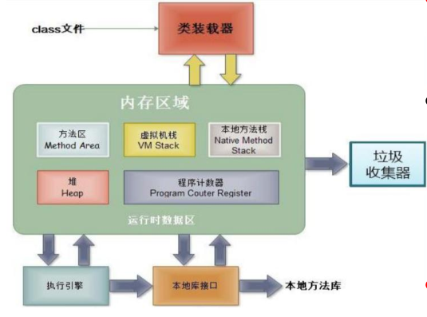

| 区域名称     | 作用                                                         |
| ------------ | ------------------------------------------------------------ |
| 程序计数器   | 程序计数器是CPU中的寄存器，它包含每一个线程下一条要执行的指令的地址 |
| 本地方法栈   | 当程序中调用了native的本地方法时，本地方法执行期间的内存区域 |
| **方法区**   | 存储已被虚拟机加载的类信息、常量、静态变量、即时编译器编译后的代码等数据。 |
| **堆内存**   | 存储对象（包括数组对象），new来创建的，都存储在堆内存。      |
| **虚拟机栈** | 用于存储正在执行的每个Java方法的局部变量表等。局部变量表存放了编译期可知长度的各种基本数据类型、对象引用，方法执行完，自动释放。 |

Java对象保存在内存中时，由以下三部分组成：

- 对象头
  - Mark Word：记录了和当前对象有关的GC、锁等信息。
  - 指向类的指针：每一个对象需要记录它是由哪个类创建出来的，而**Java对象的类数据保存在方法区**，指向类的指针就是记录创建该对象的类数据在方法区的首地址。该指针在32位JVM中的长度是32bit，在64位JVM中长度是64bit。
  - 数组长度（只有数组对象才有）
- 实例数据
  - 即实例变量的值
- 对齐填充
  - 因为JVM要求Java对象占的内存大小应该是8bit的倍数，如果不满足该大小，则需要补齐至8bit的倍数，没有特别的功能。

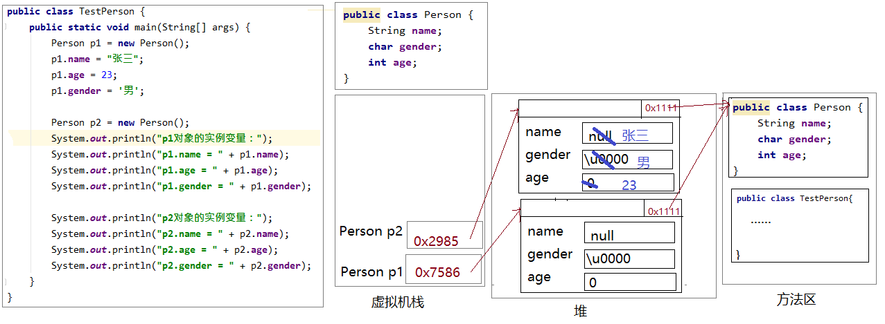

### 3、实例变量是引用数据类型（空指针异常）

实例变量也是变量，数据类型可以是8种基本数据类型，也可以是引用数据类型（数组、类等）。

*注意：引用数据类型的实例变量，如果没有赋值给他一个对象，那么通过它再访问成员或元素，将会发生空指针异常。*

```java
class Husband{
    String name;
    Wife wife;
}
class Wife{
    String name;
    Husband husband;
}
class TestMarry{
    public static void main(String[] args){
        Husband h = new Husband();
        h.name = "张三";

        Wife w = new Wife();
        w.name = "翠花";

        System.out.println("丈夫的姓名：" + h.name + "，妻子：" + h.wife);
         h.wife = w;
        System.out.println("丈夫的姓名：" + h.name + "，妻子：" + h.wife.name);//警惕空指针异常

        System.out.println("妻子的姓名：" + w.name + "，丈夫：" + w.husband);
        w.husband = h;
        System.out.println("妻子的姓名：" + w.name + "，丈夫：" + w.husband.name);//警惕空指针异常
        System.out.println("---------------------------------------");

        //离婚
        h.wife = null;
        w.husband = null;

        h.wife = new Wife();
        h.wife.name = "小何";
        h.wife.husband = h;
        System.out.println("丈夫的姓名：" + h.name + "，妻子：" + h.wife.name);
        System.out.println("妻子的姓名：" + h.wife.name + "，丈夫：" + h.wife.husband.name);
    }
}
```

总结：

（1）一个引用数据类型的变量，可以.出什么，和这个变量的类型有关，这个类型中有什么成员，就可以.出什么成员。

***（2）.操作是不是会发生空指针异常，要看.前面的变量有没有“引用”一个对象***

------

## 三、方法

### 1、方法的概念

方法也叫函数，是一组代码语句的封装，从而实现代码重用，从而减少冗余代码，通常它是一个独立功能的定义，方法是一个类中最基本的功能单元。

```java
Math.random()的random()方法
Math.sqrt(x)的sqrt(x)方法
System.out.println(x)的println(x)方法

Scanner input = new Scanner(System.in);
input.nextInt()的nextInt()方法
```

### 2、方法的特点

（1）必须先声明后使用

>  类，变量，方法等都要先声明后使用

（2）不调用不执行，调用一次执行一次。

### 3、如何声明方法

##### 3.1、声明方法的位置

声明方法的位置（必须在类中方法外），即**不能在一个方法中直接定义另一个方法**。

声明位置示例：

```java
类{
    方法1(){
        
    }
    方法2(){
        
    }
}
```

错误示例：

```java
类{
    方法1(){
        方法2(){  //位置错误
        
   		}
    }
}
```

##### 3.2、声明方法的语法格式

```java
【修饰符】 返回值类型 方法名(【形参列表 】)【throws 异常列表】{
        方法体的功能代码
}
```

一个完整的方法 = 方法头 + 方法体。

- 方法头就是 【修饰符】 返回值类型 方法名(【形参列表 】)【throws 异常列表】，也称为方法签名，通常调用方法时只需要关注方法头就可以，从方法头可以看出这个方法的功能和调用格式。方法头可能包含5个部分，但是有些部分是可能缺省的。
- 方法体就是方法被调用后要指定的代码，也是完成方法功能的具体实现代码，对于调用者来说，不了解方法体如何实现的，并影响方法的使用。

##### 3.3、方法每一个部分的含义

（1）**方法名（必选）**：给方法起一个名字，见名知意，能准确代表该方法功能的名字

（2）【**修饰符】（可选）**：会影响方法的调用方式，以及方法的可见性范围等

- 修饰符：可选的。方法的修饰符也有很多，例如：public、protected、private、static、abstract、native、final、synchronized等。其中根据是否有static，可以将方法分为静态方法和非静态方法。*其中静态方法又称为类方法，非静态方法又称为实例方法*。
- *如果实例变量的权限修饰符public没写的话，也仅限于本包使用，其他包的类是无法访问的。*

（3）**【throws 异常列表】（可选）**：可以使用 throws 关键字处理异常对象,会把异常对象声明抛出给方法的调用者处理(自己不处理,给别人处理)，最终交给**JVM**处理-->**中断处理**

（4）**(【参数列表】）（()必选，参数列表可选）**：表示完成方法体功能时需要外部提供的数据列表

- 无论是否有参数，**()不能省略**
- 如果有参数，每一个参数都要指定数据类型和参数名，多个参数之间使用**逗号**分隔，例如：
  - 一个参数： (数据类型  参数名)
  - 二个参数： (数据类型1  参数1,  数据类型2  参数2) 
- 参数的类型可以是基本数据类型、引用数据类型

（5）**返回值类型（必选）**： 表示方法运行的结果的数据类型，方法执行后将结果返回到调用者

- 基本数据类型
- 引用数据类型
- 无返回值类型：void

（6）**{方法体}（必选）**：方法体必须有{}括起来，在{}中编写完成方法功能的代码，具有方法体的方法才能被调用执行。

关于方法体中**return**语句的说明：

- return语句的作用是结束方法的执行，并将方法的结果返回去

- *如果返回值类型不是void，方法体中必须保证一定有 return 返回值; 语句*，并且要求该返回值结果的类型与声明的返回值类型一致或兼容。
- 如果返回值类型为void时，方法体中可以没有return语句，*如果要用return语句提前结束方法的执行，那么return后面不能跟返回值，直接写return ;* 就可以。
- ***return语句后面就不能再写其他代码了，否则会报错：Unreachable code***

示例：

```java
package com.atguigu.test04.method;

/**
 * 方法定义案例演示
 */
public class MethodDefineDemo {
    /**
     * 无参无返回值方法的演示
     */
    void sayHello(){
        System.out.println("hello");
    }

    /**
     * 有参无返回值方法的演示
     * @param length int 第一个参数，表示矩形的长
     * @param width int 第二个参数，表示矩形的宽
     * @param sign char 第三个参数，表示填充矩形图形的符号
     */
    void printRectangle(int length, int width, char sign){
        for (int i = 1; i <= length ; i++) {
            for(int j=1; j <= width; j++){
                System.out.print(sign);
            }
            System.out.println();
        }
    }

    /**
     * 无参有返回值方法的演示
     * @return
     */
    int getIntBetweenOneToHundred(){
        return (int)(Math.random()*100+1);
    }
    
    /**
     * 有参有返回值方法的演示
     * @param a int 第一个参数，要比较大小的整数之一
     * @param b int 第二个参数，要比较大小的整数之二
     * @return int 比较大小的两个整数中较大者的值
     */
    int max(int a, int b){
        return a > b ? a : b;
    }
}
```

### 4、如何调用实例方法

##### 4.1、方法调用语法格式

```java
对象.非静态方法(【实参列表】)
```

例如：

```java
package com.atguigu.test04.method;

/**
 * 方法调用案例演示
 */
public class MethodInvokeDemo {
    public static void main(String[] args) {
        //创建对象
        MethodDefineDemo md = new MethodDefineDemo();

        System.out.println("-----------------------方法调用演示-------------------------");

        //调用MethodDefineDemo类中无参无返回值的方法sayHello
        md.sayHello();
        md.sayHello();
        md.sayHello();
        //调用一次，执行一次，不调用不执行

        System.out.println("------------------------------------------------");
        //调用MethodDefineDemo类中有参无返回值的方法printRectangle
        md.printRectangle(5,10,'@');

        System.out.println("------------------------------------------------");
        //调用MethodDefineDemo类中无参有返回值的方法getIntBetweenOneToHundred
        md.getIntBetweenOneToHundred();//语法没问题，就是结果丢失

        int num = md.getIntBetweenOneToHundred();
        System.out.println("num = " + num);

        System.out.println(md.getIntBetweenOneToHundred());
        //上面的代码调用了getIntBetweenOneToHundred三次，这个方法执行了三次

        System.out.println("------------------------------------------------");
        //调用MethodDefineDemo类中有参有返回值的方法max
        md.max(3,6);//语法没问题，就是结果丢失
        
        int bigger = md.max(5,6);
        System.out.println("bigger = " + bigger);

        System.out.println("8,3中较大者是：" + md.max(8,9));
    }
}

```

回忆之前的代码：

```java
//1、创建Scanner的对象
Scanner input = new Scanner(System.in);//System.in默认代表键盘输入

//2、提示输入xx
System.out.print("请输入一个整数："); //对象.非静态方法(实参列表)

//3、接收输入内容
int num = input.nextInt();  //对象.非静态方法()
```

##### 4.2、形参和实参

* 形参（formal parameter）：**在定义方法时**方法名后面括号中声明的变量称为形式参数（简称形参）即形参出现在方法定义时。
* 实参（actual parameter）**：调用方法时**方法名后面括号中的使用的值/变量/表达式称为实际参数（简称实参）即实参出现在方法调用时。
* 调用时，实参的个数、类型、顺序顺序要与形参列表**一一对应**。如果方法没有形参，就不需要也不能传实参。
* 无论是否有参数，声明方法和调用方法是的 **()** 都不能丢失

##### 4.3、返回值问题

方法调用表达式是一个特殊的表达式：

- 如果被调用方法的返回值类型是void，调用时不需要也不能接收和处理（打印或参与计算）返回值结果，即方法调用表达式只能直接加 **;** 成为一个独立语句。
- 如果被调用方法有返回值，即返回值类型不是void，
  - 方法调用表达式的结果可以作为*赋值表达式的值*，
  - 方法调用表达式的结果可以作为计*算表达式的一个操作数*，
  - 方法调用表达式的结果可以作为*另一次方法调用的实参*，
  - *方法调用表达式的结果可以不接收和处理，方法调用表达式直接加;成为一个独立的语句，这种情况，返回值丢失。*

```java
package com.atguigu.test04.method;

public class MethodReturnValue {
    public static void main(String[] args) {
        //创建对象
        MethodDefineDemo md = new MethodDefineDemo();

        //无返回值的都只能单独加;成一个独立语句
        //调用MethodDefineDemo类中无参无返回值的方法sayHello
        md.sayHello();
        //调用MethodDefineDemo类中有参无返回值的方法printRectangle
        md.printRectangle(5,10,'@');

        //有返回值的
        //(1)方法调用表达式可以作为赋值表达式的值
        int bigger = md.max(7,3);
        System.out.println("bigger = " + bigger);

        //(2)方法调用表达式可以作为计算表达式的一个操作数
        //随机产生两个[1,100]之间的整数，并求和
        int sum = md.getIntBetweenOneToHundred() + md.getIntBetweenOneToHundred();
        System.out.println("sum = " + sum);

        //(3)方法调用表达式可以作为另一次方法调用的实参
        int x = 4;
        int y = 5;
        int z = 2;
        int biggest = md.max(md.max(x,y),z);
        System.out.println("biggest = " + biggest);

        //(4)方法调用表达式直接加;成为一个独立的语句，这种情况，返回值丢失
        md.getIntBetweenOneToHundred();
    }
}
```

### 5、实例方法使用当前对象的成员

在实例方法中还可以使用*当前对象的其他成员*。在Java中当前对象用this表示。

- this：在实例方法中，表示调用该方法的对象，即t**his可以看成一个变量，或者是一个对象的引用，它里面存储的是当前对象的首地址**。

- 如果没有歧义，完全可以省略this。

##### 5.1、使用this

案例：矩形类

```java
package com.atguigu.test04.method;

public class Rectangle {
    int length;
    int width;

    int area() {
        return this.length * this.width;//没有重名可以省略不写~
    }

    int perimeter(){
        return 2 * (this.length + this.width);
    }

    void print(char sign) {
        for (int i = 1; i <= this.width; i++) {
            for (int j = 1; j <= this.length; j++) {
                System.out.print(sign);
            }
            System.out.println();
        }
    }

    String getInfo(){
        return "长：" + this.length + "，宽：" + this.width +"，面积：" + this.area() +"，周长：" + this.perimeter();
    }
}

```

测试类

```java
package com.atguigu.test04.method;

public class TestRectangle {
    public static void main(String[] args) {
        Rectangle r1 = new Rectangle();
        Rectangle r2 = new Rectangle();

        System.out.println("r1对象：" + r1.getInfo());
        System.out.println("r2对象：" + r2.getInfo());

        r1.length = 10;
        r1.width = 2;
        System.out.println("r1对象：" + r1.getInfo());
        System.out.println("r2对象：" + r2.getInfo());

        r1.print('#');
        System.out.println("---------------------");
        r1.print('&');

        System.out.println("---------------------");
        r2.print('#');
        System.out.println("---------------------");
        r2.print('%');
    }
}
```

##### 5.2、省略this

```java
package com.atguigu.test04.method;

public class Rectangle {
    int length;
    int width;

    int area() {
        return length * width;
    }

    int perimeter(){
        return 2 * (length + width);
    }

    void print(char sign) {
        for (int i = 1; i <= width; i++) {
            for (int j = 1; j <= length; j++) {
                System.out.print(sign);
            }
            System.out.println();
        }
    }

    String getInfo(){
        return "长：" + length + "，宽：" + width +"，面积：" + area() +"，周长：" + perimeter();
    }
}
```

### 6、方法调用内存分析

方法不调用不执行，调用一次执行一次，每次调用会在栈中有一个入栈动作，即给当前方法开辟一块独立的内存区域，用于存储当前方法的局部变量的值，当方法执行结束后，会释放该内存，称为出栈，如果方法有返回值，就会把结果返回调用处，如果没有返回值，就直接结束，回到调用处继续执行下一条指令。

栈结构：先进后出，后进先出。

```java
package com.atguigu.test04.method;

public class MethodMemory {
    public static void main(String[] args) {
        Rectangle r1 = new Rectangle();
        Rectangle r2 = new Rectangle();
        r1.length = 10;
        r1.width = 2;
        r1.print('#');
        System.out.println("r1对象：" + r1.getInfo());
        System.out.println("r2对象：" + r2.getInfo());
    }
}
```

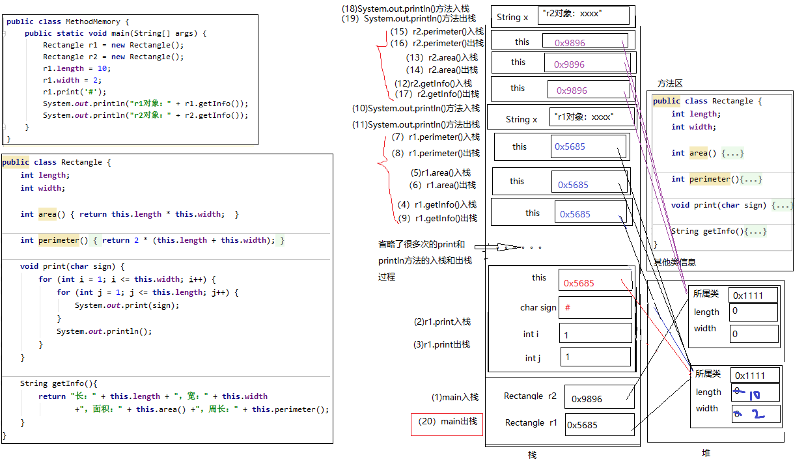

### 7、实例变量与局部变量区别（记住）

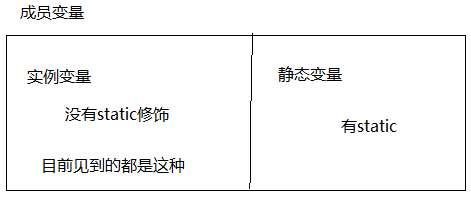

1、声明位置和方式
（1）实例变量：在类中方法外
（2）局部变量：在方法体{}中或方法的形参列表等

2、在内存中存储的位置不同
（1）实例变量：堆
（2）局部变量：栈

3、生命周期
（1）实例变量：和对象的生命周期一样，随着对象的创建而存在，随着对象被GC回收而消亡，
			而且每一个对象的实例变量是独立的。
（2）局部变量：和方法调用的生命周期一样，每一次方法被调用而在存在，随着方法执行的结束而消亡，
			而且每一次方法调用都是独立。

***实例变量的生命周期 > 局部变量***

4、作用域
（1）实例变量：通过对象就可以使用，本类中“**this.，没有歧义（重名问题）还可以省略this.**”，其他类中“对象.”
（2）局部变量：出了作用域就不能使用

5、**修饰符**
（1）实例变量：public,protected,private,final,volatile,transient等
（2）局部变量：final

6、默认值
（1）实例变量：有默认值
（2）局部变量：没有，必须手动初始化。其中的形参比较特殊，靠实参给它初始化。

------

## 四、参数问题

### 1、特殊参数之一：可变参数

在**JDK1.5**之后，当定义一个方法时，形参的类型可以确定，但是形参的个数不确定，那么可以考虑使用可变参数。可变参数的格式：

```
【修饰符】 返回值类型 方法名(【非可变参数部分的形参列表,】参数类型... 形参名){  }
```

可变参数的特点和要求：

（1）一个方法最多**只能有一个**可变参数

（2）如果一个方法包含可变参数，那么可变参数必须是形参列表的**最后一个**

（3）**在声明它的方法中，可变参数当成数组使用**

（4）其实这个书写“≈”

```
【修饰符】 返回值类型 方法名(【非可变参数部分的形参列表,】参数类型[] 形参名){  }
```

只是后面这种定义，在调用时必须传递数组，而前者更灵活，既可以传递数组，又可以直接传递数组的元素，这样更灵活了。

##### 1.1、方法只有可变参数

案例：求n个整数的和

```java
package com.atguigu.test05.param;

public class NumberTools {
    int total(int[] nums){
        int he = 0;
        for (int i = 0; i < nums.length; i++) {
            he += nums[i];
        }
        return he;
    }

    int sum(int... nums){
        int he = 0;
        for (int i = 0; i < nums.length; i++) {
            he += nums[i];
        }
        return he;
    }
}
```

```java
package com.atguigu.test05.param;

public class TestVarParam {
    public static void main(String[] args) {
        NumberTools tools = new NumberTools();

        System.out.println(tools.sum());//0个实参
        System.out.println(tools.sum(5));//1个实参
        System.out.println(tools.sum(5,6,2,4));//4个实参
        System.out.println(tools.sum(new int[]{5,6,2,4}));//传入数组实参

        System.out.println("------------------------------------");
        System.out.println(tools.total(new int[]{}));//0个元素的数组
        System.out.println(tools.total(new int[]{5}));//1个元素的数组
        System.out.println(tools.total(new int[]{5,6,2,4}));//传入数组实参
    }
}
```

##### 1.2、方法包含非可变参数和可变参数

- 非可变参数部分必须传入对应类型和个数的实参；
- 可变参数部分按照可变参数的规则传入0~n个对应类型的实参或传入1个对应类型的数组实参；

案例：

n个字符串进行拼接，每一个字符串之间使用某字符进行分割，如果没有传入字符串，那么返回空字符串""

```java
package com.atguigu.test05.param;

public class StringTools {
    String concat(char seperator, String... args){
        String str = "";
        for (int i = 0; i < args.length; i++) {
            if(i==0){
                str += args[i];
            }else{
                str += seperator + args[i];
            }
        }
        return str;
    }
}
```

```java
package com.atguigu.test05.param;

public class StringToolsTest {
    public static void main(String[] args) {
        StringTools tools = new StringTools();

        System.out.println(tools.concat('-'));
        System.out.println(tools.concat('-',"hello"));
        System.out.println(tools.concat('-',"hello","world"));
        System.out.println(tools.concat('-',"hello","world","java"));
    }
}
```

### 2、特殊参数之二：命令行参数

通过命令行给main方法的形参传递的实参称为命令行参数

```java
public class TestCommandParam{
	//形参：String[] args
	public static void main(String[] args){
		System.out.println(args);
		System.out.println(args.length);
		
		for(int i=0; i<args.length; i++){
			System.out.println("第" + (i+1) + "个参数的值是：" + args[i]);
		}
	}
}
```

命令行：

```command
java TestCommandParam
```

```command
java TestCommandParam 1 2 3
```

```command
java TestCommandParam hello atguigu
```

IDEA工具：

（1）配置运行参数

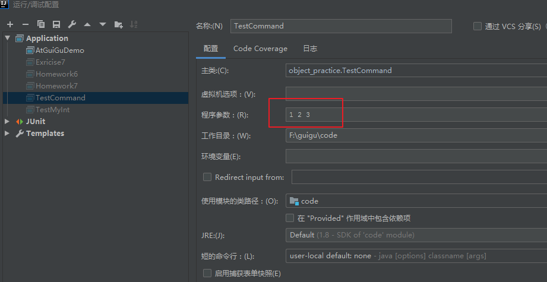

（2）运行程序

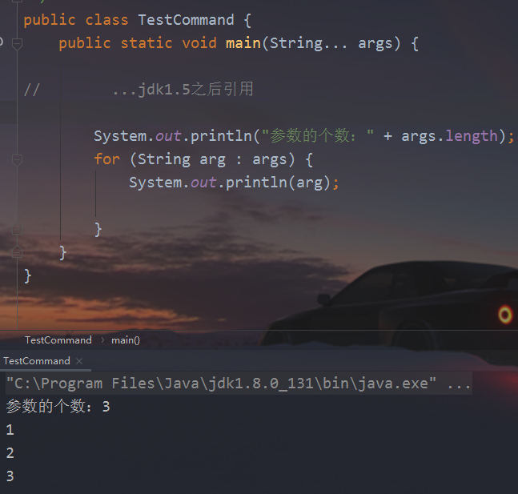

### 3、方法的参数传递机制（高频面试题）

**问题1：实参给形参传了什么值？**

**问题2：实参给形参传完值之后，形参的修改对实参是否有影响？**

方法的参数传递机制：实参给形参赋值，那么反过来形参会影响实参吗？

* 方法的*形参是基本数据类型*时，形参值的改变不会影响实参；
* 方法的*形参是引用数据类型*时，形参地址值的改变不会影响实参，但是形参地址值里面的数据的改变会影响实参，**例如，修改数组元素的值，或修改对象的属性值。**
  * 注意：String、Integer等特殊类型容易错

##### 3.1、形参是基本的数据类型

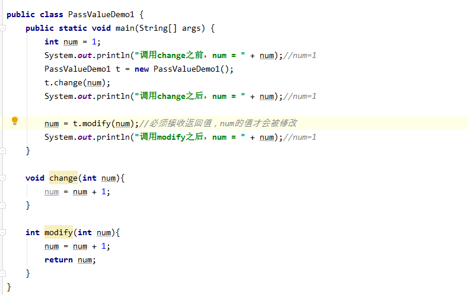

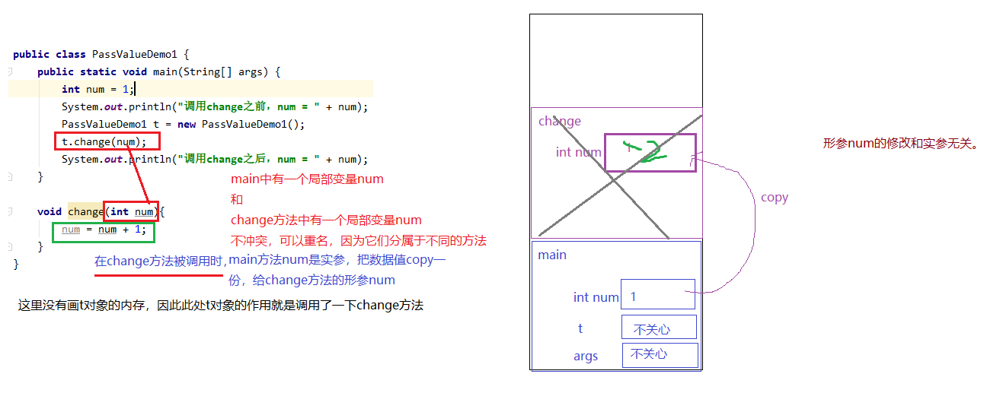

案例：编写方法，交换两个整型变量的值

```java
package com.atguigu.test05.param;

public class PrimitiveTypeParam {
    void swap(int a, int b){//交换两个形参的值
        int temp = a;
        a = b;
        b = temp;
    }

    public static void main(String[] args) {
        PrimitiveTypeParam tools = new PrimitiveTypeParam();
        int x = 1;
        int y = 2;
        System.out.println("交换之前：x = " + x +",y = " + y);//1,2
        tools.swap(x,y);//实参x,y是基本数据类型，给形参的是数据的“副本”，调用完之后，x与y的值不变
        System.out.println("交换之后：x = " + x +",y = " + y);//1,2
    }
}
```

##### 3.2、形参是引用数据类型

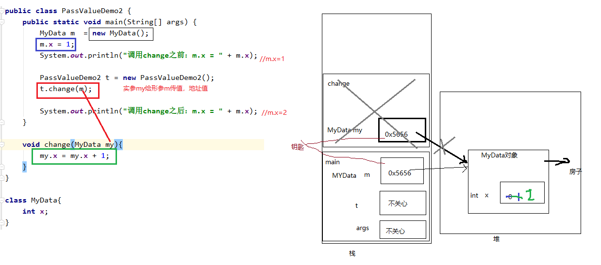

```java
package com.atguigu.test05.param;

public class ReferenceTypeParam {
    void swap(MyData my){//形参my是引用数据类型，接收的是对象的地址值，形参my和实参data指向同一个对象
        //里面交换了对象的两个实例变量的值
        int temp = my.x;
        my.x = my.y;
        my.y = temp;
    }

    public static void main(String[] args) {
        ReferenceTypeParam tools = new ReferenceTypeParam();
        MyData data = new MyData();
        data.x = 1;
        data.y = 2;
        System.out.println("交换之前：x = " + data.x +",y = " + data.y);//1,2
        tools.swap(data);//实参是data，给形参my的是对象的地址值，调用完之后，x与y的值交换
        System.out.println("交换之后：x = " + data.x +",y = " + data.y);//2,1
    }

}
```

```java
public class MyData{
    int x;
    int y;
}
```

##### 3.3、形参是数组

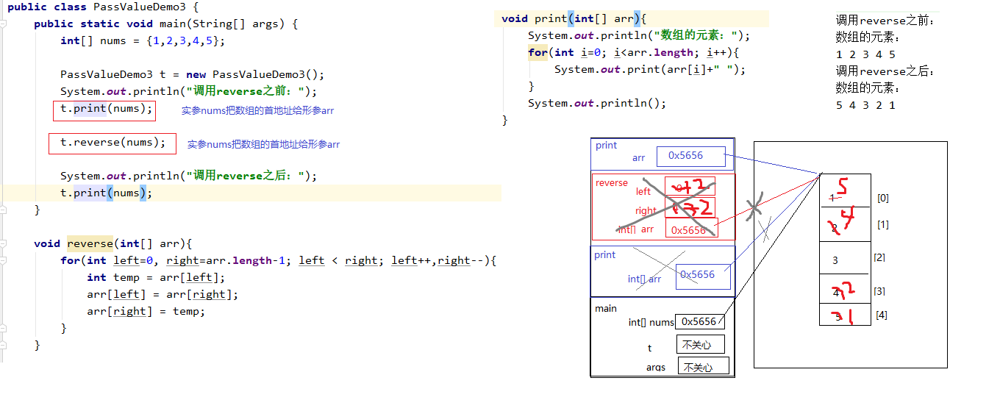

```java
package com.atguigu.test05.param;

public class ArrayTypeParam {
    void sort(int[] arr){//给数组排序，修改了数组元素的顺序，这里对arr数组进行排序，就相当于对nums数组进行排序
        for (int i = 1; i < arr.length; i++) {
            for (int j = 0; j < arr.length - i; j++) {
                if(arr[j] > arr[j+1]){
                    int temp = arr[j];
                    arr[j] = arr[j+1];
                    arr[j+1] = temp;
                }
            }
        }
    }

    void iterate(int[] arr){//输出数组的元素，元素之间使用空格分隔，元素打印完之后换行
        					//这个方法没有修改元素的值
        for (int i = 0; i < arr.length; i++) {
            System.out.print(arr[i]+" ");
        }
        System.out.println();
    }

    public static void main(String[] args) {
        ArrayTypeParam tools = new ArrayTypeParam();

        int[] nums = {4,3,1,6,7};
        System.out.println("排序之前：");
        tools.iterate(nums);//实参nums把数组的首地址给形参arr，这个调用相当于输出nums数组的元素
        					//对数组的元素值没有影响

        tools.sort(nums);//对nums数组进行排序

        System.out.println("排序之后：");
        tools.iterate(nums);//输出nums数组的元素
        //上面的代码，从头到尾，堆中只有一个数组，没有产生新数组，无论是排序还是遍历输出都是同一个数组
    }
}
```

##### 3.4、形参指向新对象（误区）

新new的对象会开辟新的内存空间，恢复成员变量的默认值。

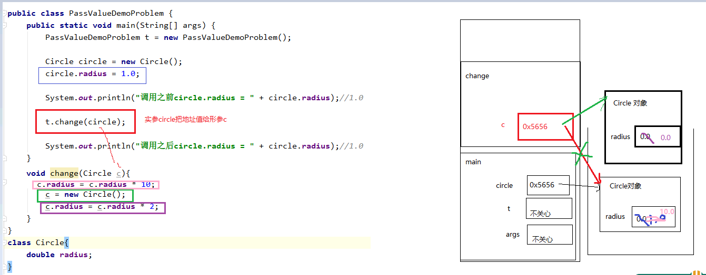

```java
package com.atguigu.test05.param;

public class AssignNewObjectToFormalParam {
    void swap(MyData my){
        my = new MyData(); //这里让my形参指向了新对象，此时堆中有两个MyData对象，和main中的data对象无关
        int temp = my.x;
        my.x = my.y;
        my.y = temp;
     
    }

    public static void main(String[] args) {
        //创建这个对象的目的是为了调用swap方法
        AssignNewObjectToFormalParam tools = new AssignNewObjectToFormalParam();
        
        MyData data = new MyData();
        data.x = 1;
        data.y = 2;
        System.out.println("交换之前：x = " + data.x +",y = " + data.y);//1,2
        tools.swap(data);//调用完之后，x与y的值交换？
        System.out.println("交换之后：x = " + data.x +",y = " + data.y);//1,2
    }
}
```

误区：

String每次调用都会new新对象。所以形参值的改变不会影响实参。

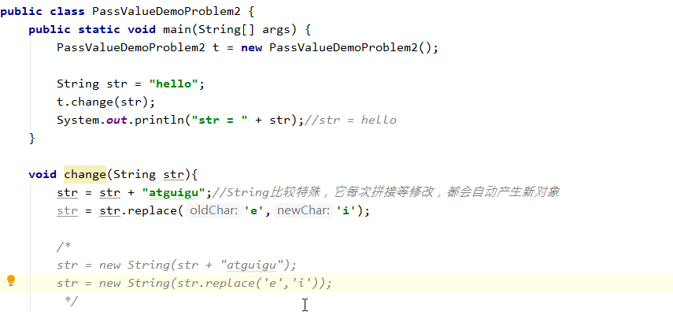

------


## 五、方法的重载

- **方法重载**：指在同一个类中，允许存在一个以上的同名方法，**只要它们的参数列表不同即可**，*与修饰符和返回值类型无关。*
- 参数列表：数据类型个数不同，数据类型不同（按理来说数据类型顺序不同也可以，但是很少见，也不推荐，逻辑上容易有歧义）。
- 重载方法调用：*JVM通过方法的参数列表，调用匹配的方法。*
  - 先找个数、类型最匹配的
  - 再找个数和类型唯一可以兼容的，如果同时多个方法可以兼容将会报错

案例，用重载实现：

（1）定义方法求两个整数的最大值

（2）定义方法求三个整数的最大值

（3）定义方法求两个小数的最大值

（4）定义方法求n个整数最大值

```java
package com.atguigu.test06.overload;

public class MathTools {
    //求两个整数的最大值
    public int max(int a,int b){
        return a>b?a:b;
    }

    //求两个小数的最大值
    public double max(double a, double b){
        return a>b?a:b;
    }

    //求三个整数的最大值
    public int max(int a, int b, int c){
        return max(max(a,b),c);
    }

    //求n整数的最大值
    public int max(int... nums){
        int max = nums[0];//如果没有传入整数，或者传入null，这句代码会报异常
        for (int i = 1; i < nums.length; i++) {
            if(nums[i] > max){
                max = nums[i];
            }
        }
        return max;
    }
}
```

### 1、找最匹配的

```java
package com.atguigu.test06.overload;

public class MethodOverloadMosthMatch {
    public static void main(String[] args) {
        MathTools tools = new MathTools();

        System.out.println(tools.max(5,3));
        System.out.println(tools.max(5,3,8));
        System.out.println(tools.max(5.7,2.5));
    }
}
```

### 2、找唯一可以兼容的

```java
package com.atguigu.test06.overload;

public class MethodOverloadMostCompatible {
    public static void main(String[] args) {
        MathTools tools = new MathTools();

        System.out.println(tools.max(5.7,9));
        System.out.println(tools.max(5,6,8,3));
//        System.out.println(tools.max(5.7,9.2,6.9)); //没有兼容的
    }
}
```

### 3、多个方法可以匹配和兼容

```java
package com.atguigu.test06.overload;

public class MathTools {
    //求两个整数的最大值
    public int max(int a,int b){
        return a>b?a:b;
    }

    //求两个小数的最大值
    public double max(double a, double b){
        return a>b?a:b;
    }

    //求三个整数的最大值
    public int max(int a, int b, int c){
        return max(max(a,b),c);
    }

    //求n整数的最大值
    public int max(int... nums){
        int max = nums[0];//如果没有传入整数，或者传入null，这句代码会报异常
        for (int i = 1; i < nums.length; i++) {
            if(nums[i] > max){
                max = nums[i];
            }
        }
        return max;
    }

/*    //求n整数的最大值
    public int max(int[] nums){  //编译就报错，与(int... nums)无法区分
        int max = nums[0];//如果没有传入整数，或者传入null，这句代码会报异常
        for (int i = 1; i < nums.length; i++) {
            if(nums[i] > max){
                max = nums[i];
            }
        }
        return max;
    }*/

/*    //求n整数的最大值
    public int max(int first, int... nums){  //当前类不报错，但是调用时会引起多个方法同时匹配
        int max = first;
        for (int i = 0; i < nums.length; i++) {
            if(nums[i] > max){
                max = nums[i];
            }
        }
        return max;
    }*/
}
```

### 4、方法的重载和返回值无关

```java
package com.atguigu.test06.overload;

public class MathTools {
    public int getOneToHundred(){
    	return (int)(Math.random()*100);
    }
    
    public double getOneToHundred(){
    	return Math.random()*100;
    }
}
//以上方法不是重载
```

------

## 六、方法的递归调用

递归调用**：方法自己调用自己的现象就称为递归。

**递归的分类:**

* 递归分为两种，直接递归和间接递归。
* 直接递归称为方法自身调用自己。
* 间接递归可以A方法调用B方法，B方法调用C方法，C方法调用A方法。

**注意事项**：

* 递归一定要有条件限定，保证递归能够停止下来，否则会发生栈内存溢出（Stack Overflow）。
* 在递归中虽然有限定条件，但是递归深度不能太深，否则效率低下，或者也会发生栈内存溢出。

  * 能够使用循环代替的，尽量使用循环代替递归

案例：计算斐波那契数列（Fibonacci）的第n个值，斐波那契数列满足如下规律，

```java
1,1,2,3,5,8,13,21,....
```

即从第三个数开始，一个数等于前两个数之和。假设f(n)代表斐波那契数列的第n个值，那么f(n)满足：

f(n) = f(n-2) + f(n-1); 

```java
package com.atguigu.test07.recursion;

public class FibonacciTest {
    public static void main(String[] args) {
        FibonacciTest t = new FibonacciTest();
        //创建FibonacciTest的对象，目的是为了调用f方法

        for(int i=1; i<=10; i++){
            System.out.println("斐波那契数列第" +i +"个数:" + t.f(i));
        }

        System.out.println(t.f(20));//6765

        System.out.println("-----------------------------");
        for(int i=1; i<=10; i++){
            System.out.println("斐波那契数列第" +i +"个数:" + t.fValue(i));
        }

        System.out.println(t.fValue(20));//6765
    }

    //使用递归的写法
    int f(int n){//计算斐波那契数列第n个值是多少
        if(n<1){//负数是返回特殊值1，表示不计算负数情况
            return 1;
        }
        if(n==1 || n==2){
            return 1;
        }
        return f(n-2) + f(n-1);
    }

    //不用递归
    int fValue(int n){//计算斐波那契数列第n个值是多少
        if(n<1){//负数是返回特殊值1，表示不计算负数情况
            return 1;
        }
        if(n==1 || n==2){
            return 1;
        }
        //从第三个数开始，  等于 前两个整数相加
        int beforeBefore = 1; //相当于n=1时的值
        int before = 1;//相当于n=2时的值
        int current = beforeBefore + before; //相当于n=3的值
        //再完后
        for(int i=4; i<=n; i++){
            beforeBefore = before;
            before = current;
            current = beforeBefore + before;
            /*
            假设i=4
                beforeBefore = before; //相当于n=2时的值
                before = current; //相当于n=3的值
                current = beforeBefore + before; //相当于n = 4的值
            假设i=5
                beforeBefore = before; //相当于n=3的值
                before = current; //相当于n = 4的值
                current = beforeBefore + before; //相当于n = 5的值
                ....
             */
        }
        return current;
    }
}

```

------

## 七、对象数组

数组是用来存储一组数据的容器，一组基本数据类型的数据可以用数组装，那么一组对象也可以使用数组来装。

即数组的元素可以是基本数据类型，也可以是引用数据类型。当元素是引用数据类型是，我们称为对象数组。

> 注意：对象数组，首先要创建数组对象本身，即确定数组的长度，然后再创建每一个元素对象，如果不创建，数组的元素的默认值就是null，所以很容易出现空指针异常NullPointerException。

### 1、对象数组的声明和使用

案例：

（1）定义矩形类，包含长、宽属性，area()求面积方法，perimeter()求周长方法，String getInfo()返回圆对象的详细信息的方法

（2）在测试类中创建长度为5的Rectangle[]数组，用来装3个矩形对象，并给3个矩形对象的长分别赋值为10,20,30，宽分别赋值为5,15,25，遍历输出

```java
package com.atguigu.test08.array;

public class Rectangle {
    double length;
    double width;

    double area(){//面积
        return length * width;
    }

    double perimeter(){//周长
        return 2 * (length + width);
    }

    String getInfo(){
        return "长：" + length +
                "，宽：" + width +
                "，面积：" + area() +
                "，周长：" + perimeter();
    }
}

```

```java
package com.atguigu.test08.array;

public class ObjectArrayTest {
    public static void main(String[] args) {
        //声明并创建一个长度为3的矩形对象数组
        Rectangle[] array = new Rectangle[3];

        //创建3个矩形对象，并为对象的实例变量赋值，
        //3个矩形对象的长分别是10,20,30
        //3个矩形对象的宽分别是5,15,25
        //调用矩形对象的getInfo()返回对象信息后输出
        for (int i = 0; i < array.length; i++) {
            //创建矩形对象
            array[i] = new Rectangle();

            //为矩形对象的成员变量赋值
            array[i].length = (i+1) * 10;
            array[i].width = (2*i+1) * 5;

            //获取并输出对象对象的信息
            System.out.println(array[i].getInfo());
        }
    }
}
```

### 2、对象数组的内存图分析

对象数组中数组元素存储的是元素对象的首地址。

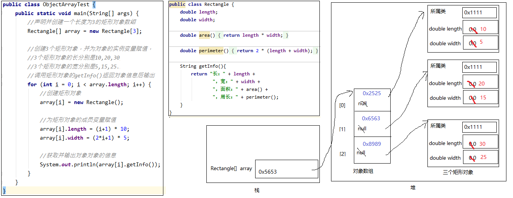

### 3、二维数组

##### 3.1、什么是二维数组

一个一维数组只能存储一组同类型的数据，如果需要同时存储多组同类型的数据，就需要使用二维数组。例如，使用一维数组存储一个小组的学员成绩，使用二维数组可以存储多个小组的学员成绩。

* 二维数组：本质上就是元素为一维数组的一个数组。

* 二维数组的标记：\[\]\[\]

```java
int[][] arr; //arr是一个二维数组，可以看成元素是int[]一维数组类型的一维数组
```

二维数组也可以看成一个二维表，行*列组成的二维表，只不过这个二维表，每一行的列数还可能不同。但是每一个单元格中的元素的数据类型是一致的，例如：都是int，都是String等。

二维数组也可以看成一个一维数组，只是此时元素是一维数组对象。

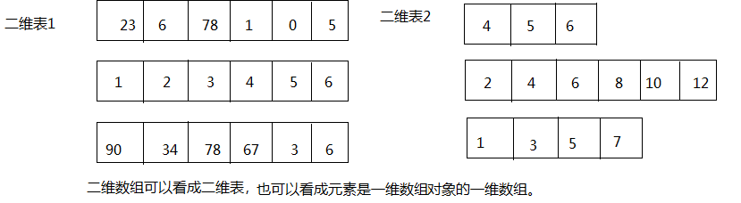

##### 3.2、二维数组的声明

二维数组声明的语法格式：

```java
//推荐
元素的数据类型[][] 二维数组的名称;

//不推荐
元素的数据类型  二维数组名[][];
//不推荐
元素的数据类型[]  二维数组名[];
```

例如：

```java
public class Test20TwoDimensionalArrayDefine {
    public static void main(String[] args) {
        //存储多组成绩
        int[][] grades;

        //存储多组姓名
        String[][] names;
    }
}
```

面试：

```java
int[] x, y[];
//x是一维数组，y是二维数组
```

##### 3.3、二维数组的静态初始化

静态初始化就是用静态数据（编译时已知）为数组初始化。

```java
//以下格式要求声明与静态初始化必须一起完成
元素的数据类型[][] 二维数组的名称 = {
			{元素1，元素2，元素3 。。。}, 
			{第二行的值列表},
			...
			{第n行的值列表}
		};

元素的数据类型[][] 二维数组名 = new 元素的数据类型[][]{
			{元素1，元素2，元素3 。。。}, 
			{第二行的值列表},
			...
			{第n行的值列表}
		};

元素的数据类型[][] 二维数组名;
二维数组名 = new 元素的数据类型[][]{
			{元素1，元素2，元素3 。。。}, 
			{第二行的值列表},
			...
			{第n行的值列表}
		};
```

**如果是静态初始化，右边new 数据类型\[\]\[\]中不能写数字，因为行数和列数，由{}的元素个数决定**

举例：

```java
	int[][] arr = {{1,2,3},{4,5,6},{7,8,9,10}};//声明与初始化必须在一句完成

	int[][] arr = new int[][]{{1,2,3},{4,5,6},{7,8,9,10}};

	int[][] arr;
	arr = new int[][]{{1,2,3},{4,5,6},{7,8,9,10}};

	arr = new int[3][3]{{1,2,3},{4,5,6},{7,8,9,10}};//错误，静态初始化右边new 数据类型[][]中不能写数字
```

二维数组静态初始化演示：

```java
public class Test21TwoDimensionalArrayInitialize {
    public static void main(String[] args) {
        //存储多组成绩
        int[][] grades = {
                    {89,75,99,100},
                    {88,96,78,63,100,86},
                    {56,63,58},
                    {99,66,77,88}
                };

        //存储多组姓名
        String[][] names = {
            {"张三","李四", "王五", "赵六"},
            {"刘备","关羽","张飞","诸葛亮","赵云","马超"},
            {"曹丕","曹植","曹冲"},
            {"孙权","周瑜","鲁肃","黄盖"}
        };
    }
}
```

##### 3.4、二维数组的使用

因为二维数组是用来存储多组数据的，因此要比一维数组麻烦一些，需要我们搞清楚如下几个概念：

- 二维数组的长度/行数：二维数组名.length

- 二维数组的某一行：二维数组名[行下标]，此时相当于获取其中一组数据。它本质上是一个一维数组。行下标的范围：[0, 二维数组名.length-1]。此时把二维数组看成一维数组的话，元素是行对象。

- 某一行的列数：二维数组名[行下标].length，因为二维数组的每一行是一个一维数组。

- 某一个元素：二维数组名\[行下标\]\[列下标\]，即先确定行/组，再确定列。

```java
public class Test22TwoDimensionalArrayUse {
    public static void main(String[] args){
        //存储3个小组的学员的成绩，分开存储，使用二维数组。
		/*
		int[][] scores1;
		int scores2[][];
		int[] scores3[];*/

        int[][] scores = {
                {85,96,85,75},
                {99,96,74,72,75},
                {52,42,56,75}
        };

        System.out.println(scores);//[[I@15db9742
        System.out.println("一共有" + scores.length +"组成绩.");

        //[[：代表二维数组，I代表元素类型是int
        System.out.println(scores[0]);//[I@6d06d69c
        //[：代表一维数组，I代表元素类型是int
        System.out.println(scores[1]);//[I@7852e922
        System.out.println(scores[2]);//[I@4e25154f
        //System.out.println(scores[3]);//ArrayIndexOutOfBoundsException: 3

        System.out.println("第1组有" + scores[0].length +"个学员.");
        System.out.println("第2组有" + scores[1].length +"个学员.");
        System.out.println("第3组有" + scores[2].length +"个学员.");

        System.out.println("第1组的每一个学员成绩如下：");
        //第一行的元素
        System.out.println(scores[0][0]);//85
        System.out.println(scores[0][1]);//96
        System.out.println(scores[0][2]);//85
        System.out.println(scores[0][3]);//75
        //System.out.println(scores[0][4]);//java.lang.ArrayIndexOutOfBoundsException: 4
    }
}
```

##### 3.5、二维数组的遍历

```java
for(int i=0; i<二维数组名.length; i++){ //二维数组对象.length
    for(int j=0; j<二维数组名[i].length; j++){//二维数组行对象.length
        System.out.print(二维数组名[i][j]);
    }
    System.out.println();
}
```

```java
public class Test23TwoDimensionalArrayIterate {
    public static void main(String[] args) {
        //存储3个小组的学员的成绩，分开存储，使用二维数组。
        int[][] scores = {
                {85,96,85,75},
                {99,96,74,72,75},
                {52,42,56,75}
        };

        System.out.println("一共有" + scores.length +"组成绩.");
        for (int i = 0; i < scores.length; i++) {
            System.out.print("第" + (i+1) +"组有" + scores[i].length + "个学员，成绩如下：");
            for (int j = 0; j < scores[i].length; j++) {
                System.out.print(scores[i][j]+"\t");
            }
            System.out.println();
        }
    }
}
```

##### 3.6、二维数组动态初始化

如果二维数组的每一个数据，甚至是每一行的列数，需要后期单独确定，那么就只能使用动态初始化方式了。动态初始化方式分为两种格式：

###### （1）规则二维表：每一行的列数是相同的

```java
//（1）确定行数和列数
元素的数据类型[][] 二维数组名 = new 元素的数据类型[m][n];
	m:表示这个二维数组有多少个一维数组。或者说一共二维表有几行
	n:表示每一个一维数组的元素有多少个。或者说每一行共有一个单元格

//此时创建完数组，行数、列数确定，而且元素也都有默认值

//（2）再为元素赋新值
二维数组名[行下标][列下标] = 值;
```

```java
/*
 1 1 1 1 1
 2 2 2 2 2
 3 3 3 3 3
 4 4 4 4 4
 */
public class Test24SameElementCount {
    public static void main(String[] args) {
        //1、声明二维数组，并确定行数和列数
        int[][] arr = new int[4][5];

        //2、确定元素的值
        for (int i = 0; i < arr.length; i++) {
            for (int j = 0; j < arr.length; j++) {
                arr[i][j] = i + 1;
            }
        }

        //3、遍历显示
        for(int i=0; i<arr.length; i++){
            for(int j=0; j<arr[i].length; j++){
                System.out.print(arr[i][j] + " ");
            }
            System.out.println();
        }
    }
}
```

###### （2）不规则：每一行的列数不一样

```java
//（1）先确定总行数
元素的数据类型[][] 二维数组名 = new 元素的数据类型[总行数][];

//此时只是确定了总行数，每一行里面现在是null

//（2）再确定每一行的列数，创建每一行的一维数组
二维数组名[行下标] = new 元素的数据类型[该行的总列数];

//此时已经new完的行的元素就有默认值了，没有new的行还是null

//(3)再为元素赋值
二维数组名[行下标][列下标] = 值;
```

```java
/*
 1
 2 2
 3 3 3
 4 4 4 4
 5 5 5 5 5
 */
public class Test25DifferentElementCount {
    public static void main(String[] args){
        //1、声明一个二维数组，并且确定行数
        //因为每一行的列数不同，这里无法直接确定列数
        int[][]  arr = new int[5][];

        //2、确定每一行的列数
        for(int i=0; i<arr.length; i++){
			/*
			arr[0] 的列数是1
			arr[1] 的列数是2
			arr[2] 的列数是3
			arr[3] 的列数是4
			arr[4] 的列数是5
			*/
            arr[i] = new int[i+1];
        }

        //3、确定元素的值
        for(int i=0; i<arr.length; i++){
            for(int j=0; j<arr[i].length; j++){
                arr[i][j] = i+1;
            }
        }

        //4、遍历显示
        for(int i=0; i<arr.length; i++){
            for(int j=0; j<arr[i].length; j++){
                System.out.print(arr[i][j] + " ");
            }
            System.out.println();
        }

    }
}
```

###### （3）警惕空指针异常

观察一下代码，运行后会出现什么结果。

```java
public class Test26NullPointerException {
    public static void main(String[] args) {
        //定义数组
        int[][] arr = new int[3][];

        System.out.println(arr[0][0]);//NullPointerException
    }
}
```

因为此时数组的每一行还未分配具体存储元素的空间，此时arr\[0\]是null，此时访问arr\[0\]\[0\]会抛出`NullPointerException` 空指针异常。


**空指针异常在内存图中的表现**


##### 3.7、二维数组的内存图分析

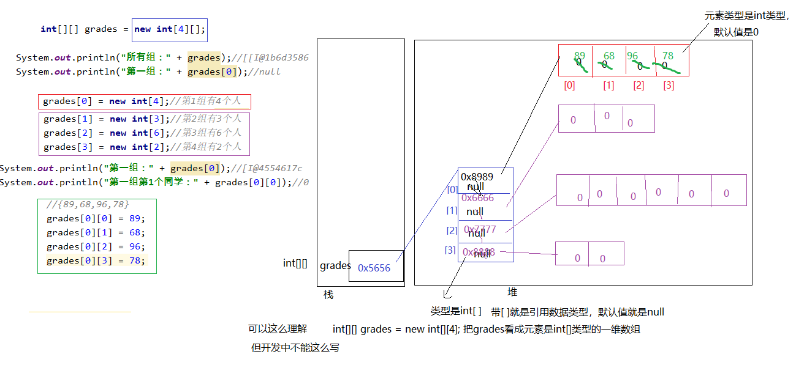

二维数组本质上是元素类型是一维数组的一维数组。

那么二维数组名中存储的是 首地址，这个首地址是元素是一维数组的一维数组的首地址。

二维数组名[下标]存储的也是首地址，这个搜地址是每一行这个一维数组的首地址。

```java
        int[][] arr = {
            {1},
            {2,2},
            {3,3,3},
            {4,4,4,4},
            {5,5,5,5,5}
        };
```


```java
		//1、声明二维数组，并确定行数和列数
		int[][] arr = new int[4][5];
		
		//2、确定元素的值
		for (int i = 0; i < arr.length; i++) {
			for (int j = 0; j < arr.length; j++) {
				arr[i][j] = i + 1;
			}
		}
```


```java
		//1、声明一个二维数组，并且确定行数
		//因为每一行的列数不同，这里无法直接确定列数
		int[][]  arr = new int[5][];
		
		//2、确定每一行的列数
		for(int i=0; i<arr.length; i++){
			/*
			arr[0] 的列数是1
			arr[1] 的列数是2
			arr[2] 的列数是3
			arr[3] 的列数是4
			arr[4] 的列数是5
			*/
			arr[i] = new int[i+1];
		}
		
		//3、确定元素的值
		for(int i=0; i<arr.length; i++){
			for(int j=0; j<arr[i].length; j++){
				arr[i][j] = i+1;
			}
		}
```


------

## 八、封装

### 1、封装的好处

```java
1、什么是封装？封装的好处是什么？
封装是面向对象第1个基本特征。
狭义的封装就是把某些成员限定在一定范围内可见。
广义的封装就是把一些成员限定在一定边界范围内 以及 对功能的封装，对系统的封装。
        方法就是封装了一个可复用的代码功能。
        系统封装就是封装了一个独立的组件。支付宝

封装：
    隐藏了该隐藏的，暴露该暴露。


生活中：
    快递都会有包裹包装商品。
    快递的包裹的好处：
    （1）隐藏细节
    （2）安全：
        隐藏信息的安全
        保护，避免受损
    （3）方便运输
    ...

Java中：
    （1）安全
    （2）便于使用
    （3）代码的复用性
```

没有封装的情景：

```java
public class Student {
    String name;
    int score;
}
```

```java
import java.util.Scanner;

public class TestStudent {
    public static void main(String[] args) {
        Student s1 = new Student();
        s1.name = "张三";
        s1.score = 89;

        Student s2 = new Student();
        s2.name = "李四";
 /*       s2.score = -89;//从语法角度来说，对的，int类型可以是负数
        //从业务角度来说，就不合理*/

        Scanner input  = new Scanner(System.in);
        System.out.print("请输入成绩：");
        int s = input.nextInt();
        if(s >= 0 && s<=100){
            s2.score = s;
        }
        //每次给成绩赋值都要加if判断，对使用者要求比较高，而且会导致重复代码很多

        input.close();
    }
}
```

有封装的情景：

```java
public class XueSheng {
    //private：私有的，只能本类使用，在外面无法直接使用name,score
    private String name;
    private int score;

   void setName(String name){
        this.name = name;
    }
    void setScore(int score){
        if(score>=0 && score<=100) {
            this.score = score;
        }else{
            System.out.println("成绩范围[0,100]");
        }
    }

    String getInfo(){
        return "姓名：" + name +"，成绩：" + score;
    }
}
```

```java
import java.util.Scanner;

public class TestXueSheng {
    public static void main(String[] args) {
        XueSheng x1 = new XueSheng();
/*        x1.name = "李四";
        x1.score = -89;*///错误，因为private就不能直接使用
        x1.setName("李四");

        Scanner input  = new Scanner(System.in);
        System.out.print("请输入成绩：");
        int s = input.nextInt();
        x1.setScore(s);
        //不需要加条件判断

        System.out.println(x1.getInfo());

        input.close();
    }
}
```

### 2、权限修饰符

实现封装就是指控制类或成员的可见性范围。这就需要依赖访问控制修饰符，也称为权限修饰符来控制。

权限修饰符：public,protected,缺省,private

| 修饰符    | 本类 | 本包 | 其它包子类 | 其它包非子类 |
| --------- | ---- | ---- | ---------- | ------------ |
| private   | √    | ×    | ×          | ×            |
| 缺省      | √    | √    | ×          | ×            |
| protected | √    | √    | √          | ×            |
| public    | √    | √    | √          | √            |

外部类：public和缺省

成员变量、成员方法、构造器、成员内部类：public,protected,缺省,private

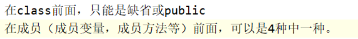

### 3、get和set方法

```java
如果给成员变量加private等权限修饰符，限制了可见性范围，
那么在外面想要访问成员变量怎么办？

就需要给这个成员变量加get或set方法。
get方法：外面来获取成员变量的值用的         拿，获取
set方法：外面来“修改”成员变量的值用的       设置

手动编写：
    //成员方法，没有特殊情况，基本上都是public
    //调用就setName()方法的目的是为了修改name的值，所以要接收一个name的新值，并且给this.name赋值
    public void setName(String name){
        this.name = name;
    }
    //调用getName()方法的目的是为了得到name的值
    public String getName(){
        return name;//所以这里返回name值给他
    }

习惯上：get/set方法名都是 get/set单词 + 成员变量名构成的，成员变量名在这里首字母大写。
    boolean类型的成员变量的get方法名不是以get开头的，而是以is开头，符合英语阅读习惯。
可以使用快捷键生成get/set方法。 Alt + Insert。而且按快捷键时，光标的位置需要在类中，方法外。
```

## 九、继承

### 1、提要

```
继承是面向对象编程的一种强大的代码复用方式；

Java只允许单继承，所有类最终的根类是Object；

protected允许子类访问父类的字段和方法；

子类的构造方法可以通过super()调用父类的构造方法；

可以安全地向上转型为更抽象的类型；

可以强制向下转型，最好借助instanceof判断；

子类和父类的关系是is，has关系不能用继承
```

`Student`类包含了`Person`类已有的字段和方法，只是多出了一个`score`字段和相应的`getScore()`、`setScore()`方法。

能不能在`Student`中不要写重复的代码？

这个时候，继承就派上用场了。

继承是面向对象编程中非常强大的一种机制，它首先可以复用代码。当我们让`Student`从`Person`继承时，`Student`就获得了`Person`的所有功能，我们只需要为`Student`编写新增的功能

### 2、继承的好处

```
（1）代码的复用性
父类写过的代码子类就可以不用再写了
（2）代码的扩展性
子类和父类有差别，子类会扩展（新增、修改）父类的成员
（3）is-a的关系
Student is a Person.
Teacher is a Person.
子类是父类事物的一个子类别。
人是一个大的类别。
学生是一个小的分支。
```

### 3、继承的语法和特点

```java
如何继承？
【修饰符】 class 子类名  extends 父类名{

}

父类：SuperClass，又称为为基类、超类
子类：SubClass，又称为派生类

3、继承的特点
（1）Java支持多层继承，即代代相传
（2）Java只支持单继承，每一个子类只能同时有一个直接父类，即只有一个亲生父亲
C++里面是多重继承，同时继承多个父类。
（3）同一个Java父类同时可以有多个子类
（4）父类中所有的成员变量、成员方法都会继承到子类中。
父类中有private修饰的成员，在子类中不能直接使用，但是可以间接使用。
另外，跨包的子类，也不能直接使用父类中修饰符“缺省”的成员。
（5）Java所有类都有父类，如果一个类没有写它的父类是谁，
默认它的父类是java.lang.Object类。
即Object类是Java的根父类。

4、查看继承关系快捷键：Ctrl + H
   查看继承关系的UML图：选择子类名按Ctrl + Alt + U
```

### 4、方法的重写Override

```java
如果说父类中某个方法的声明被继承到子类了，
但是这个方法的实现（方法体）不完全适用于子类，该怎么办？

解决办法：子类重新实现这个方法，即重写这个方法。
方法重写：Override
注意区分：方法重载Overload

方法重写的要求：
（1）方法名：必须相同
（2）形参列表：必须相同（个数、类型相同，形参名无所谓）
（3）返回值类型：
A：基本数据类型和void：必须相同
B：引用数据类型：要么完全一致，要么是父类被重写方法的子类型，即<=的关系
（4）权限修饰符：
A：被重写方法不能是private，跨包的子类被重写方法不能是缺省的
B：重写方法的权限修饰符要求>=被重写方法的权限修饰符
（5）其他要求：待补充

在子类中，如果要调用父类被重写的方法，那么必须加super.，
否则就是调用子类自己重写的方法体。


重写父类方法的快捷键：Ctrl + o
重写方法建议都加上@Override，
    如果满足重写要求，加不加它没有区别
    如果没有满足重写要求，加它的好处，可以让编译器严格按照重写要求检查，提示错误
                        不加它，编译器就没有好好检查，漏掉了错误提示
```

```java
public class TestOverride {
}
class Father{
    void m1(int a){
        //...
    }
    Object m2(){
        //...
        return null;
    }
    private void m3(){

    }

    void print1n(){
        System.out.println("hello");
    }
}
class Son extends Father{
    void m1(int b){//形参名不看，只看类型和个数
                    //如果形参个数或类型不同，就变成重载了，不是重写
        //...
    }
    public String m2(){
        //...
        return null;
    }

//    @Override //加上它就会提示不满足重写要求的错误
    void println(){
        System.out.println("world");
    }
}
```

### 5、重写toString方法

```java
6、有一个特殊的方法：toString()
作用：把对象的信息拼接为一个字符串返回
    类似于我们之前自己编写的getInfo()

特殊性：
（1）它是在Object类中声明过的，所有类本身就已经从Object类继承了这个方法
（2）默认情况下，它的实现是
    对象的类型 @ 对象的hashCode值，
    建议子类都“重写”这个方法。
    快捷键：Alt + Insert --》toString
（3）当我们用System.out.println()方法输出对象时，可以省略.toString()
        或者当我们对象与字符串拼接时，也可以省略.toString()
        换句话说，当我们打印对象时，对象与字符串拼接时，都会自动调用toString方法
```

```java
public class Rectangle {
    private double length;
    private double width;

    public double getLength() {
        return length;
    }

    public void setLength(double length) {
        this.length = length;
    }

    public double getWidth() {
        return width;
    }

    public void setWidth(double width) {
        this.width = width;
    }

    //通过Ctrl + o得到的toString代码模板
/*    @Override
    public String toString() {
        return super.toString();
    }*/

    //通过Alt + Insert快捷键得到 toString
    @Override
    public String toString() {
        return "Rectangle{" +
                "length=" + length +
                ", width=" + width +
                '}';
    }
}
```

```java
package com.atguigu.inherited;

public class TestToString {
    public static void main(String[] args) {
        Rectangle r = new Rectangle();
        r.setLength(8);
        r.setWidth(2);
        System.out.println(r.toString());
        System.out.println(r);//等价  r.toString()
    }
}
```

### 6、继承对象分布图

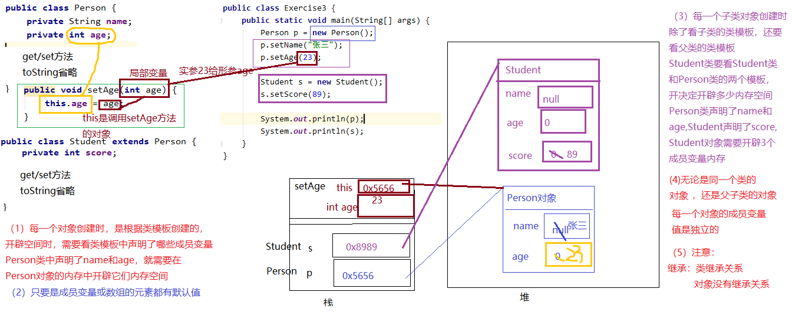

------


## 十、注解

### 1、什么是注解

注解（Annotation）是放在Java源码的类、方法、字段、参数前的一种特殊“注释”

```java
@Resource("hello")
public class Hello {
    @Inject
    int n;

    @PostConstruct
    public void hello(@Param String name) {
        System.out.println(name);
    }

    @Override
    public String toString() {
        return "Hello";
    }
}
//注释会被编译器直接忽略，注解则可以被编译器打包进入class文件，
//因此，注解是一种用作标注的“元数据”。
```

### 2、注解的作用

从JVM的角度看，注解本身对代码逻辑没有任何影响，如何使用注解完全由工具决定。

```java
第一类是由编译器使用的注解，例如：
@Override：让编译器检查该方法是否正确地实现了覆写；
@SuppressWarnings：告诉编译器忽略此处代码产生的警告。
这类注解不会被编译进入.class文件，它们在编译后就被编译器扔掉了。

第二类是由工具处理.class文件使用的注解，比如有些工具会在加载class的时候，对class做动态修改，实现一些特殊的功能。这类注解会被编译进入.class文件，但加载结束后并不会存在于内存中。这类注解只被一些底层库使用，一般我们不必自己处理。

第三类是在程序运行期能够读取的注解，它们在加载后一直存在于JVM中，这也是最常用的注解。例如，一个配置了@PostConstruct的方法会在调用构造方法后自动被调用（这是Java代码读取该注解实现的功能，JVM并不会识别该注解）。
    
定义一个注解时，还可以定义配置参数。配置参数可以包括：
所有基本类型；
String；
枚举类型；
基本类型、String、Class以及枚举的数组。
因为配置参数必须是常量，所以，上述限制保证了注解在定义时就已经确定了每个参数的值。
注解的配置参数可以有默认值，缺少某个配置参数时将使用默认值。
此外，大部分注解会有一个名为value的配置参数，对此参数赋值，可以只写常量，相当于省略了value参数。
如果只写注解，相当于全部使用默认值。
```

```java
public class Hello {
    @Check(min=0, max=100, value=55)
    public int n;

    @Check(value=99)
    public int p;

    @Check(99) // @Check(value=99)
    public int x;

    @Check
    public int y;
}
/*@Check就是一个注解。第一个@Check(min=0, max=100, value=55)明确定义了三个参数，第二个@Check(value=99)只定义了一个value参数，它实际上和@Check(99)是完全一样的。最后一个@Check表示所有参数都使用默认值。*/
```

1. 注解（Annotation）是Java语言用于工具处理的标注：
2. 注解可以配置参数，没有指定配置的参数使用默认值；
3. 如果参数名称是`value`，且只有一个参数，那么可以省略参数名称。

```java
 //举例：
 3个最早的系统注解
（1）@Override：只能加在重写的方法上面
告诉编译器，某个方法是重写的方法，让编译器执行一段检查格式的代码，
按照重写的要求严格检查当前方法是否符合重写的要求。

当重写方法满足重写要求时，@Override也是可以去掉的。
当重写方法满足不重写要求时，@Override去掉有风险，编译时检查不彻底。

（2）@Deprecated：给编译器看的，标记在已过时的代码上
逻辑删除 和 物理删除

（3）@SuppressWarnings：抑制警告
```

```java
import java.util.Date;

public class TestAnnotation {
    @SuppressWarnings("all")
    public static void main(String[] args) {
        Date d = new Date(2022,9,27);
        System.out.println(d);//Fri Oct 27 00:00:00 CST 3922
//        d.setYear(2023);

        Date d2 = new Date(2022-1900,9-1,27);
        System.out.println(d2);

    }
}
```

------


## 十一、多态


## 十二、实例初始化

## 十三、关键字和API