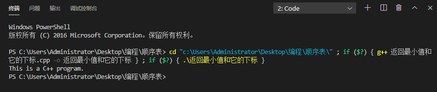

*4月24日          晴* <!--more-->

今日任务：

- [ ] 数学660习题
- [ ] 英语语法课
- [ ] 数据结构顺序表视频
- [ ] 数据结构算法题
- [x] vscode环境调试
- [ ] 关系数据库

------

现在是上午九点，早上起来感冒没有好转，而且还有点肚子疼，活着太难了~

看了某乎大佬的文章终于把vscode里gcc配置弄好了，可以编译程序了~开心。

附上大佬的链接 https://zhuanlan.zhihu.com/p/87864677

------

别问，问就是一天没学习~   北京时间23:43分，睡觉:sleeping:.

然后问题：个人域名的根目录在哪？？？怎么上传html文件到根目录呢？？？？

刚刚安装了hexo 小表情插件~希望运行成功，保佑。