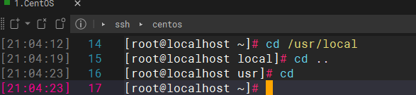

---
<!-- truncate -->
<!-- truncate -->
<!-- truncate -->
slug:  product-Linux
title: Linux常用命令
authors: [jiguanchen]
tags: [linux]
---

*在这里总结了一些常用的Linux命令~*<!--more-->

## 一、基础命令：

1、	cd命令：切换目录



2、	ls命令：列出目录内容


3、	pwd命令：查询所在的目录


4、cat命令：查看小文件内容 


5、more命令：查看大文件内容


6、head命令：查看前n行


7、tail命令：查看文件后面n行


8、touch命令：创建一个空文件


9、mkdir命令：创建目录


10：rm命令：删除文件或目录


11、cp命令：拷贝文件


12、mv命令：移动或更名现有的文件或目录


13、echo命令：标准输出命令


14、man命令和help命令：查看帮助文档和查看内部命令帮助


15、clear命令：清屏

16、grep命令：查找文件里符合条件的字符串。-i 忽略大小写


17、find命令：查询文件  顺序查找 效率低


18、locate命令：根据索引查找  配合updatedb使用


19、cal：查看日历


20、tar命令：压缩文件、解压缩文件


21、poweroff：关机命令

## 二、网络配置命令

对比 windows图形化这样的↓


1、ifconfig/ ip addr命令： 查看网络配置信息


2、 为什么修改ip为固定ip呢？

如使用Linux作为服务器使用，应采用固定IP地址，而不是自动分配IP，避免变化。

3、怎么修改呢？

 vim /etc/sysconfig/network-scripts/ifcfg-ens33

```
#静态分配IP，而不再使用DHCP动态分配
BOOTPROTO="static"
#IP和子网掩码
IPADDR=192.168.74.128
NETMASK=255.255.255.0
#网关和DNS服务器
GATEWAY=192.168.74.2
DNS1=8.8.8.8
#IP地址的前24为代表网络地址，后面是主机地址
PREFIX=24


解释：
DEVICE=eth0    #接口名（设备,网卡）
BOOTPROTO=none  # IP的配置方法[none|static|bootp|dhcp]（引导时不使用协议|静态分配IP|BOOTP协议|DHCP	协议）
BROADCAST=192.168.1.255   #广播地址
HWADDR=00:0C:2x:6x:0x:xx   #MAC地址
IPADDR=192.168.1.23        #IP地址
NETMASK=255.255.255.0     # 网络掩码
NETWORK=192.168.1.0       #网络地址
ONBOOT=yes              #系统启动的时候网络接口是否有效（yes/no）
TYPE=Ethernet              #网络类型（通常是Ethemet）

```

## 三、进程命令

对比 win👇


1、ps命令：   proess


-aux参数： ps –aux|grep xxx  结合管道符使用

```
System V展示风格：

USER：用户名称
PID：进程号
%CPU：进程占用CPU的百分比
%MEM：进程占用物理内存的百分比
VSZ：进程占用的虚拟内存大小（单位：KB）
RSS：进程占用的物理内存大小（单位：KB）
TT：终端名称,缩写
STAT：进程状态，其中S-睡眠，s-该进程是会话的先导进程，N-进程拥有比普通优先级更低的优先级，R-正在运行，D-短期等待，Z-僵死进程，T-被跟踪或者被停止等等
STARTED：进程的启动时间
TIME：CPU时间，即进程使用CPU的总时间
COMMAND：启动进程所用的命令和参数，如果过长会被截断显示
```


-a : 显示当前总段的所有进行信息   -u : 以用户的格式显示进程信息     -x : 显示后台进程运行的参数

-ef参数：以全格式显示当前所有的进程  -e 显示所有进程。-f 全格式。 ps -ef|grep xxx

```
BSD风格：

UID：用户ID 
PID：进程ID 
PPID：父进程ID 
C：CPU用于计算执行优先级的因子。数值越大，表明进程是CPU密集型运算，执行优先级会降低；数值越小，表明进程是I/O密集型运算，执行优先级会提高
STIME：进程启动的时间
TTY：完整的终端名称
TIME：CPU时间
CMD：启动进程所用的命令和参数
```


2、kill命令：

kill pid杀死指定pid对应的进程.

kill pid 告诉进程，你需要被关闭，请自行停止运行并退出

kill -9 pid：强行杀死进程 告诉进程，你被终结了，请立刻退出

## 四、服务类命令（centos）

对比---win👇


1、service

-   管理方式：

service 服务名 start

​    service 服务名 stop

​    service 服务名 restart

​    service 服务名 reload

​    service 服务名 status

-   查看方法：/etc/init.d/服务名
-   通过 chkconfig 命令设置自启动

​	查看服务chkconfig  --list|grep xxx

​    chkconfig  --level 5  服务名  on

-   运行级别：


```
查看默认级别： vi /etc/inittab

Linux系统有7种运行级别(runlevel)：常用的是级别3和5

运行级别0：系统停机状态，系统默认运行级别不能设为0，否则不能正常启动

运行级别1：单用户工作状态，root权限，用于系统维护，禁止远程登陆

运行级别2：多用户状态(没有NFS)，不支持网络

运行级别3：完全的多用户状态(有NFS)，登陆后进入控制台命令行模式

运行级别4：系统未使用，保留

运行级别5：X11控制台，登陆后进入图形GUI模式

运行级别6：系统正常关闭并重启，默认运行级别不能设为6，否则不能正常启动
```


2、systemctl：

-   有方便统一的管理方式（常用的方法）

​       systemctl start 服务名(xxxx.service)

​       systemctl restart 服务名(xxxx.service)

​       systemctl stop 服务名(xxxx.service)

​       systemctl reload 服务名(xxxx.service)

​       systemctl status 服务名(xxxx.service)

-   l查看服务的方法 /usr/lib/systemd/system

-   查看服务的命令

​       systemctl list-unit-files

​       systemctl --type service

-   通过systemctl命令设置自启动

​       自启动systemctl enable service_name

​       不自启动systemctl disable service_name

-   运行级别


-   查看默认级别： vim /etc/inittab

```
Centos7运行级别简化为：

multi-user.target等价于原运行级别3（多用户有网，无图形界面）

graphical.target等价于原运行级别5（多用户有网，有图形界面）
```

3、netstat

查看系统的网络情况 

-an 按一定顺序排列输出

-p 显示哪个进程在调用

netstat –anp|grep 8080 查看占用8080端口的进程

如果出现端口冲突，可以先使用该命令找到占用端口的进程，再使用kill杀死进程


