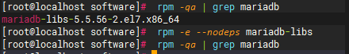
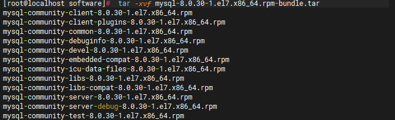
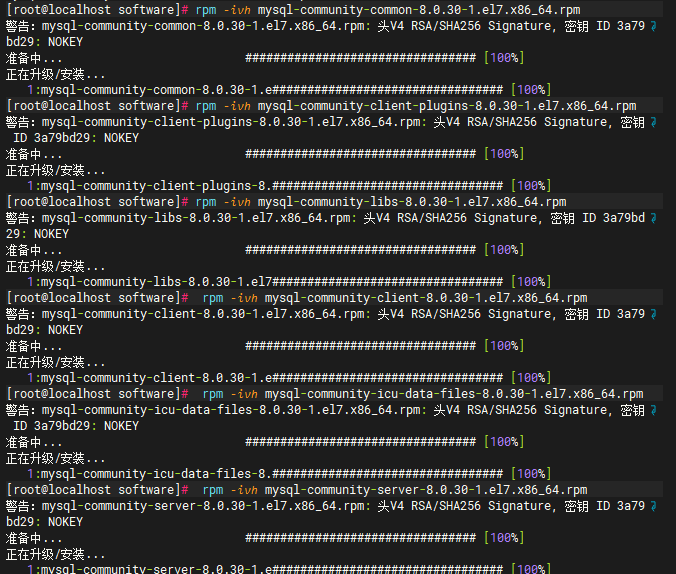
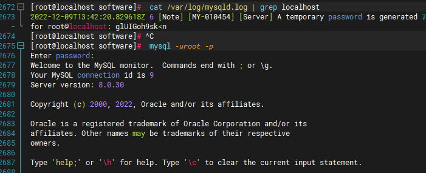
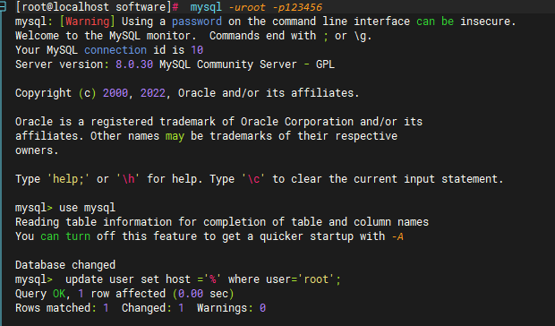
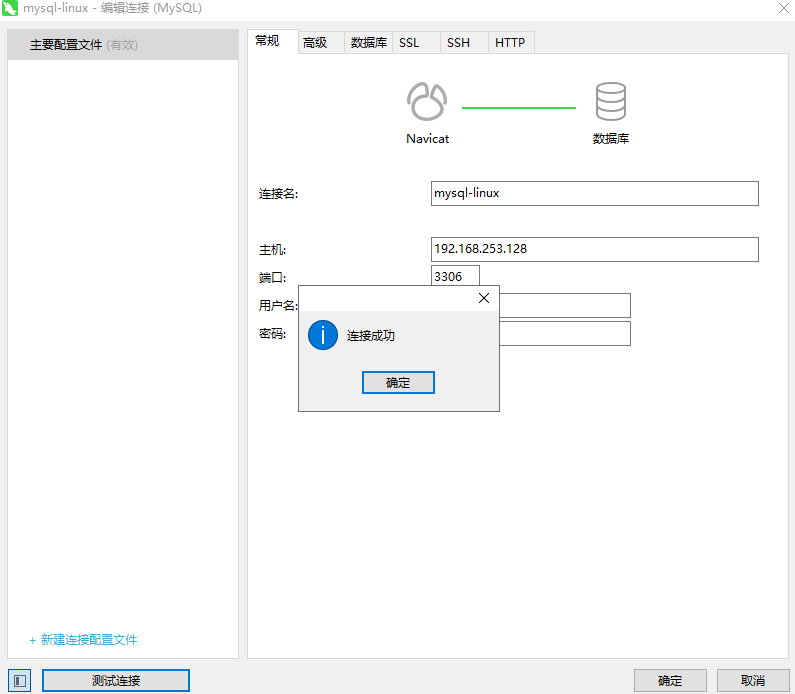
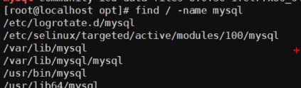

*安装mysql8.0以CentOS为例，傻瓜式安装？haha~平时傻瓜式安装习惯了，今天来尝试一些指定版本的手动安装，真香啊~*<!--more-->

一、 查看并卸载mariadb

centos7中会自带的mariadb  与 mysql冲突  所以我们要把它卸载

```shell
 rpm -qa | grep mariadb
 rpm -e --nodeps mariadb-libs
```



二、下载mysql安装包

下载安装包 https://downloads.mysql.com/archives/community/

三、上传到opt中的mysql 目录,然后解压

```shell
 tar -xvf mysql-8.0.30-1.el7.x86_64.rpm-bundle.tar
```



四、安装依赖关系顺序安装执行 （有先后顺序、倒序卸载）

```shell
 rpm -ivh mysql-community-common-8.0.30-1.el7.x86_64.rpm
 rpm -ivh mysql-community-client-plugins-8.0.30-1.el7.x86_64.rpm
 rpm -ivh mysql-community-libs-8.0.30-1.el7.x86_64.rpm 
 rpm -ivh mysql-community-client-8.0.30-1.el7.x86_64.rpm
 rpm -ivh mysql-community-icu-data-files-8.0.30-1.el7.x86_64.rpm
 rpm -ivh mysql-community-server-8.0.30-1.el7.x86_64.rpm
```



五、对mysql进行初始化

```shell
 mysqld --initialize --console
```

六、修改mysql安装目录的所有用户和所属组

```shell
 chown -R mysql:mysql /var/lib/mysql/
```

七、开启mysql 服务

```shell
 systemctl start mysqld
```

八、查看mysql的临时密码

```shell
 cat /var/log/mysqld.log | grep localhost
```

九、登录mysql



到这基本就ok了，但是我们总不能用这个临时密码登录吧，所以要修改我们mysql密码

十、修改密码

```mysql
alter user 'root'@'localhost' identified by '123456';
```

十一、修改root用户的登录IP限制

```mysql
 use mysql;
 update user set host ='%' where user='root';
```



十二、重启mysql服务

```mysql
systemctl restart mysqld
```

🆗；现在我们用本地可视化工具Navicat尝试连接



十三、如果你想卸载，请逆序依次执行，要注意一定把/var/lib/mysql目录删掉。



over~
