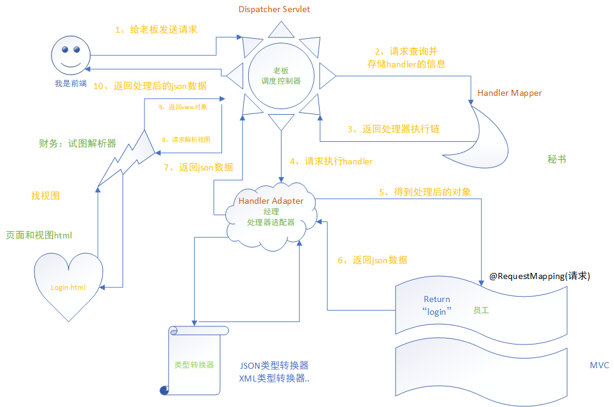

**起因：**SpringMVC*是 Spring 框架提供的一款基于 MVC 模式的轻量级 Web 开发框架，为了让自己更清晰的认识SpringMVC底层的实现流程，对SpringMVC有更加深层次的认识，对它进行了使用流程的使用与总结*。<!--more-->

## 一、什么是SpringMVC

Spring MVC 使用 MVC 架构模式的思想，将 Web 应用进行职责解构，把一个复杂的 Web 应用划分成模型（Model）、控制器（Contorller）以及视图（View）三层。

-   Model：负责对请求进行处理，并将结果返回给 Controller；
-   View：负责将请求的处理结果进行渲染，展示在客户端浏览器上；
-   Controller：是 Model 和 View 交互的纽带；主要负责接收用户请求，并调用 Model 对请求处理，然后将 Model 的处理结果传递给 View。

Spring MVC 本质是对 Servlet 的进一步封装，其最核心的组件是 DispatcherServlet，它是 Spring MVC 的前端控制器，主要负责对请求和响应的统一地处理和分发。Controller 接收到的请求其实就是 DispatcherServlet 根据一定的规则分发给它的。

## 二、SpringMVC常用组件


| 组件                                      | **说明**                                                     | 提供者   |
| ----------------------------------------- | ------------------------------------------------------------ | -------- |
| DispatcherServlet（前端控制器、总控制器） | 它是 Spring MVC 的核心，其本质就是一个 Servlet。它负责将所有的请求进行统一分发，相当于一个 Spring MVC 的流程控制中心，控制整个流程的执行，对各个组件进行统一调度，以降低组件之间的耦合性，有利于组件之间的拓展。 | 框架自带 |
| HandlerMapping（处理器映射器）            | 负责根据请求的 url、method 等信息查找响应的 Handler 处理器（即 Controller 控制器方法）。 | 框架自带 |
| Handler（处理器）                         | Controller 控制器，负责在 DispatcherServlet 的控制下，对具体的用户请求进行处理。 | 自己编写 |
| HandlerAdapter（处理器适配器）            | 它负责根据 HandlerMapping 映射器找到的处理器（Handler）信息，按照特定规则执行相关的处理器（Handler）方法。 | 框架自带 |
| ViewResolver（视图解析器）                | 通过 ModelAndView 对象中的 View 信息对逻辑视图名进行解析，将其解析成真正的视图 View，并返回给 DispatcherServlet。是逻辑视图（result）----->物理视图（/WEB-INF/templates/result.html）的过程。 | 框架自带 |
| View（视图）                              | 将 Model 模型数据通过页面展示给用户。                        | 自己编写 |


1.  DispatcherServlet（前端控制器）、HandlerMapping（处理器映射器）、HandlerAdapter（处理器适配器）、Handler（处理器）、ViewResolver（视图解析器）和 View（视图）。

## 三、SpringMVC基本流程图



1、浏览器发送请求——>DispatcherServlet

该请求会被 DispatcherServlet（前端控制器）拦截；前端控制器收到请求后自己不进行处理，而是委托给其他组件进行处理，作为统一访问点，进行全局的流程控制。

```xml
<!-- DS：前端控制器 -->
    <servlet>
        <servlet-name>ds</servlet-name>
        <servlet-class>org.springframework.web.servlet.DispatcherServlet</servlet-class>

        <init-param>
            <param-name>contextConfigLocation</param-name>
            <param-value>classpath:applicationContext-web.xml</param-value>
        </init-param>

        <load-on-startup>1</load-on-startup>
    </servlet>
    <servlet-mapping>
        <servlet-name>ds</servlet-name>
        <url-pattern>/</url-pattern>
    </servlet-mapping>
```

2、DispatcherServlet——>HandlerMapping

DispatcherServlet 调用 HandlerMapping（处理器映射器）找到具体的处理器（Handler）及拦截器，最后以 HandlerExecutionChain 执行链的形式返回给 DispatcherServlet。

3、DispatcherServlet——>HandlerAdapter

DispatcherServlet 将执行链返回的 Handler 信息发送给 HandlerAdapter（处理器适配器）。处理器适配器将会把处理器包装为适配器，从而支持多种类型的处理器，即适配器设计模式的应用，从而很容易支持很多类型的处理器。

4、HandlerAdapter——>Handler

根据 Handler 信息找到并执行相应的 Handler（即 Controller 控制器）对请求进行处理，Handler 执行完毕后会返回给 HandlerAdapter 一个 ModelAndView 对象（Spring MVC 的底层对象，包括 Model 数据模型和 View 视图信息）。

5、DispatcherServlet——>ViewResolver

DispatcherServlet 接收到 ModelAndView 对象后，会请求 ViewResolver（视图解析器）对视图进行解析。

6、DispatcherServlet——>View

ViewResolver 解析完成后，会将 View 视图并返回给 DispatcherServlet。DispatcherServlet 接收到具体的 View 视图后，进行视图渲染，将 Model 中的模型数据填充到 View 视图中的 request 域，生成最终的 View（视图）。

7、DispatcherServlet——>响应

返回控制权给DispatcherServlet，由它响应用户，到此一个流程结束。

## 四、SpringMVC的优势

Spring MVC 框架内部采用松耦合、可插拔的组件结构，具有高度可配置性，比起其他的 MVC 框架更具有扩展性和灵活性。此外，Spring MVC 的注解驱动（annotation-driven）和对 REST 风格的支持，也是它最具有特色的功能。

 Spring MVC 是 Spring 框架的众多子项目之一，自 Spring 框架诞生之日起就包含在 Spring 框架中了，它可以与 Spring 框架无缝集成，在性能方面具有先天的优越性。对于开发者来说，Spring MVC 的开发效率要明显高于其它的 Web 框架，因此 Spring MVC 在企业中得到了广泛的应用，成为目前业界最主流的 MVC 框架之一。

Spring MVC 基于原生的 Servlet 实现，通过功能强大的前端控制器 DispatcherServlet，对请求和响应进行统一处理。

