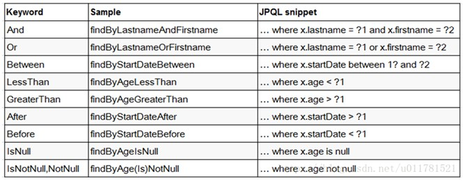
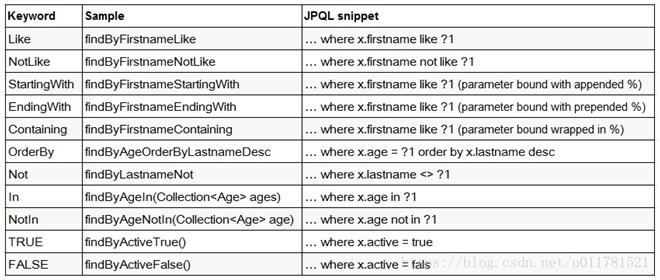

**背景**：*MongoRepository 和 MongoTemplate 是两个用于与 MongoDB 数据库交互的 Java 库。两者的主要区别在于它们的设计和方法。*<!--more--> 

MongoRepository 是一个 Spring Data 仓库，它提供了一个高级、通用和方便的 API，用于 MongoDB 集合上的 CRUD（创建、读取、更新、删除）操作。它使用仓库模式，可以很容易地执行基本操作，而不需要编写任何样板代码。

另一方面，MongoTemplate 是由 Spring Data MongoDB 提供的低级 API。它是 MongoDB Java 驱动程序 API 的直接表示，并提供了更细粒度的控制，以对 MongoDB 集合上的操作进行更多的控制。与 MongoRepository 相比，它需要更多的代码执行相同的操作，但提供了更高的控制和可定制性。

## MongoTemplate 部分API实操

引入实体类

```java
@NoArgsConstructor
@AllArgsConstructor
@Data
@Document("User")
public class User {
    @Id
    private String id;
    private String name;
    private Integer age;
    private String email;
    private String createDate;
}
```

**常用方法**
mongoTemplate.findAll(User.class): 查询User文档的全部数据
mongoTemplate.findById(<id>, User.class): 查询User文档id为id的数据
mongoTemplate.find(query, User.class);: 根据query内的查询条件查询
mongoTemplate.upsert(query, update, User.class): 修改
mongoTemplate.remove(query, User.class): 删除
mongoTemplate.insert(User): 新增

**Query对象**
1、创建一个query对象（用来封装所有条件对象)，再创建一个criteria对象（用来构建条件）
2、 精准条件：criteria.and(“key”).is(“条件”)
   模糊条件：criteria.and(“key”).regex(“条件”)
3、封装条件：query.addCriteria(criteria)
4、大于（创建新的criteria）：Criteria gt = Criteria.where(“key”).gt（“条件”）
   小于（创建新的criteria）：Criteria lt = Criteria.where(“key”).lt（“条件”）
5、Query.addCriteria(new Criteria().andOperator(gt,lt));
6、一个query中只能有一个andOperator()。其参数也可以是Criteria数组。
7、排序 ：query.with（new Sort(Sort.Direction.ASC, "age"). and(new Sort(Sort.Direction.DESC, "date")))

```java
/**
 * @author JaChen
 * @date 2023/2/1 15:11
 */
@SpringBootTest
public class MongoTemplateTest {

    @Autowired
    private MongoTemplate template;

    // 1、增加的方法

    /**
     * 增加数据
     */
    @Test
    public void insert(){
            User user = template
                    .insert(new User(null, "胡歌", 30,
                            "12345@qq.com", new Date()));
            System.out.println("user = " + user);
    }

    /**
     * 批量增加数据
     */
    @Test
    public void batchInsert(){
        User.UserBuilder user1 = User.builder()
                .name("好人1")
                .age(17)
                .email("110@gamil.com")
                .createDate(new Date());

        User.UserBuilder user2 = User.builder()
                .name("好人2")
                .age(18)
                .email("111@gamil.com")
                .createDate(new Date());

        Collection<User.UserBuilder> collection = new ArrayList<>();
        collection.add(user1);
        collection.add(user2);

        // 这里指定要传入的表类型 User.class
        Collection<User.UserBuilder> userBuilders = template.insert(collection,User.class);

        for (User.UserBuilder userBuilder : userBuilders) {
            System.out.println("userBuilder = " + userBuilder);
        }
    }

    // 2、查询的方法

    /**
     * 查询所有数据
     */
    @Test
    public void getAll() {
        List<User> list = template.findAll(User.class);
        for (User user : list) {
            System.out.println("user = " + user);
        }
    }

    /**
     * 根据id查询
     */
    @Test
    public void getUserId() {
        User user = template.findById("63d7b78696d9140e49730444", User.class);
        System.out.println(user);
    }

    /**
     * 条件查询  where name ='jachen' and age=21
     */
    @Test
    public void queryUser() {
        //封装条件
        Query query = new Query(
                Criteria.where("name").is("jachen")
                        .and("age").is(21)
        );
        //调用方法
        List<User> list = template.find(query, User.class);
        System.out.println(list);
    }

    /**
     * 模糊查询  底层没有封装模糊查询方法 ，需要自己编写正则
     */
    @Test
    public void likeQueue(){

        // 正则匹配
        Pattern pattern = Pattern.compile("^.*人.*$");

        // 创建Query对象
        Query query = new Query(Criteria.where("name").regex(pattern));

        // 查询
        List<User> users = template.find(query, User.class);
        for (User user : users) {
            System.out.println("user = " + user);
        }
    }

    /**
     * 分页查询
     */
    @Test
    public void pageQueue(){

        System.out.println("查询第一页 每页俩条数据");

        // 设置当前页
        int page = 1;
        // 设置每页显示的条数
        int pageSize = 2;
        // 设置skip
        int skip = (page-1) * pageSize;

        Query query = new Query().skip(skip).limit(pageSize);

        List<User> users = template.find(query, User.class);

        for (User user : users) {
            System.out.println("user = " + user);
        }

        System.out.println("=====================================");

        System.out.println("查询name是好人，或者年龄大于20的数据");

        // 创建Criteria查询标准
        Criteria criteria = new Criteria();
        Criteria find = criteria.orOperator(Criteria.where("name").is("好人")
                , Criteria.where("age").lt(20));
        List<User> list = template.find(new Query(find), User.class);
        for (User user : list) {
            System.out.println("user = " + user);
        }
    }


    // 3、修改的方法

    /**
     * 修改指定id对象的数据
     */
    @Test
    public void update(){

        User user = template.findById("63d7b78696d9140e49730444", User.class);
        if (user!=null){
            //修改值设置到user对象
            user.setAge(18);
            user.setEmail("9141581@qq.com");
            //修改值封装到update对象里面
            Update update = new Update();
            update.set("age",user.getAge());
            update.set("email",user.getEmail());
            Query query = new Query(Criteria.where("id").is("63d7b78696d9140e49730444"));
            UpdateResult upsert = template.upsert(query, update, User.class);
            long count = upsert.getModifiedCount();
            System.out.println("count = " + count);
        }else {
            System.out.println("修改中断出现异常！");
        }

    }


    // 4、删除的方法

    /**
     * 删除操作
     */
    @Test
    public void delete(){
        Query query =
                new Query(Criteria.where("_id").is("63da209ec19103171259d992"));
        DeleteResult result = template.remove(query, User.class);
        long count = result.getDeletedCount();
        System.out.println(count);
    }

}
```

## MongoRepository部分API实操

Spring Data提供了对mongodb数据访问的支持，我们只需要继承MongoRepository类，按照Spring Data规范就可以了

SpringData 方法定义规范

**需要添加Repository类**

```java
/**
 * @author JaChen
 * @date 2023/2/1 18:43
 */
@Repository
public interface UserRepository extends MongoRepository<User,String> {
    
}
```

*Spring Data MongoDB 3.2.12 API文档：https://docs.spring.io/spring-data/mongodb/docs/3.2.12/api/*





 1、不是随便声明的，而需要符合一定的规范
 2、 查询方法以find | read | get开头
 3、 涉及条件查询时，条件的属性用条件关键字连接
 4、 要注意的是：条件属性首字母需要大写
 5、 支持属性的级联查询，但若当前类有符合条件的属性则优先使用，而不使用级联属性,若需要使用级联属性，则属性之间使用_强制进行连接

**实操**

```java
import java.util.Optional;

/**
 * @author JaChen
 * @date 2023/2/1 16:54
 */
@SpringBootTest
public class MongoRepositoryTest {

    @Autowired
    private UserRepository repository;

    // 1、增加的方法

    /**
     * 增加一条数据
     *
     * 比较insert和save
     * 两种方法的主要区别在于它们是否允许存在相同的 _id 值。
     * 如果要插入新文档，那么可以使用 repository.insert()；
     * 如果要更新已有文档，则可以使用 repository.save()。
     */
    @Test
    public void insert(){
        User user = User.builder().createDate(new Date()).email("hahaha@abc.cn")
                .age(66).name("太上老君1").build();
        repository.insert(user);
        //repository.save(user);
    }

    /**
     * 增加多条数据
     */
    @Test
    public void batchInsert(){

        User user2 = User.builder().createDate(new Date()).email("hahaha@abc.cn")
                .age(66).name("太上老君2").build();
        User user3 = User.builder().createDate(new Date()).email("hahaha@abc.cn")
                .age(66).name("太上老君3").build();
        List<User> users = Arrays.asList(user3, user2);
        repository.saveAll(users);
    }

    // 2、查询操作
    /**
     * 查询全部 并根据id查询
     */
    @Test
    public void queryById(){

        List<User> users = repository.findAll();
        for (User user : users) {
            System.out.println("user = " + user);
        }

        Optional<User> user = repository.findById("63da07d1bfe3447c655f0e6f");
        System.out.println("user = " + user);

    }

    /**
     * 条件查询 where name='jachen' and age=18  findAll
     */
    @Test
    public void queryByNameAndAge(){

        User user = User.builder().name("太上老君").age(66).build();
        System.out.println("user = " + user);
        // Example根据给定的示例对象，查询数据库中与该示例对象匹配的数据。
        Example<User> example = Example.of(user);
        System.out.println("example = " + example);

        // 注意：如果只有表中一个数据查不出来 list为null
        /**
         * 为什么出现这种情况呢？
         * 1、数据库中没有与示例对象匹配的数据：请检查数据库中是否有与示例对象匹配的数据，并确保匹配条件是否正确。
         * 2、查询代码有错误：请检查查询代码，确保没有任何语法错误或逻辑错误。
         * 3、Example对象中没有填写完整的条件：示例对象只需包含需要匹配的字段，其他字段的值可以是 null，
         * 但是如果存在需要匹配的字段没有填写值，则该字段的匹配条件不完整，可能导致查询结果为空。
         * 4、我的错误是：数据库里的字段没有指定类型为space.jachen.yygh.hosp.User.User 出现空值
         *
         */
        List<User> userList = repository.findAll(example);
        userList.forEach(user1 -> {
            System.out.println("user1 = " + user1);
        });
    }

    /**
     * 条件查询 findOne()
     */
    @Test
    public void test(){
        //封装条件
        User user = new User();
        user.setAge(66);
        Example<User> example = Example.of(user);
        //调用方法得到结果 如果多条匹配打印第一条
        User user1 = repository.findOne(example).get();
        System.out.println(user1);
    }


    /**
     * 模糊查询
     */
    @Test
    public void findQueryLike() {

        //创建模糊查询匹配器
        ExampleMatcher matcher = ExampleMatcher.matching()
                //改变默认字符串匹配方式：模糊查询
                .withStringMatcher(ExampleMatcher.StringMatcher.CONTAINING)
                .withIgnoreCase(true);

        User user = new User();
        user.setName("上");
        Example<User> example = Example.of(user,matcher);

        // where name like '上'
        List<User> list = repository.findAll(example);
        list.forEach(System.out::println);
    }


    /**
     * 条件分页查询带排序
     */
    @Test
    public void findQueryPage() {
        //设置排序规则
        Sort sort = Sort.by(Sort.Direction.DESC, "age");

        //设置分页参数
        //第一个参数当前页  0代表第一页
        //第二个参数 每页显示记录数
        //第三个参数 排序规则对象
        Pageable pageable = PageRequest.of(0, 2, sort);

        //创建模糊查询匹配器
        ExampleMatcher matcher = ExampleMatcher.matching()
                //改变默认字符串匹配方式：模糊查询
                .withStringMatcher(ExampleMatcher.StringMatcher.CONTAINING)
                .withIgnoreCase(true);

        User user = new User();
        user.setName("上");
        Example<User> example = Example.of(user,matcher);

        //调用方法实现查询
        Page<User> pages = repository.findAll(example, pageable);
        List<User> list = pages.getContent();
        list.forEach(System.out::println);
    }


    // 自定义查询方法：可以简化操作

    /**
     * 根据名字模糊查询 带分页
     */
    @Test
    public void findByNameLike(){
        List<User> users = repository.findByNameLike("上");
        /*users.forEach(user -> {
            System.out.println("user = " + user);
        });*/
        users.forEach(System.out::println);
    }

    /**
     * 查询age>20岁的或者name=ceci的数据
     */
    @Test
    public void findByAgeAfterOrName(){
        List<User> users = repository.findByAgeAfterOrName(20, "ceci");
        users.forEach(System.out::println);
    }

    /**
     * 查询邮箱不是null的list
     */
    @Test
    public void findByEmailIsNotNull(){
        List<User> userList = repository.findByEmailIsNotNull();
        userList.forEach(System.out::println);
    }

}
```

## 总结

MongoRepository 是一个更高级和易于使用的 API，而 MongoTemplate 是一个提供更多控制的低级 API。选择哪种方法取决于项目的具体要求。
