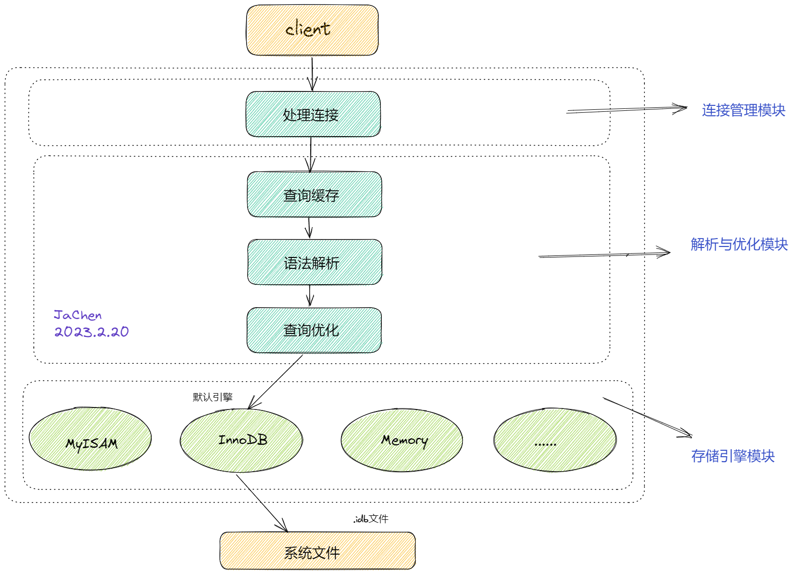
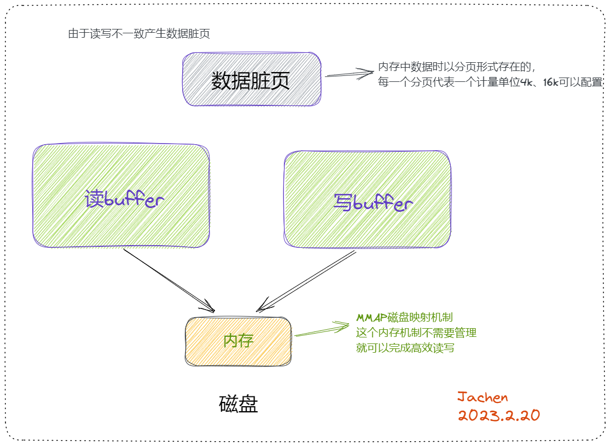

**背景**：*我们通常理解的mysql5.7过渡到8.0是由于查询缓存很鸡肋，要保证每次查询都是相同的sql查询语句，命中率自然会很低。但是真的只是因为这个原因吗？那么我要是在高并发下请求同一sql的场景这显然也是存在的，那为什么还要去掉这层缓存呢？*<!--more-->

## 官方描述

MySQL 8.0 在缓存方面也进行了一些改变，以下是一些主要变化：

1.  自适应哈希索引：MySQL 8.0 引入了自适应哈希索引，用于在内存中缓存查询结果。这种索引可以根据查询的频率和模式自动调整大小，从而提高查询性能。
2.  持久化内存引擎：MySQL 8.0 引入了 InnoDB 持久化内存引擎，这是一种将数据存储在内存中的引擎。与传统的内存引擎不同，持久化内存引擎可以将数据持久化到磁盘上，以避免数据丢失。
3.  更好的查询缓存：MySQL 8.0 引入了更好的查询缓存机制，用于缓存查询结果。与之前的版本不同，MySQL 8.0 不再使用全局查询缓存，而是改为使用基于查询语句的缓存。
4.  更好的内存管理：MySQL 8.0 改进了内存管理，使得内存使用更加高效。这包括改进了内存分配器、提供了更好的内存监控和警告功能等。

其中第三点提到了 MySQL 8.0 引入了更好的查询缓存机制，用于缓存查询结果，这与之前的版本不同，MySQL 8.0 不再使用全局查询缓存，而是改为使用基于查询语句的缓存。这里我们具体展开来看看这个变化。

在之前的 MySQL 版本中，查询缓存是一种可用于缓存 SELECT 语句的结果集的机制。这个机制通过在内存中缓存查询结果集，以便在以后执行相同的查询时可以直接从缓存中读取结果集，而无需执行查询。这种机制可以大大提高查询性能，特别是在有大量重复查询的情况下。

然而，MySQL 8.0 中的查询缓存与之前版本不同，它不再使用全局查询缓存，而是改为使用基于查询语句的缓存。具体来说，每个查询都会被单独缓存，并且只有相同的查询（包括查询语句和参数）才能从缓存中获取结果集。这种机制可以避免之前版本中遇到的一些问题，比如全局查询缓存锁和内存分配问题。

另外，MySQL 8.0 还支持对查询缓存进行更细粒度的控制，包括可以对某些查询禁用查询缓存，可以在查询语句中指定查询结果集是否需要被缓存等。

虽然 MySQL 8.0 引入了基于查询语句的缓存机制，但是需要注意的是，查询缓存并不总是对性能有益。对于一些查询频率低、数据更新频繁的情况，缓存可能会浪费内存，而不是提高性能。因此，需要根据具体情况来评估是否使用查询缓存。

------

## 探究去掉查询缓存的原因

我们先来看看mysql5.7服务端获取客户端请求的基本流程，查询缓存是在解析与优化模块的开始位置，也就意味着它是以全局查询缓存存在的，那么这样有什么弊端呢？它能否保证高并发写的读写一致呢？

### 管理策略层面的缺失

在高并发下查询同一个sql语句select *from user where id = 1;那么存在查询缓存的确可以提高查询的效率，这是我们普遍认为的正常情况。但是在不正常的情况下是会出大问题的，如果我们已经在内存中的数据在磁盘中进行了update修改，我们就必须要使我们缓存中的数据更新，保证数据的一致性，**但是在mysql5.7中，对内存是没有管理策略的，内存中数据的生效、失效、过期都没有进行标记**。那么如果不能保证缓存数据的一致性就会查到脏数据，如果我们是在对数据一致性要求不高的场景下的程序，那么使用查询缓存是不影响的，总不能正在玩着游戏，你停机游戏对数据进行更新？

### 底层有完善的缓存机制

我们的排序，大数据量的查找，order by ，join操作等，join是左表去匹配右表，左表拿出一行数据到右表一一对比，这个比的过程是绝对不会从磁盘中一一拿出来比的，它底层会把数据加载到内存的缓冲区**buffer**中，再进行比较。

处理连接的瓶颈中并发连接数会有限制，比如500个线程，虽然它从缓存内存中取很快，但是对于select语句，只要做好优化，比如创建好索引，在磁盘中取也是不慢的，而且mysql底层的磁盘是有机的组合的，并且在高频的访问中，它也会有读buffer，甚至还存在写buffer，如果读buffer中的数据没有被修改，它每次也是在内存中读的，也不会在磁盘中读，所以就没必要再加查询缓存了。

### 查询缓存容量小，存在瓶颈，且命中率也很低

这个缓存机制是由一系列小缓存组成的。比如表缓存，记录缓存，key缓存，权限缓存等 。只有相同的SQL语句才会命中查询缓存。两个查询请求在任何字符上的不同（例如：空格、注释、大小写），都会导致缓存不会命中。在两条查询之间 有 INSERT 、 UPDATE 、 DELETE 、 TRUNCATE TABLE 、 ALTER TABLE 、 DROP TABLE 或 DROP DATABASE 语句也会导致缓存失效，所以在MySQL 8之后就抛弃了这个功能。

如果一张表中有8000万条数据，查询缓存显然就会力不从心，如果只存热点数据呢？即便是使用lru算法，我们也无法确定已经存在mysql的缓存数据，即便我们缓存了10w条数据，但是我们不知道是8000w条中的哪一个，就会发生缓存穿透，无法命中。加缓存集群更是无从谈起，所以mysql8.0就直接废弃了。

## 替代方案

应用层组织缓存，最简单的是使用redis,ehcached等

------

## 总结

缓存的意义在于快速查询提升系统性能，可以灵活控制缓存的一致性
8.0之前让DBA一直禁用的mysql缓存的限制：

1.  MySQL基本没有手段灵活的管理缓存失效和生效，尤其对于频繁更新的表；
2.  SQL必须完全一致才会导致cache命中；
3.  为了节省内存空间，太大的result set不会被cache(query_cache_limit)；
4.  MySQL缓存在分库分表环境下是不起作用的；
5.  执行SQL里有触发器，自定义函数时，MySQL缓存也是不起作用的；
6.  在表的结构或数据发生改变时，基于该表相关cache.立即全部失效。
