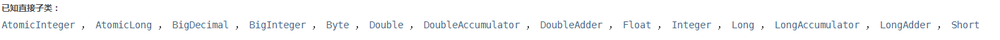

​		*equals是Java中非常常见的方法，equals不只是字符串区别于==的一个比较的方法，继承Object的类都可以重写equals方法，因为类很多，有时候会记得很乱，所以这里总结一下和它相关的一些知识点。*<!--more-->

话不多说，上源码，以下基于JDK1.8文档总结

## 1 、Object类中

Indicates whether some other object is "equal to" this one. 指示其他对象是否“等于”此对象。

```java
public boolean equals(Object obj) {
      return (this == obj);
}
```

**重写equals方法**

子类重写equals方法时，要遵循如下规则：

- 自反性：对于任何非空引用值 x，x.equals(x) 都应返回 true。 
- 对称性：对于任何非空引用值 x 和 y，当且仅当 y.equals(x) 返回 true 时，x.equals(y) 才应返回 true。 
- 传递性：对于任何非空引用值 x、y 和 z，如果 x.equals(y) 返回 true，并且 y.equals(z) 返回 true，那么 x.equals(z) 应返回 true。 
- 一致性：对于任何非空引用值 x 和 y，多次调用 x.equals(y) 始终返回 true 或始终返回 false，前提是对象上 equals 比较中所用的信息没有被修改。 
- 对于任何非空引用值 x，x.equals(null) 都应返回 false。 

​		当此方法被重写时，通常有必要重写 hashCode 方法，以维护 hashCode 方法的常规协定，该协定声明相等对象必须具有相等的哈希码。

## 2、String类中

Compares this string to the specified object. 将此字符串与指定对象进行比较。

```java
public boolean equals(Object anObject) {
    if (this == anObject) {
        return true;
    }
    if (anObject instanceof String) {
        String anotherString = (String)anObject;
        int n = value.length;
        if (n == anotherString.value.length) {
            char v1[] = value;
            char v2[] = anotherString.value;
            int i = 0;
            while (n-- != 0) {
                if (v1[i] != v2[i])
                    return false;
                i++;
            }
            return true;
        }
    }
    return false;
}
```

## 3、Arrays类中

Returns <tt>true</tt> if the two specified arrays of longs are <i>equal</i> to one another.
如果两个数组以相同的顺序包含相同的元素，那么它们就是相等的。另外，如果两个数组引用都为空，则认为两个数组引用相等。

```java
public static boolean equals(long[] a, long[] a2) {
    if (a==a2)
        return true;
    if (a==null || a2==null)
        return false;

    int length = a.length;
    if (a2.length != length)
        return false;

    for (int i=0; i<length; i++)
        if (a[i] != a2[i])
            return false;

    return true;
}
```

## 4、Collection类

Compares the specified object with this collection for equality.  将指定的对象与此集合进行比较以获得相等性。 

```java
boolean equals(Object o);
```

## 5、Set类（HashSet、LinkedHashSet、TreeSet...）

Compares the specified object with this set for equality.   比较指定对象与此集合是否相等。

```java
public boolean equals(Object o) {
        if (o == this)
            return true;

        if (!(o instanceof Set))
            return false;
        Collection<?> c = (Collection<?>) o;
        if (c.size() != size())
            return false;
        try {
            return containsAll(c);
        } catch (ClassCastException unused)   {
            return false;
        } catch (NullPointerException unused) {
            return false;
        }
    }
public int hashCode() {
        int h = 0;
        Iterator<E> i = iterator();
        while (i.hasNext()) {
            E obj = i.next();
            if (obj != null)
                h += obj.hashCode();
        }
        return h;
    }
```

## 6、List类（ArrayList、LinkedList、Vector、Stack...）

Compares the specified object with this list for equality.比较指定对象与此列表是否相等。

```java
public boolean equals(Object o) {
    if (o == this)
        return true;
    if (!(o instanceof List))
        return false;

    ListIterator<E> e1 = listIterator();
    ListIterator<?> e2 = ((List<?>) o).listIterator();
    while (e1.hasNext() && e2.hasNext()) {
        E o1 = e1.next();
        Object o2 = e2.next();
        if (!(o1==null ? o2==null : o1.equals(o2)))
            return false;
    }
    return !(e1.hasNext() || e2.hasNext());
}
//Returns the hash code value for this list.
public int hashCode() {
        int hashCode = 1;
        for (E e : this)
            hashCode = 31*hashCode + (e==null ? 0 : e.hashCode());
        return hashCode;
    }
//Vector
public synchronized boolean equals(Object o) {
        return super.equals(o);
    }
public synchronized int hashCode() {
        return super.hashCode();
    }
//Stack
class Stack<E> extends Vector<E>{}
```

## 7、Map类（Hashtable、HashMap、LinkedHashMap、TreeMap...）

Compares the specified object with this map for equality. 比较指定对象与此映射是否相等。

```java
public boolean equals(Object o) {
    if (o == this)
        return true;

    if (!(o instanceof Map))
        return false;
    Map<?,?> m = (Map<?,?>) o;
    if (m.size() != size())
        return false;

    try {
        Iterator<Entry<K,V>> i = entrySet().iterator();
        while (i.hasNext()) {
            Entry<K,V> e = i.next();
            K key = e.getKey();
            V value = e.getValue();
            if (value == null) {
                if (!(m.get(key)==null && m.containsKey(key)))
                    return false;
            } else {
                if (!value.equals(m.get(key)))
                    return false;
            }
        }
    } catch (ClassCastException unused) {
        return false;
    } catch (NullPointerException unused) {
        return false;
    }

    return true;
}
public int hashCode() {
        int h = 0;
        Iterator<Entry<K,V>> i = entrySet().iterator();
        while (i.hasNext())
            h += i.next().hashCode();
        return h;
}
```

## 8、Number类以Integer为例



```java
public boolean equals(Object obj) {
    return (this == obj);
}
// Integer
public boolean equals(Object obj) {
        if (obj instanceof Integer) {
            return value == ((Integer)obj).intValue();
        }
        return false;
    }
 /**
     * The value of the {@code Integer}.
     *
     * @serial
     */
    private final int value;

    /**
     * Constructs a newly allocated {@code Integer} object that
     * represents the specified {@code int} value.
     *
     * @param   value   the value to be represented by the
     *                  {@code Integer} object.
     */
    public Integer(int value) {
        this.value = value;
    }

```

9、File类中

Tests this abstract pathname for equality with the given object. 测试此抽象路径名是否与给定对象相等。

```java
public boolean equals(Object obj) {
    if ((obj != null) && (obj instanceof File)) {
        return compareTo((File)obj) == 0;
    }
    return false;
}
// Compares two abstract pathnames lexicographically.
public int compareTo(File pathname) {
        return fs.compare(this, pathname);
    }
/**
* The FileSystem object representing the platform's local file system.
*/
 private static final FileSystem fs = DefaultFileSystem.getFileSystem();
/**
* Compare two abstract pathnames lexicographically.
*/
public abstract int compare(File f1, File f2);
```
