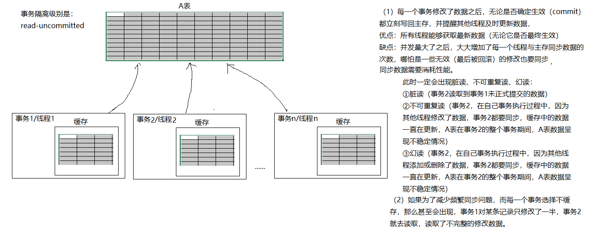
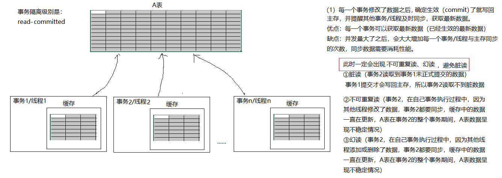
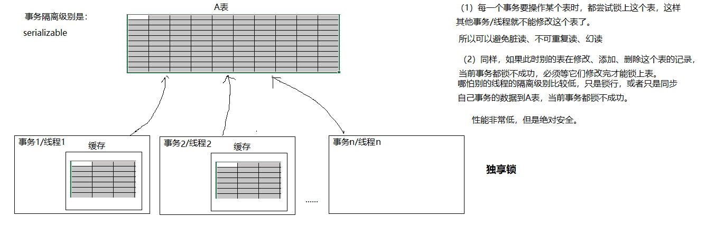

***背景**：今天在复习事务的隔离级别的时候总结了一些新的想法，之前只知道事务的隔离级别分为读未提交、读已提交、可重复读、序列化四个隔离级别，而在并发运行中，出现的隔离级别中的脏读、幻读和不可重复读的区别，以及他们的触发条件不是很清，经过了一番折腾，这里总结了一些想法。*<!--more-->

[mysql8.0官方文档]:https://dev.mysql.com/doc/refman/8.0/en/innodb-transaction-isolation-levels.html

## 1、那么究竟什么是脏读、幻读和不可重复读呢？

- 脏读：一个事务读取了另一个事务未提交数据；
- 不可重复读：同一个事务中前后两次读取同一条记录不一样。因为被其他事务修改了并且提交了。
- 幻读：一个事务读取了另一个事务新增、删除的记录情况，记录数不一样，像是出现幻觉。

##  2、什么是事务的隔离级别呢？如何查看隔离级别？(dos 命令)

事务隔离是数据库处理的基础之一。隔离是首字母缩略词 [ACID](https://dev.mysql.com/doc/refman/8.0/en/glossary.html#glos_acid)中的 I ；隔离级别是在多个事务同时进行更改和执行查询时微调性能与结果的可靠性、一致性和可再现性之间的平衡的设置。

```mysql
/*
mysql支持四个隔离级别：
read-uncommitted：会出现脏读、不可重复读、幻读
read-committed：可以避免脏读，会出现不可重复读、幻读
repeatable-read：可以避免脏读、不可重复读、幻读。但是两个事务不能操作（写update,delete）同一个行。
serializable：可以避免脏读、不可重复读、幻读。但是两个事务不能操作（写update,delete）同一个表。

修改隔离级别：
set transaction_isolation='隔离级别';  
#mysql8之前 transaction_isolation变量名是 tx_isolation

查看隔离级别：
select @@transaction_isolation; 默认为：repeatable-read可重复读
*/
```

**数据库提供的 4 种事务隔离级别：**

| 隔离级别         | 描述                                                         |
| ---------------- | ------------------------------------------------------------ |
| read-uncommitted | 允许A事务读取其他事务未提交和已提交的数据。会出现脏读、不可重复读、幻读问题 |
| read-committed   | 只允许A事务读取其他事务已提交的数据。可以避免脏读，但仍然会出现不可重复读、幻读问题 |
| repeatable-read  | 确保事务可以多次从一个字段中读取相同的值。在这个事务持续期间，禁止其他事务对这个字段进行更新。可以避免脏读和不可重复读。但是幻读问题仍然存在。注意：mysql中使用了MVCC多版本控制技术，在这个级别也可以避免幻读。 |
| serializable     | 确保事务可以从一个表中读取相同的行，相同的记录。在这个事务持续期间，禁止其他事务对该表执行插入、更新、删除操作。所有并发问题都可以避免，但性能十分低下。 |








**总结**：

1.  脏读：是在读未提交时发生的，事务A读取了事务B还未提交的数据，是一种错误。
2.  幻读：发生在读未提交、读已提交和可重复读级别都会出现，它强调的是记录数不一样，即增删的情况。事务A读取了事务B已提交的数据，发生了幻读，它不是错误。
3.  不可重复读：发生在读未提交和读已提交的隔离级别，它强调的是数据内容发生改变，即修改的情况。事务A读取了事务B已提交的数据，事务A前后两次读取同一条记录不一样，它也不是错误。

