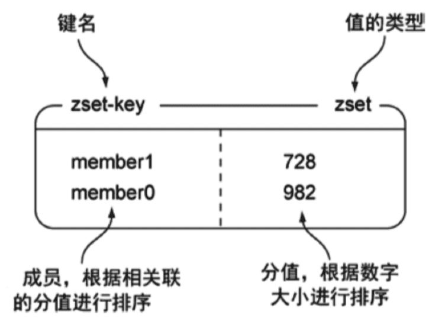
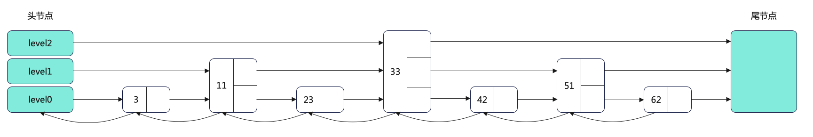
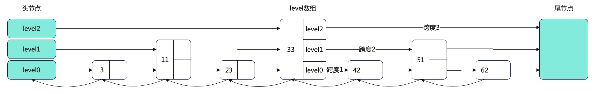
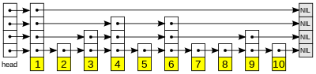

**背景**：*接着上一篇Redis五大基本命令组的使用一文，我们知道SortedSet底层是由压缩列表ziplist和跳跃表zSkiplist实现的 ，那么为什么不用红黑树实现呢？跳跃表和红黑树谁更好呢？*<!--more-->

## 一、WHERE 用在哪？

我们看到的各种网页的排行榜底层无一不是SortedSet实现的，由于自身的高性能这个有序的集合，在这一模块做出了极大的贡献。例如小说视频等网站需要对用户上传的小说视频做排行榜，榜单可以按照用户关注数，更新时间，字数等打分，做排行。

## 二、WHAT 什么是ZSet？

Redis 有序集合和集合一样也是 string 类型元素的集合,且不允许重复的成员。不同的是每个元素都会关联一个 double 类型的分数。redis 正是通过分数来为集合中的成员进行从小到大的排序。

## 三、HOW 怎么实现的？

有序集合的成员是唯一的, 但分数(score)却可以重复。有序集合是通过两种数据结构实现：

-   **压缩列表(ziplist)**: ziplist是为了提高存储效率而设计的一种特殊编码的双向链表。它可以存储字符串或者整数，存储整数时是采用整数的二进制而不是字符串形式存储。它能在O(1)的时间复杂度下完成list两端的push和pop操作。但是因为每次操作都需要重新分配ziplist的内存，所以实际复杂度和ziplist的内存使用量相关
-   **跳跃表（zSkiplist)**: 跳跃表的性能可以保证在查找，删除，添加等操作的时候在对数期望时间内完成，这个性能是可以和平衡树来相比较的，而且在实现方面比平衡树要优雅，这是采用跳跃表的主要原因。跳跃表的复杂度是O(log(n))。
-   如图：



## 四、跳跃表的实现（多层的有序链表，空间换时间）

为了满足自身的功能需要， Redis 基于 William Pugh 论文中描述的跳跃表进行了以下修改：

-   允许重复的 `score` 值：多个不同的 `member` 的 `score` 值可以相同。
-   进行对比操作时，不仅要检查 `score` 值，还要检查 `member` ：当 `score` 值可以重复时，单靠 `score` 值无法判断一个元素的身份，所以需要连 `member` 域都一并检查才行。
-   每个节点都带有一个高度为 1 层的后退指针，用于从表尾方向向表头方向迭代：当执行 [ZREVRANGE](http://redis.readthedocs.org/en/latest/sorted_set/zrevrange.html#zrevrange) 或 [ZREVRANGEBYSCORE](http://redis.readthedocs.org/en/latest/sorted_set/zrevrangebyscore.html#zrevrangebyscore) 这类以逆序处理有序集的命令时，就会用到这个属性。

下面展示的是 3 层的跳表，头节点是一个 level 数组，作为 level0~level2 的头指针



##### 1、跳表结点的结构定义：

```c
typedef struct zskiplistNode {
    // sorted set 中的元素
    sds ele;
    // 元素权重
    double score;
    // 后向指针（为了便于从跳表的尾节点倒序查找）
    struct zskiplistNode *backward;
    // 节点的 level 数组
    struct zskiplistLevel {
        // 每层上的前向指针
        struct zskiplistNode *forward;
        // 跨度，记录节点在某一层 *forward 指针和该节点，跨越了 level0 上的几个节点
        unsigned long span;
    } level[];
} zskiplistNode;
```

##### 2、跳表的定义:

```c
typedef struct zskiplist {
    // 头节点和尾节点
    struct zskiplistNode *header, *tail;
    unsigned long length;
    int level;
} zskiplist;
```



##### 3、跳表节点的查询

在查询某个节点时，跳表会从头节点的最高层开始，查找下一个节点：

-   访问下一个节点
    -   当前节点的元素权重 < 要查找的权重
    -   当前节点的元素权重 = 要查找的权重，且节点数据<要查找的数据
-   访问当前节点 level 数组的下一层指针
    -   当前节点的元素权重 > 要查找的权重

```c
//获取跳表的表头
x = zsl->header;
//从最大层数开始逐一遍历
for (i = zsl->level-1; i >= 0; i--) {
   ...
   while (x->level[i].forward && (x->level[i].forward->score < score || (x->level[i].forward->score == score 
    && sdscmp(x->level[i].forward->ele,ele) < 0))) {
      ...
      x = x->level[i].forward;
    }
    ...
}
```

层数的设置：

-   每层的节点数约是下一层节点数的一半。

1.  好处：查找时类似于二分查找，查找复杂度可以减低到 O(logN)
2.  坏处：每次插入/删除节点，都要调整后续节点层数，带来额外开销

-   随机生成每个节点的层数`。Redis 跳表采用了这种方法。

```c
// Redis 中，跳表节点层数是由 zslRandomLevel 函数决定。
int zslRandomLevel(void) {
    int level = 1;
    while ((random()&0xFFFF) < (ZSKIPLIST_P * 0xFFFF))
        level += 1;
    return (level<ZSKIPLIST_MAXLEVEL) ? level : ZSKIPLIST_MAXLEVEL;
}

......
    
// 其中每层增加的概率是 0.25，最大层数是 32。
#define ZSKIPLIST_MAXLEVEL 32 /* Should be enough for 2^64 elements */
#define ZSKIPLIST_P 0.25      /* Skiplist P = 1/4 */
```

##### 4、跳表节点的插入zslInsert

```c
zskiplistNode *zslInsert(zskiplist *zsl, double score, sds ele) {
    zskiplistNode *update[ZSKIPLIST_MAXLEVEL], *x;
    unsigned int rank[ZSKIPLIST_MAXLEVEL];
    int i, level;

    serverAssert(!isnan(score));
    x = zsl->header;
    // 从最高层的 level 开始找
    for (i = zsl->level-1; i >= 0; i--) {
        // 每层待插入的位置
        rank[i] = i == (zsl->level-1) ? 0 : rank[i+1];
        // forward.score < 待插入 score || (forward.score < 待插入 score && forward.ele < ele)
        while (x->level[i].forward &&
               (x->level[i].forward->score < score ||
                (x->level[i].forward->score == score &&
                 sdscmp(x->level[i].forward->ele, ele) < 0))) {
            // 在同一层 level 找下一个节点
            rank[i] += x->level[i].span;
            x = x->level[i].forward;
        }
        update[i] = x;
    }

    // 随机层数
    level = zslRandomLevel();

    // 如果待插入节点的随机层数 > 跳表当前的层数
    if (level > zsl->level) {
        // 增加对应的层数
        for (i = zsl->level; i < level; i++) {
            rank[i] = 0;
            update[i] = zsl->header;
            update[i]->level[i].span = zsl->length;
        }
        zsl->level = level;
    }
    // 新建节点
    x = zslCreateNode(level, score, ele);
    // 设置新建节点的 level 数组
    for (i = 0; i < level; i++) {
        x->level[i].forward = update[i]->level[i].forward;
        update[i]->level[i].forward = x;

        /* update span covered by update[i] as x is inserted here */
        x->level[i].span = update[i]->level[i].span - (rank[0] - rank[i]);
        update[i]->level[i].span = (rank[0] - rank[i]) + 1;
    }

    for (i = level; i < zsl->level; i++) {
        update[i]->level[i].span++;
    }

    x->backward = (update[0] == zsl->header) ? NULL : update[0];
    if (x->level[0].forward)
        x->level[0].forward->backward = x;
    else
        zsl->tail = x;
    zsl->length++;
    return x;
}
```

##### 5、跳表节点的删除zslDelete

```c
int zslDelete(zskiplist *zsl, double score, sds ele, zskiplistNode **node) {
    zskiplistNode *update[ZSKIPLIST_MAXLEVEL], *x;
    int i;

    x = zsl->header;
    // 找到待删除的节点
    for (i = zsl->level-1; i >= 0; i--) {
        while (x->level[i].forward &&
                (x->level[i].forward->score < score ||
                    (x->level[i].forward->score == score &&
                     sdscmp(x->level[i].forward->ele,ele) < 0)))
        {
            x = x->level[i].forward;
        }
        update[i] = x;
    }
    x = x->level[0].forward;
    // 判断节点的 score 和 ele 是否符合条件
    if (x && score == x->score && sdscmp(x->ele,ele) == 0) {
        // 删除该节点
        zslDeleteNode(zsl, x, update);
        if (!node)
            // 释放内存
            zslFreeNode(x);
        else
            *node = x;
        return 1;
    }
    return 0; /* not found */
}

```

##### 6、SortedSet基本操作

首先看下如何创建跳表，代码在 object.c 中，可以看到会调用 dictCreate 函数创建哈希表，之后调用 zslCreate 函数创建跳表。

```c
robj *createZsetObject(void) {
    zset *zs = zmalloc(sizeof(*zs));
    robj *o;

    zs->dict = dictCreate(&zsetDictType,NULL);
    zs->zsl = zslCreate();
    o = createObject(OBJ_ZSET,zs);
    o->encoding = OBJ_ENCODING_SKIPLIST;
    return o;
}
```

哈希表和跳表的数据必须保持一致

## 五、什么是红黑树呢？

红黑树是AVL树的优化，红黑树通过一些着色法则确保没有一条路径会比其它路径长出两倍，因而达到接近平衡的目的。所谓红黑树，不仅是一个二叉搜索树，而且必须满足一下规则：

1.  每个节点不是红色就是黑色
2.  不可能有连在一起的红色节点
3.  根节点都是黑色
4.  每个红色结点的两个子节点都是黑色的，叶子节点都是黑色的
5.  从任一节点到其每个叶子的所有路径都包含相同数目的黑色节点。

## 六、那么 为什么Sorted底层会选择跳表而不是红黑树呢？

-   **从内存占用上来比较，跳表比平衡树更灵活一些**。平衡树每个节点包含 2 个指针（分别指向左右子树），而跳表每个节点包含的指针数目平均为 1/(1-p)，具体取决于参数 p 的大小。如果像 Redis里的实现一样，取 p=1/4，那么平均每个节点包含 1.33 个指针，比平衡树更有优势。
-   **在做范围查找的时候，跳表比平衡树操作要简单**。在平衡树上，我们找到指定范围的小值之后，还需要以**中序遍历**的顺序继续寻找其它不超过大值的节点。如果不对平衡树进行一定的改造，这里的中序遍历并不容易实现。而在跳表上进行范围查找就非常简单，只需要在找到小值之后，对第 1 层链表进行若干步的遍历就可以实现。
-   **从算法实现难度上来比较，跳表比平衡树要简单得多**。平衡树的插入和删除操作可能**引发子树的调整**，逻辑复杂，而跳表的插入和删除只需要修改相邻节点的指针，操作简单又快速。



-   红黑树：插入、查找为O(logn)，但常数项较小；无锁实现的复杂性很高，一般需要加锁；数据天然有序。
-   SkipList：插入、查找为O(logn)，但常数项比红黑树要大；底层结构为链表，可无锁实现；数据天然有序。

## 总结

1.  跳跃表是一种随机化数据结构，查找、添加、删除操作都可以在对数期望时间下完成，维持结构平衡的成本比较低，完全依靠随机。(Redis 中，跳表节点层数是由 zslRandomLevel 函数决定。)
2.  跳跃表目前在 Redis 的唯一作用，就是作为有序集类型的底层数据结构之一（另一个构成有序集的结构是字典）。
3.  跳表不用考虑中序遍历以及子树分支调整等问题，更加灵活，实现简单。
4.  跳表的应用场景：HBase MemStore 内部存储数据，redis的zset和levelDB存储结构采用的也是skiplist。
5.  红黑树的应用场景：linux内核的红黑树算法，IO多路复用epoll的实现采用红黑树组织管理sockfd，以支持快速的增删改查，ngnix中,用红黑树管理timer,因为红黑树是有序的,可以很快的得到距离当前最小的定时器，java中TreeMap，jdk1.8的hashmap的实现.
6.  b+树的应用场景：B/B+树是为了磁盘或其它存储设备而设计的一种平衡多路查找树(相对于二叉,B树每个内节点有多个分支),与红黑树相比,在相同的的节点的情况下,一颗B/B+树的高度远远小于红黑树的高度(在下面B/B+树的性能分析中会提到).B/B+树上操作的时间通常由存取磁盘的时间和CPU计算时间这两部分构成,而CPU的速度非常快,所以B树的操作效率取决于访问磁盘的次数,关键字总数相同的情况下B树的高度越小，磁盘I/O所花的时间越少.
