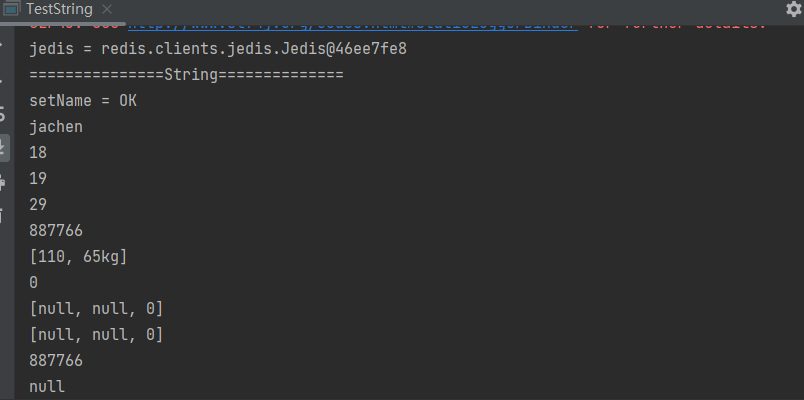
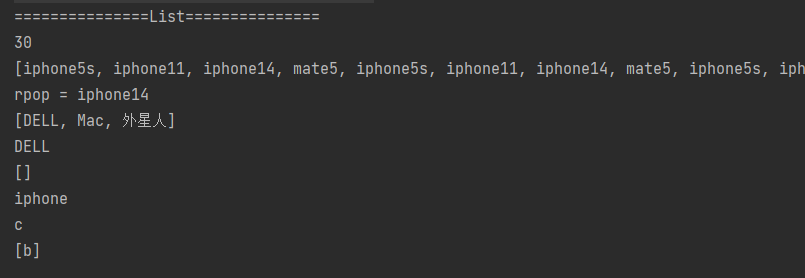
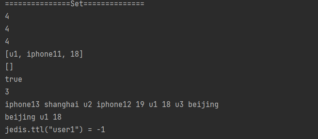
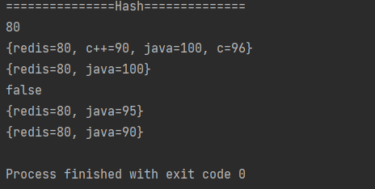
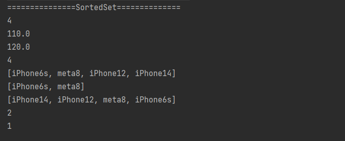

为了加深对原生redis命令的认识，我又手写了边通过jedis调用原生redis API 的实操，<!--more-->*Redis命令十分丰富，包括的命令组有Cluster、Connection、Geo、Hashes、HyperLogLog、Keys、Lists、Pub/Sub、Scripting、Server、Sets、Sorted Sets、Strings、Transactions一共14个redis命令组两百多个redis命令，Redis中文命令大全。您可以通过下面的检索功能快速查找命令，已下是全部已知的redis命令列表。如果您有兴趣的话也可以查看我们的[网站结构图](http://www.redis.cn/map.html),它以节点图的形式展示了所有redis命令。*

Redis官网：https://redis.io/

## 一、使用Java操作Redis方式

1、Jedis

```tex
Jedis 是直连模式，在多个线程间共享一个 Jedis 实例时是线程不安全的,需要使用连接池

其API提供了比较全面的Redis命令的支持，相比于其他Redis 封装框架更加原生

Jedis中的方法调用是比较底层的暴露的Redis的API，Java方法基本和Redis的API保持着一致

使用阻塞的I/O，方法调用同步，程序流需要等到socket处理完I/O才能执行，不支持异步操作
```

2、Lettuce

```
高级Redis客户端，用于线程安全同步，异步响应

基于Netty的的事件驱动，可以在多个线程间并发访问, 通过异步的方式可以更好的利用系统资源
```

我就用Jedis操作了.....

## 二、亲笔演练Redis五大常用命令组

1、使用连接池

```java
package space.jachen.jedis;

import redis.clients.jedis.Jedis;
import redis.clients.jedis.JedisPool;
import redis.clients.jedis.JedisPoolConfig;

/**
 *
 * TODO： 测试jedis与redis建立连接  使用线程池
 *
 * @author JaChen
 * @date 2022/12/10 15:37
 */
public class Test2 {


    public static void main(String[] args) {

        // 建立连接池配置信息
        JedisPoolConfig poolConfig = new JedisPoolConfig();
        poolConfig.setMaxTotal(200);
        poolConfig.setMaxIdle(32);
        poolConfig.setMaxWaitMillis(10*100);
        poolConfig.setBlockWhenExhausted(true);
        poolConfig.setTestOnBorrow(true);

        // 创建一个连接池
        JedisPool pool = new JedisPool(poolConfig, "192.168.253.128", 6379);

        // 从连接池获取一个现成的连接
        Jedis jedis = pool.getResource();
        System.out.println("jedis = " + jedis);

        // 不使用的时候放回连接池
        jedis.close();


    }


}
```

2、操作String

```java
package space.jachen.jedis;

import redis.clients.jedis.Jedis;
import redis.clients.jedis.JedisPool;
import redis.clients.jedis.JedisPoolConfig;

/**
 *
 * @author JaChen
 * @date 2022/12/10 15:41
 */
public class TestString {


    public static void main(String[] args) {

        // 1、建立连接池配置信息
        JedisPoolConfig poolConfig = new JedisPoolConfig();
        poolConfig.setMaxTotal(200);
        poolConfig.setMaxIdle(32);
        poolConfig.setMaxWaitMillis(10*100);
        poolConfig.setBlockWhenExhausted(true);
        poolConfig.setTestOnBorrow(true);

        // 2、创建一个连接池
        JedisPool pool = new JedisPool(poolConfig, "192.168.253.128", 6379);

        // 3、从连接池获取一个现成的连接
        Jedis jedis = pool.getResource();
        System.out.println("jedis = " + jedis);

        // 4、操作String
        System.out.println("===============String==============");
        // TODO：存储字符串的类型，key-value
        //  notice:
        //  1、值的长度不能超过512 MB
        //  2、key命名规范，不要过长，冒号分割，业务名:表名:ID

        // TODO: 应用 ：
        //  1、验证码
        //  2、计时器、发号器
        //  3、重复订单提交令牌
        //  4、热点商品卡片(序列化对象存储)
        //  5、分布式锁
        String setName = jedis.set("name", "jachen");
        System.out.println("setName = " + setName);
        System.out.println(jedis.get("name"));

        jedis.set("age","18");
        System.out.println(jedis.get("age"));

        // incr 对应 的值 进行加1操作，并返回新值。
        jedis.incr("age");
        System.out.println(jedis.get("age"));

        // 将key对应的数字加increment。(如果key不存在，操作之前，key会被置为零。)
        jedis.incrBy("age",10);
        System.out.println(jedis.get("age"));

        jedis.set("cart","887766");
        System.out.println(jedis.get("cart"));

        // 批量设置或获取多个key的值
        jedis.mset("tell", "110", "weight", "65kg");
        System.out.println(jedis.mget("tell","weight"));

        jedis.setnx("sex","0");
        System.out.println(jedis.get("sex"));

        // 原子性操作
        // 将key设置值为value，如果key不存在等同SET命令。
        jedis.msetnx("k1","v1","k2","v2","sex","0");
        System.out.println(jedis.mget("k1","k2","sex"));

        // 当key存在时什么也不做,  是set if not exists的简写。
        jedis.msetnx("k1","v1","k2","v2","sex","1");
        System.out.println(jedis.mget("k1","k2","sex"));

        // 设置key对应字符串value，
        // 并且设置key在给定的seconds时间之后超时过期,原子操作
        jedis.setex("car",2,"887766");
        System.out.println(jedis.get("car"));
        try {
            Thread.sleep(3000);
        } catch (InterruptedException e) {
            throw new RuntimeException(e);
        }
        System.out.println(jedis.get("car"));

        // 5、不使用的时候放回连接池
        jedis.close();

    }
}

```

运行结果：



3、操作List

```java
package space.jachen.jedis;

import redis.clients.jedis.Jedis;

import java.util.List;

/**
 * @author JaChen
 * @date 2022/12/10 21:05
 */
public class TestList {

    public static void main(String[] args) {


        // 1、获取一个Jedis连接
        Jedis jedis = new Jedis("192.168.253.128",6379);

        // 2、操作List
        // TODO: 字符串列表，按照插入顺序排序
        //  存储结构：双向链表，插入删除时间复杂度O(1)快,查找为O(n)慢
        //  notice：
        //  1、通常添加一个元素到列表的头部（左边）或者尾部（右边）
        //  2、存储的都是string字符串类型
        //  3、支持分页操作，高并发项目中，第一页数据都是来源list，第二页和更多信息则是通过数据库加载
        //  4、一个列表最多可以包含 232 - 1 个元素 (4294967295, 每个列表不超过40亿个元素)

        // TODO: 应用：
        //  1、简单队列
        //  2、最新评论列表
        //  3、非实时排行榜：定时计算榜单，如手机日销榜单
        System.out.println("===============List===============");

        // ① 将一个或多个值插入到列表头部  key value1 [value2]
        jedis.lpush("phone","mate5","iphone14","iphone11","iphone5s");
        System.out.println(jedis.llen("phone"));
        System.out.println(jedis.lrange("phone",0,-1));

        // ② 移除并获取列表最后一个元素
        String rpop = jedis.rpop("phone");
        System.out.println("rpop = " + rpop);

        // ③ 在key对应的list的尾部添加一个元素
        jedis.rpush("netbook","DELL","Mac","外星人");
        System.out.println(jedis.lrange("netbook",0,-1));

        // ④ 从key对应的list的尾部删除一个元素，并返回该元素
        System.out.println(jedis.lpop("netbook"));

        // ⑤ 移出并获取列表的最后一个元素，
        // 如果列表没有元素会阻塞列表直到等待超时或发现可弹出元素为止
        // BRPOP LIST1 LIST2 .. LISTN TIMEOUT
        jedis.del("netbook","iphone");
        System.out.println(jedis.lrange("iphone",0,-1));
        jedis.rpush("iphone","a","b","c");
        List<String> list = jedis.brpop("iphone", "netbook", "1");
        for (String s : list) {
            System.out.println(s);
        }

        // ⑥ 移除元素,可以指定移除个数
        jedis.lrem("iphone",1,"a");
        System.out.println(jedis.lrange("iphone",0,-1));

        // 3、关闭连接
        jedis.close();

    }

}

```

运行结果：



4、操作Set

```java
package space.jachen.jedis;

import redis.clients.jedis.Jedis;

import java.util.List;
import java.util.Set;

/**
 * @author JaChen
 * @date 2022/12/10 21:40
 */
public class TestSet {


    public static void main(String[] args) {

        // 1、获取一个Jedis连接
        Jedis jedis = new Jedis("192.168.253.128",6379);

        // TODO: 将一个或多个成员元素加入到集合中，已经存在于集合的成员元素将被忽略
        //  notice: 集合是通过哈希表实现的

        // TODO: 应用：
        //  1、去重
        //  2、社交应用关注、粉丝、共同好友
        //  3、统计网站的PV、UV、IP
        //  4、大数据里面的用户画像标签集合
        // 2、操作Set
        System.out.println("===============Set==============");

        // ① 添加一个或多个指定的member元素到集合的 key中.
        // 指定的一个或者多个元素member 如果已经在集合key中存在则忽略
        jedis.sadd("user1","u1","beijing","18","iphone11");
        jedis.sadd("user2","u2","shanghai","19","iphone12");
        jedis.sadd("user3","u3","beijing","19","iphone13");

        // ② 返回集合存储的key的基数 (集合元素的数量).
        System.out.println(jedis.scard("user1"));
        System.out.println(jedis.scard("user2"));
        System.out.println(jedis.scard("user3"));

        // ③ 返回的集合元素是第一个key的集合与后面所有key的集合的差集
        System.out.println(jedis.sdiff("user1", "user2", "user3"));

        // ④ 返回指定所有的集合的成员的交集.
        System.out.println(jedis.sinter("user1", "user2"));

        // ⑤ 返回成员 member 是否是存储的集合 key的成员.
        System.out.println(jedis.sismember("user1","beijing"));

        // ⑥ 在key集合中移除指定的元素. 如果指定的元素不是key集合中的元素则忽略
        jedis.srem("user1","iphone11");
        System.out.println(jedis.scard("user1"));

        // ⑦ 返回给定的多个集合的并集中的所有成员.
        Set<String> sunion = jedis.sunion("user1", "user2", "user3");
        for (String s : sunion) {
            System.out.print(s + " ");
        }
        System.out.println();

        // ⑧ 返回key集合所有的元素.
        Set<String> user1 = jedis.smembers("user1");
        for (String s : user1) {
            System.out.print(s + " ");
        }

        // key的存活时间
        System.out.println("\njedis.ttl(\"user1\") = " + jedis.ttl("user1"));

        // 3、关闭连接
        jedis.close();

    }
}

```

运行结果：



5、操作Hash

```java
package space.jachen.jedis;

import redis.clients.jedis.Jedis;

import java.util.HashMap;

/**
 * @author JaChen
 * @date 2022/12/10 22:03
 */
public class TestHash {

    public static void main(String[] args) {


        // 1、获取一个Jedis连接
        Jedis jedis = new Jedis("192.168.253.128",6379);


        // 2、Hash操作
        // TODO：string类型的field和value的映射表，hash特别适合用于存储对象
        //  notice：每个 hash 可以存储 232 - 1 键值对（40多亿）

        // TODO：应用:
        //  1、购物车
        //  2、用户个人信息
        //  3、商品详情
        System.out.println("===============Hash==============");

        // ① 设置 key 指定的哈希集中指定字段的值
        jedis.hset("class","redis","80");
        System.out.println(jedis.hget("class","redis"));

        HashMap<String, String> hashMap = new HashMap<>();
        hashMap.put("java","100");
        hashMap.put("c++","90");
        hashMap.put("c","96");
        jedis.hmset("class",hashMap);
        // ② 返回 key 指定的哈希集中所有的字段和值
        System.out.println(jedis.hgetAll("class"));

        // ③ 从 key 指定的哈希集中移除指定的域
        jedis.hdel("class","c","c++");
        System.out.println(jedis.hgetAll("class"));
        // ④ 返回hash里面field是否存在
        System.out.println(jedis.hexists("class","c"));

        // ⑤ 增加 key 指定的哈希集中指定字段的数值,  如果是-1 则是递减
        // HINCRBY key field increment
        jedis.hincrBy("class","java",-5);
        System.out.println(jedis.hgetAll("class"));
        jedis.hincrBy("class","java",-5);
        System.out.println(jedis.hgetAll("class"));

        // 3、关闭Jedis连接
        jedis.close();

    }

}

```

运行结果：



6、操作SortedSet

```java
package space.jachen.jedis;

import redis.clients.jedis.Jedis;

import java.util.HashMap;

/**
 * @author JaChen
 * @date 2022/12/10 22:36
 */
public class TestSortedSet {

    public static void main(String[] args) {

        // 1、获取一个Jedis连接
        Jedis jedis = new Jedis("192.168.253.128",6379);


        // 2、操作SortedSet 可叫zSet
        // TODO:
        //  1、有序集合可以看做是在Set集合的的基础上为集合中的每个元素维护了一个顺序值: score,
        //  它允许集合中的元素可以按照score进行排序
        //  2、如果某个成员已经是有序集的成员，
        //  那么更新这个成员的分数值，分数值可以是整数值或双精度浮点数。
        //  3、用于将一个或多个成员元素及其分数值加入到有序集当中
        //  notice:
        //  1、底层使用到了Ziplist压缩列表和“跳跃表”两种存储结构
        //  2、如果重复添加相同的数据，score值将被反复覆盖，保留最后一次修改的结果

        // TODO：
        //  应用：
        //  1、实时排行榜：商品热销榜、体育类应用热门球队、积分榜
        //  2、优先级任务、队列
        //  3、朋友圈 文章点赞-取消，逻辑：用户只能点赞或取消，
        //  统计一篇文章被点赞了多少次，可以直接取里面有多少个成员
        System.out.println("===============SortedSet==============");

        // ① 向有序集合添加一个或多个成员，或者更新已存在成员的分数
        jedis.zadd("goods",100,"iPhone14");

        // ② 获取有序集合的成员数
        System.out.println(jedis.zcard("goods"));

        // ③ 有序集合中对指定成员的分数加上增量 increment
        jedis.zincrby("goods",10,"iPhone14");
        System.out.println(jedis.zscore("goods","iPhone14"));
        jedis.zincrby("goods",10,"iPhone14");
        System.out.println(jedis.zscore("goods","iPhone14"));

        HashMap<String, Double> hashMap = new HashMap<>();
        hashMap.put("meta8",60D);
        hashMap.put("iPhone12",101D);
        hashMap.put("iPhone6s",30D);
        jedis.zadd("goods",hashMap);
        // ④ 计算在有序集合中指定区间分数的成员数
        System.out.println(jedis.zcount("goods",10,150));
        // ⑤ 通过索引区间返回有序集合指定区间内的成员, 成员的位置按分数值递增(从小到大)来排序
        System.out.println(jedis.zrange("goods",0,-1));
        // 根据score正序输出
        System.out.println(jedis.zrangeByScore("goods",0D,100));
        // ⑥ 通过索引区间返回有序集合指定区间内的成员, 成员的位置按分数值递增(从大到小)来排序
        System.out.println(jedis.zrevrange("goods",0,-1));
        // ⑦ 返回有序集合中指定成员的排名，有序集成员按分数值递减(从大到小)排序
        System.out.println(jedis.zrevrank("goods","meta8"));
        // ⑧ 返回有序集key中成员member的排名。其中有序集成员按score值递增(从小到大)顺序排列
        System.out.println(jedis.zrank("goods","meta8"));


        // 3、 关闭jedis连接
        jedis.close();


    }
}

```

运行结果：



## 总结

除了要了解这些数据结构的常用场景之前，还有继续加深对他们底层实现的了解，比如SortedSet底层为什么要使用跳跃表呢？为什么使用红黑树等等。
