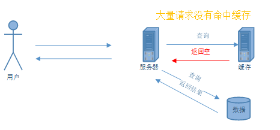
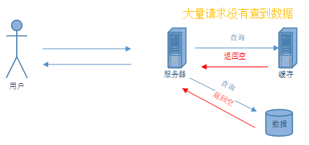
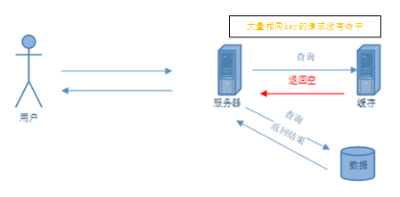

---
<!-- truncate -->
<!-- truncate -->
<!-- truncate -->
slug: talk-about-redis-cache-exceptions-and-solutions
title: Redis缓存常见异常及解决方案
authors: [jiguanchen]
tags: [zhongjianjian,redis]
---

**背景**：*Redis是一种流行的内存数据结构存储，广泛用作数据库、缓存和消息代理。Redis 主要用来做缓存使用，在提高数据查询效率、保护数据库等方面起到了关键性的作用，很大程度上提高系统的性能。当然在使用过程中，也会出现一些异常情景，导致 Redis 失去缓存作用。*<!--more-->

## Redis常见应用

1.  缓存：Redis通常用作缓存，以存储常用数据，以减少数据库查询次数。
2.  会话管理：Redis用于存储Web应用程序中的用户会话数据。
3.  实时分析：Redis用于处理和分析大量的实时数据。
4.  队列管理：Redis用于实现消息队列，以异步分发和处理任务。
5.  排行榜和计数：Redis用于维护游戏、社交媒体和其他应用中项目的实时排名和计数。
6.  发布/订阅消息：Redis支持发布/订阅消息模式，并用于实时聊天和通知系统。

## Redis常见缓存异常

缓存雪崩 缓存穿透 缓存击穿

### 1、缓存雪崩

#### 1.1现象

-   发生在缓存数据在同一时刻大量失效，比如缓存数据的过期时间设置为同一时刻。
-   由于缓存中的数据失效，大量的请求直接请求后端数据，导致系统请求量瞬间增加，造成系统压力过大，从而宕机。



#### 1.2原因

-   缓存服务不可用。
-   缓存服务可用，但是大量 KEY 同时失效。

#### 1.3解决方案

1.   缓存服务不可用
     redis 的部署方式主要有单机、主从、哨兵和 cluster 模式。

-   单机
    只有一台机器，所有数据都存在这台机器上，当机器出现异常时，redis 将失效，可能会导致 redis 缓存雪崩。
-   主从
    主从其实就是一台机器做主，一个或多个机器做从，从节点从主节点复制数据，可以实现读写分离，主节点做写，从节点做读。
    优点：当某个从节点异常时，不影响使用。
    缺点：当主节点异常时，服务将不可用。
-   哨兵
    哨兵模式也是一种主从，只不过增加了哨兵的功能，用于监控主节点的状态，当主节点宕机之后会进行投票在从节点中重新选出主节点。
    优点：高可用，当主节点异常时，自动在从节点当中选择一个主节点。
    缺点：只有一个主节点，当数据比较多时，主节点压力会很大。
-   cluster 模式
    集群采用了多主多从，按照一定的规则进行分片，将数据分别存储，一定程度上解决了哨兵模式下单机存储有限的问题。
    优点：高可用，配置了多主多从，可以使数据分区，去中心化，减小了单台机子的负担.
    缺点：机器资源使用比较多，配置复杂。
-   小结
    从高可用得角度考虑，使用哨兵模式和 cluster 模式可以防止因为 redis 不可用导致的缓存雪崩问题。

2.   大量 KEY 同时失效
     可以通过设置永不失效、设置不同失效时间、使用二级缓存和定时更新缓存失效时间

-   设置永不失效
    如果所有的 key 都设置不失效，不就不会出现因为 KEY 失效导致的缓存雪崩问题了。redis 设置 key 永远有效的命令如下：
    PERSIST key
    缺点：会导致 redis 的空间资源需求变大。
-   设置随机失效时间
    如果 key 的失效时间不相同，就不会在同一时刻失效，这样就不会出现大量访问数据库的情况。
    redis 设置 key 有效时间命令如下：
    Expire key
    示例代码如下，通过 RedisClient 实现

```java
/**
* 随机设置小于30分钟的失效时间
* @param redisKey
* @param value
*/
private void setRandomTimeForReidsKey(String redisKey,String value){
//随机函数
Random rand = new Random();
//随机获取30分钟内（30*60）的随机数
int times = rand.nextInt(1800);
//设置缓存时间（缓存的key,缓存的值，失效时间：单位秒）
redisClient.setNxEx(redisKey,value,times);
}
```

-   使用二级缓存
    二级缓存是使用两组缓存，1 级缓存和 2 级缓存，同一个 Key 在两组缓存里都保存，但是他们的失效时间不同，这样 1 级缓存没有查到数据时，可以在二级缓存里查询，不会直接访问数据库。
    示例代码如下：

```java
public static void main(String[] args) {
CacheTest test = new CacheTest();
//从1级缓存中获取数据
String value = test.queryByOneCacheKey("key");
//如果1级缓存中没有数据，再二级缓存中查找
if(StringUtils.isBlank(value)){
value = test.queryBySecondCacheKey("key");
//如果二级缓存中没有，从数据库中查找
if(StringUtils.isBlank(value)){
value =test.getFromDb();
//如果数据库中也没有，就返回空
if(StringUtils.isBlank(value)){
System.out.println("数据不存在!");
}else{
//二级缓存中保存数据
test.secondCacheSave("key",value);
//一级缓存中保存数据
test.oneCacheSave("key",value);
System.out.println("数据库中返回数据!");
}
}else{
//一级缓存中保存数据
test.oneCacheSave("key",value);
System.out.println("二级缓存中返回数据!");
}
}else {
System.out.println("一级缓存中返回数据!");
}
}
```

-   异步更新缓存时间

    每次访问缓存时，启动一个线程或者建立一个异步任务来，更新缓存时间。

    示例代码如下：

```java
public class CacheRunnable implements Runnable {

private ClusterRedisClientAdapter redisClient;
/**
* 要更新的key
*/
public String key;

public CacheRunnable(String key){
this.key =key;
}

@Override
public void run() {
//更细缓存时间
redisClient.expire(this.getKey(),1800);
}

public String getKey() {
return key;
}

public void setKey(String key) {
this.key = key;
}
}
public static void main(String[] args) {
CacheTest test = new CacheTest();
//从缓存中获取数据
String value = test.getFromCache("key");
if(StringUtils.isBlank(value)){
//从数据库中获取数据
value = test.getFromDb("key");
//将数据放在缓存中
test.oneCacheSave("key",value);
//返回数据
System.out.println("返回数据");
}else{
//异步任务更新缓存
CacheRunnable runnable = new CacheRunnable("key");
runnable.run();
//返回数据
System.out.println("返回数据");
}
}
```

### 2、缓存穿透

#### 2.1现象

-   发生在请求的数据不存在于缓存，但是请求依然会到达后端服务器。
-   由于请求的数据不存在，每次请求都会到达后端服务器，导致大量的无效请求，增加了后端的压力。



#### 2.2异常原因

-   非法调用

#### 2.3解决方案

1.  对于不存在的数据设置一个空值，设置有效期
2.  对请求数据做限流
3.  哈希/布隆过滤器预处理
4.  使用布尔值进行标识（例如：0或1）表示数据是否存在
5.  双重检查机制（Cache Aside Pattern）

*TODO 这里只写了第一种解决方案，剩下的以后补充...*

-   缓存空值
    当缓存和数据库中都没有值时，可以在缓存中存放一个空值，这样就可以减少重复查询空值引起的系统压力增大，从而优化了缓存穿透问题。
    示例代码如下：

```java
private String queryMessager(String key){
//从缓存中获取数据
String message = getFromCache(key);
//如果缓存中没有 从数据库中查找
if(StringUtils.isBlank(message)){
message = getFromDb(key);
//如果数据库中也没有数据 就设置短时间的缓存
if(StringUtils.isBlank(message)){
//设置缓存时间（缓存的key,缓存的值，失效时间：单位秒）
redisClient.setNxEx(key,null,60);
}else{
redisClient.setNxEx(key,message,1800);
}
}
return message;
}
```

缺点：大量的空缓存导致资源的浪费，也有可能导致缓存和数据库中的数据不一致。

### 3、缓存击穿

#### 3.1现象

当一个高流量的请求访问同一个缓存数据时，如果该数据的缓存失效，那么所有的请求都会直接请求数据库，造成数据库压力过大。

与缓存穿透区别：缓存击穿是因为某个数据被大量请求，导致其缓存失效，从而打击数据库；缓存穿透是因为请求了不存在的数据，导致所有请求都需要访问数据库。



#### 3.2异常原因

-   热点 KEY 失效的同时，大量**相同** KEY 请求同时访问。

#### 3.3解决方案

1.  加锁机制：对于特定的数据请求加锁，避免大量请求造成的缓存失效。
2.  分布式锁：使用分布式锁来确保对特定数据的更新操作是原子性的。
3.  后备机制：在缓存失效时使用后备机制，保证缓存请求能够得到响应。
4.  限流机制：对请求数据进行限流，防止大量请求造成的压力。
5.  对于过期的数据进行异步删除：避免因数据过期导致的缓存击穿。

-   分布式锁

    使用分布式锁，同一时间只有 1 个请求可以访问到数据库，其他请求等待一段时间后，重复调用。

    示例代码如下

```java
/**
* 根据key获取数据
* @param key
* @return
* @throws InterruptedException
*/
public String queryForMessage(String key) throws InterruptedException {
//初始化返回结果
String result = StringUtils.EMPTY;
//从缓存中获取数据
result = queryByOneCacheKey(key);
//如果缓存中有数据，直接返回
if(StringUtils.isNotBlank(result)){
return result;
}else{
//获取分布式锁
if(lockByBusiness(key)){
//从数据库中获取数据
result = getFromDb(key);
//如果数据库中有数据，就加在缓存中
if(StringUtils.isNotBlank(result)){
oneCacheSave(key,result);
}
}else {
//如果没有获取到分布式锁，睡眠一下，再接着查询数据
Thread.sleep(500);
return queryForMessage(key);
}
}
return result;
}
```

还可以预先设置热门数据，通过一些监控方法，及时收集热点数据，将数据预先保存在缓存中。

总结：

-   缓存雪崩是因为缓存数据的失效导致的请求增加，造成系统压力过大，宕机。
-   缓存穿透是因为请求的数据不存在，导致请求直接到达后端，增加了后端的压力。
-   缓存击穿是因为某个数据被大量请求，导致其缓存失效，从而打击数据库。


## 其他常见的Redis错误及其解决方法：

1.  连接被拒绝：当Redis没有运行或防火墙阻止了连接时会发生此错误。解决方案：检查Redis是否正在运行，如果防火墙阻止了连接，请为Redis添加一个例外。
2.  达到最大客户端数：当太多客户端试图同时连接到Redis时会发生此错误。解决方案：增加Redis配置文件中的maxclients设置，或添加更多的Redis实例。
3.  内存不足：当Redis的内存用尽时会发生此错误。解决方案：减小存储在Redis中的数据的大小，为服务器添加更多内存，或使用Redis的逐出策略自动删除最近最少使用的项目。
4.  语法错误：当命令以错误的语法发送到Redis时会发生此错误。解决方案：检查命令的语法，然后重试。
5.  未找到键：当尝试检索不存在的键的值时会发生此错误。解决方案：使用EXISTS命令在尝试检索其值之前检查键是否存在。
6.  将数据加载到内存：当Redis从磁盘重新加载数据到内存时会发生此错误。解决方案：等待重新加载完成，或增加Redis配置文件中的保存间隔。
