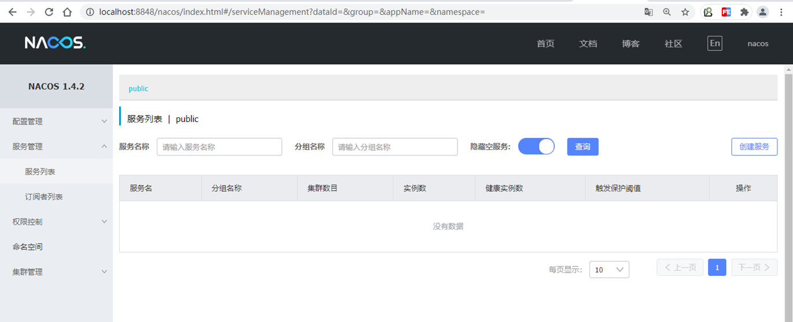
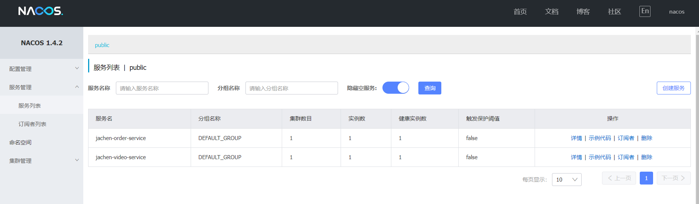
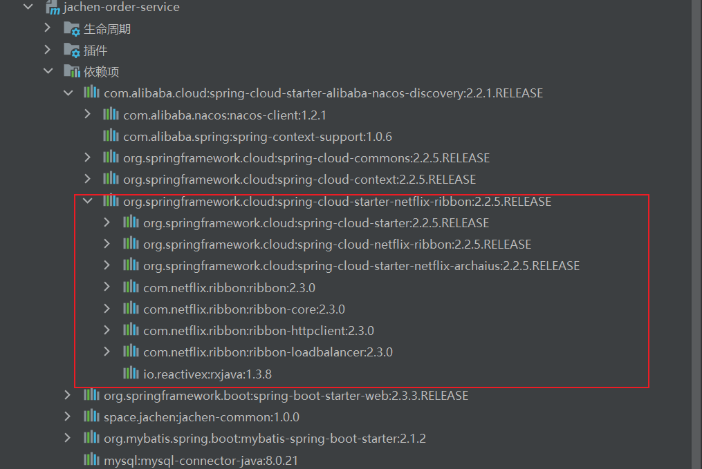

**背景**：*Nacos官网这样介绍自己：一个更易于构建云原生应用的动态服务发现、配置管理和服务管理平台。那么它到底是什么？它是怎么使用的呢？它的出现帮助我们解决了哪些问题？这是本文探究的重点。*<!--more-->

Nacos官方文档：https://nacos.io/zh-cn/docs/what-is-nacos.html。

## Nacos到底是什么？

Nacos就是注册中心+配置中心的组合（Nacos = Eureka+Config+Bus）

Nacos 的关键特性包括:

-   **服务发现和服务健康监测**

    Nacos 支持基于 DNS 和基于 RPC 的服务发现。服务提供者使用 [原生SDK](https://nacos.io/zh-cn/docs/sdk.html)、[OpenAPI](https://nacos.io/zh-cn/docs/open-api.html)、或一个[独立的Agent TODO](https://nacos.io/zh-cn/docs/other-language.html)注册 Service 后，服务消费者可以使用[DNS TODO](https://nacos.io/zh-cn/docs/xx) 或[HTTP&API](https://nacos.io/zh-cn/docs/open-api.html)查找和发现服务。

    Nacos 提供对服务的实时的健康检查，阻止向不健康的主机或服务实例发送请求。Nacos 支持传输层 (PING 或 TCP)和应用层 (如 HTTP、MySQL、用户自定义）的健康检查。 对于复杂的云环境和网络拓扑环境中（如 VPC、边缘网络等）服务的健康检查，Nacos 提供了 agent 上报模式和服务端主动检测2种健康检查模式。Nacos 还提供了统一的健康检查仪表盘，帮助您根据健康状态管理服务的可用性及流量。

-   **动态配置服务**

    动态配置服务可以让您以中心化、外部化和动态化的方式管理所有环境的应用配置和服务配置。

    动态配置消除了配置变更时重新部署应用和服务的需要，让配置管理变得更加高效和敏捷。

    配置中心化管理让实现无状态服务变得更简单，让服务按需弹性扩展变得更容易。

    Nacos 提供了一个简洁易用的UI ([控制台样例 Demo](http://console.nacos.io/nacos/index.html)) 帮助您管理所有的服务和应用的配置。Nacos 还提供包括配置版本跟踪、金丝雀发布、一键回滚配置以及客户端配置更新状态跟踪在内的一系列开箱即用的配置管理特性，帮助您更安全地在生产环境中管理配置变更和降低配置变更带来的风险。

-   **动态 DNS 服务**

    动态 DNS 服务支持权重路由，让您更容易地实现中间层负载均衡、更灵活的路由策略、流量控制以及数据中心内网的简单DNS解析服务。动态DNS服务还能让您更容易地实现以 DNS 协议为基础的服务发现，以帮助您消除耦合到厂商私有服务发现 API 上的风险。

    Nacos 提供了一些简单的 [DNS APIs TODO](https://nacos.io/zh-cn/docs/xx) 帮助您管理服务的关联域名和可用的 IP:PORT 列表.

-   **服务及其元数据管理**

    Nacos 能让您从微服务平台建设的视角管理数据中心的所有服务及元数据，包括管理服务的描述、生命周期、服务的静态依赖分析、服务的健康状态、服务的流量管理、路由及安全策略、服务的 SLA 以及最首要的 metrics 统计数据。

据说nacos在阿里巴巴内部有超过10万的实例运行，已经过了类似双十一等各种大型流量的考验.....

*举个简单的例子 现在有一个Order订单的服务要去远程调用Video视频的服务完成下单操作。* 

OrderController类：

```java
/**
 * @author JaChen
 * @date 2023/1/31 17:26
 */
@RestController
@RequestMapping("api/v1/order")
public class OrderController {

    @Autowired
    RestTemplate restTemplate;

    /**
     * 下单的方法
     * @param id
     * @return
     */
    @GetMapping("/save/{id}")
    public Object save(@PathVariable Integer id){
        Video v = restTemplate
            // 这里路径是写死的 如果ip变了 我们每次都要更改源码
                .getForObject("http://127.0.0.1:9000/api/v1/video/getById/"
                        + id, Video.class);
        if (v != null) {
            VideoOrder.builder()
                    .videoId(v.getId())
                    .videoTitle(v.getTitle())
                    .createTime(new Date());
        }else {
            return ResponseUtil.resultMap(false,444,"下单失败");
        }
        return ResponseUtil.resultMap(true,200,"下单成功"
                ,VideoOrder.VideoOrderBuilder.class);
    }
}
```

VideoController类

```java
**
 * @author JaChen
 * @date 2023/1/31 16:21
 */
@RestController
@RequestMapping("api/v1/video")
public class VideoController {

    @Autowired
    VideoService videoService;

    @GetMapping("getById/{id}")
    public Object getById(@PathVariable Integer id){

        Video video = videoService.getById(id);

        return ResponseUtil.resultMap(true,200,"查询成功",video);
    }
}
```

当Order服务去调用Video服务的时候，.getForObject("http://127.0.0.1:9000/api/v1/video/getById/"+id, Video.class);这里路径是写死的 ，如果服务的ip换了或者新增其他服务 ，需要我们去更改源码 ，得不偿失，那么有没有一个应用，可以在Order服务完成下单操作时就知道哪些服务是“活着”的呢？Nacos一个更易于构建云原生应用的动态服务发现、配置管理和服务管理平台随时应运而生，所有服务启动前都会把自己注册到Nacos注册中心进行统一管理，同时，比如订单服务想去远程调用我们的其他服务 可以去注册中心查找这些服务的状态信息，实现动态去获取他们的地址，这样就避免了自身源码的改动，也为实现负载均衡等其他功能提供了基础。

总结

什么是注册中心（服务治理）

-   服务注册：服务提供者provider，启动的时候向注册中心上报自己的网络信息
    -   服务发现：服务消费者consumer,启动的时候向注册中心上报自己的网络信息，拉取provider的相关网络信息
-   核心:服务管理,是有个服务注册表，心跳机制动态维护，服务实例在启动时注册到服务注册表，并在关闭时注销。


-   特性大图：要从功能特性，非功能特性，全面介绍我们要解的问题域的特性诉求
-   架构大图：通过清晰架构，让您快速进入 Nacos 世界
-   业务大图：利用当前特性可以支持的业务场景，及其最佳实践
-   生态大图：系统梳理 Nacos 和主流技术生态的关系
-   优势大图：展示 Nacos 核心竞争力
-   战略大图：要从战略到战术层面讲 Nacos 的宏观优势

**为什么要用**

-   微服务应用和机器越来越多，调用方需要知道接口的网络地址，如果靠配置文件的方式去控制网络地址，对于动态新增机器，维护带来很大问题

## Nacos是怎么使用的呢？

#### 1、安装

1.1 Linux/Mac安装Nacos

-   解压安装包
-   进入bin目录
-   启动 sh startup.sh -m standalone
-   访问 localhost:8848/nacos/index.html
-   默认账号密码 nacos/nacos

1.2 Win安装

-   解压安装包
-   进入bin目录
-   启动 startup.cmd -m standalone
-   访问 localhost:8848/nacos/index.html
-   默认账号密码 nacos/nacos

默认：MODE="cluster"集群方式启动，如果单机启动需要设置-m tandalone参数，否则，启动失败。

#### 2、登录页面

http://localhost:8848/nacos/index.html#/login



果然是国内的技术 页面看着就是亲切~

官网文档:https://spring.io/projects/spring-cloud-alibaba#learn

#### 3、配置

3.1在Order服务和Video服务都 添加相关依赖

```xml
<!--添加nacos客户端-->
<dependency>
     <groupId>com.alibaba.cloud</groupId>
     <artifactId>spring-cloud-starter-alibaba-nacos-discovery</artifactId>
</dependency>
```

3.2 在yml文件配置server-addr

```yaml
  cloud:
    nacos:
      server-addr: 127.0.0.1:8848
```

3.3 在启动类上开启服务注册

```java
@EnableDiscoveryClient
```

现在我们已经把这俩个服务注册到了Nacos上



3.4 引入DiscoveryClient用于查找服务的客户端并修改OrderController.java

```java
// 获取服务列表 (可能是集群)
        List<ServiceInstance> instanceList = discoveryClient
                .getInstances("jachen-video-service");
        ServiceInstance instance = instanceList.get(0);
        Video v = restTemplate.getForObject(instance.getUri()
                + "/api/v1/video/getById/" + id, Video.class);
```

3.5 Nacos怎么开启负载均衡呢？

```java
    /**
     * 远程调用
     * @return RestTemplate对象
     */
    @Bean
    // 在RestTemplate请求的时候开启负载均衡。
    @LoadBalanced
    public RestTemplate getRestTemplate(){
        return new RestTemplate();
    }
```

一个注解就搞定了。使用Ribbon可以这样直接指定服务名

```
        // 获取服务列表 (可能是集群)
        List<ServiceInstance> instanceList = discoveryClient
                .getInstances("jachen-video-service");
        Video v = restTemplate.getForObject("http://jachen-video-service"
                + "/api/v1/video/getById/" + id, Video.class);
```

为什么可以实现负载均衡呢？



## 总结：

1.  Nacos是一个开源的分布式服务发现、配置管理和服务管理平台。
2.  功能全面：Nacos不仅支持服务注册与发现，还支持配置管理和服务管理。
3.  易于使用：Nacos的接口简洁明了，容易上手。
4.  性能优秀：Nacos采用了高性能的分布式架构，能够承受大量的服务注册与查询。
5.  活跃的社区：Nacos有活跃的社区支持，问题能够得到快速解决。
