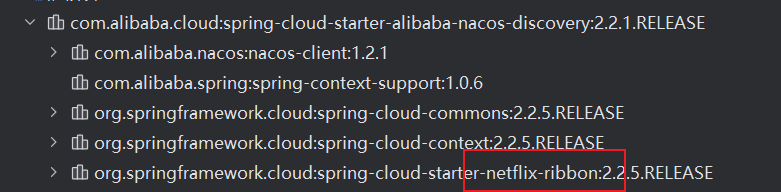
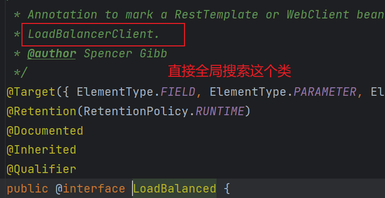
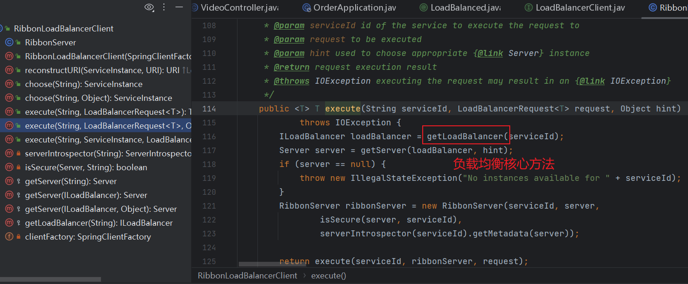
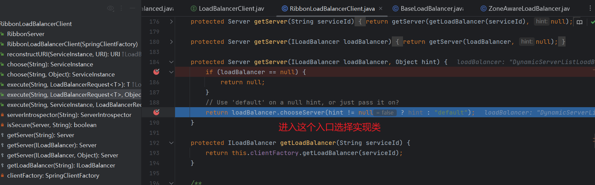
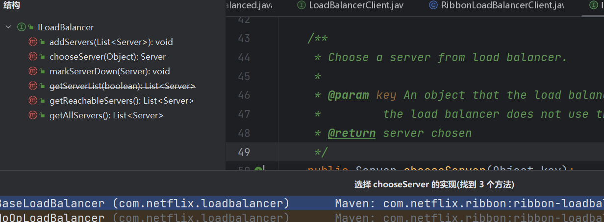
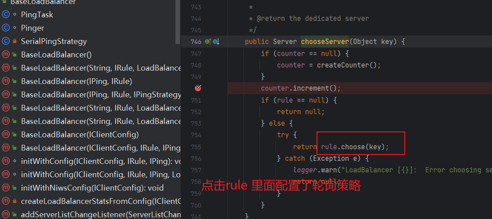
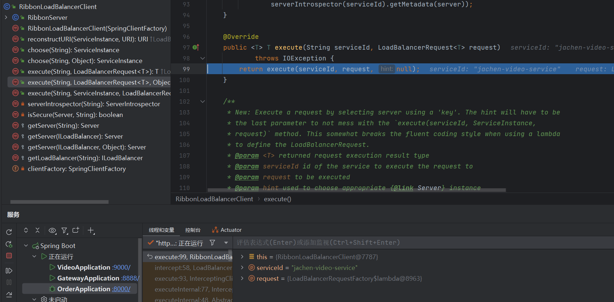
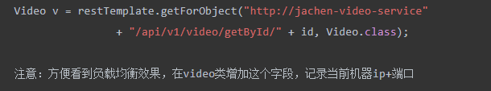

**背景**：*Ribbon是一个用于客户端负载均衡的开源项目，它基于Netflix Hystrix库，用于提供客户端侧负载均衡算法。它可以在微服务架构中帮助您控制客户端对服务器的访问，以实现负载均衡、断路器和智能路由。Ribbon提供了一组API，可以在您的应用程序代码中集成负载均衡功能，从而提高系统的可用性和稳定性。*<!--more-->

这个是开源地址：https://github.com/Netflix/ribbon

在接受这个厉害的组件前先 **讲讲什么负载均衡和常见的解决方案**

-   什么是负载均衡（Load Balance）

    ```
    分布式系统中一个非常重要的概念，当访问的服务具有多个实例时，需要根据某种“均衡”的策略决定请求发往哪个节点，这就是所谓的负载均衡，
    ```

    ```
    原理是将数据流量分摊到多个服务器执行，减轻每台服务器的压力，从而提高了数据的吞吐量
    ```

-   软硬件角度负载均衡的种类

    -   通过硬件来进行解决，常见的硬件有NetScaler、F5、Radware和Array等商用的负载均衡器，但比较昂贵的
    -   通过软件来进行解决，常见的软件有LVS、Nginx等,它们是基于Linux系统并且开源的负载均衡策略

-   从端的角度负载均衡有两种

    -   服务端负载均衡
    -   客户端负载均衡

    

-   常见的负载均衡策略（看组件的支持情况）

    -   节点轮询
        -   简介：每个请求按顺序分配到不同的后端服务器
    -   weight 权重配置
        -   简介：weight和访问比率成正比，数字越大，分配得到的流量越高
    -   固定分发
        -   简介：根据请求按访问ip的hash结果分配，这样每个用户就可以固定访问一个后端服务器
    -   随机选择、最短响应时间等等

## AlibabaCloud集成Ribbon实现负载均衡

我们来看看它在哪个包下？这个是Nacos整合ribbon的包



-   什么是Ribbon 

    Ribbon是一个客户端负载均衡工具，通过Spring Cloud封装，可以轻松和AlibabaCloud整合

-   订单服务增加@LoadBalanced 注解

```java
@Bean
@LoadBalanced
public RestTemplate restTemplate() {
  return new RestTemplate();
}
```

接着我的上一篇文章，https://blog.jiguanchen.space/blog/product-nacos

-   调用实战

```java
Video v = restTemplate.getForObject("http://jachen-video-service"
                + "/api/v1/video/getById/" + id, Video.class);

 // 注意:方便看到负载均衡效果，在video类增加这个字段，记录当前机器ip+端口
```

它的实操非常简单，那它底层的源码是怎么走的呢？我们断点看一下。

## Ribbon负载均衡源码走读

-   分析思路
    -   通过直接找入口



-   分析@LoadBalanced 
    -   1）首先从注册中心获取provider的列表
    -    2）通过一定的策略选择其中一个节点
    -    3）再返回给restTemplate调用









最后返回调用的服务



## Ribbon支持的负载均衡策略

| 策略类                    | 命名               | 描述                                                         |
| ------------------------- | ------------------ | ------------------------------------------------------------ |
| RandomRule                | 随机策略           | 随机选择server                                               |
| RoundRobinRule            | 轮询策略           | 按照顺序选择server（默认）                                   |
| RetryRule                 | 重试策略           | 当选择server不成功，短期内尝试选择一个可用的server           |
|                           |                    |                                                              |
| AvailabilityFilteringRule | 可用过滤策略       | 过滤掉一直失败并被标记为circuit tripped的server，过滤掉那些高并发链接的server（active connections超过配置的阈值） |
| WeightedResponseTimeRule  | 响应时间加权重策略 | 根据server的响应时间分配权重，以响应时间作为权重，响应时间越短的服务器被选中的概率越大，综合了各种因素，比如：网络，磁盘，io等，都直接影响响应时间 |
| ZoneAvoidanceRule         | 区域权重策略       | 综合判断server所在区域的性能，和server的可用性，轮询选择server |

怎么配置呢？

```xml
订单服务增加配置
jachen-video-service:
  ribbon:
    NFLoadBalancerRuleClassName: com.netflix.loadbalancer.RandomRule
```

-   策略选择： 1、如果每个机器配置一样，则建议不修改策略 (推荐) 2、如果部分机器配置强，则可以改为 WeightedResponseTimeRule

**上面就是ribbon的底层实现，它还是美中不足的。存在的问题：不规范，风格不统一，维护性比较差**

那么为什么存在这些问题呢？

我们来看上面的代码



*每次我们都要去在代码里这样拼路径，如果我的方法特别多呢？很显然这种方法是不可取的，所以也就引出了Feign组件*

什么是Feign

```tex
SpringCloud提供的伪http客户端(本质还是用http)，封装了Http调用流程，更适合面向接口化
让用Java接口注解的方式调用Http请求.

不用像Ribbon中通过封装HTTP请求报文的方式调用 Feign默认集成了Ribbon
```

官方文档：https://spring.io/projects/spring-cloud-openfeign

-   Nacos支持Feign,可以直接集成实现负载均衡的效果 可以使用springboot等注解

## 改造微服务 集成Open-Feign

-   Feign让方法调用更加解耦

-   使用feign步骤讲解

    -   加入依赖(order客户端)

        ```xml
                <dependency>
                    <groupId>org.springframework.cloud</groupId>
                    <artifactId>spring-cloud-starter-openfeign</artifactId>
                </dependency>
        ```

    -   配置注解(order客户端)

    ```java
    //启动类增加
    @EnableFeignClients
    ```

    -   增加一个远程调用接口(可以在order模块里面也可以单独拿出去自己一个模块)

    ```java
    //订单服务增加接口，服务名称记得和nacos保持一样
    @FeignClient(name="jachen-video-service") 
    ```

    -   编写代码

    ```java
    @GetMapping(value = "/api/v1/video/find_by_id")
    Video findById(@PathVariable int videoId);
    
    // 一定注意上面错误的 一定要注意路径一定完整 
    // @RequestParam里面都要指定
    // 如果参数要用restful风格接收 用@PathVariable
    // 路径的参数如果和方法里参数不一样 一定要加("id")参数
    @GetMapping("/api/v1/video/getById/{id}")
    Video getById(@RequestParam("id") Integer id);
    ```

    -   注入videoservice（在order客户端controller层加入）就像在本地使用一样简单
    
    ```java
        @Autowired
        private VideoService videoService;
        
        ...
        
        Video v = videoService.getById(id);
        
        ...
    ```

    Ribbon和feign两个的区别和选择
    
    ```tex
    选择feign
    默认集成了ribbon
    写起来更加思路清晰和方便
    采用注解方式进行配置，配置熔断等方式方便
    ```
    
    

