---
<!-- truncate -->
<!-- truncate -->
<!-- truncate -->
slug: product-torna-smart-doc
title: smart-doc+Trona无侵入式API文档管理平台
authors: [jiguanchen]
tags: [wenjian-gongju, Torna]
---

**背景**：[smart-doc (opens new window)](https://gitee.com/smart-doc-team/smart-doc)+ Torna 组成行业领先的文档生成和管理解决方案，使用smart-doc无侵入完成Java源代码分析和提取注释生成API文档，自动将文档推送到Torna企业级接口文档管理平台。<!--more-->

我们先来看看效果图：

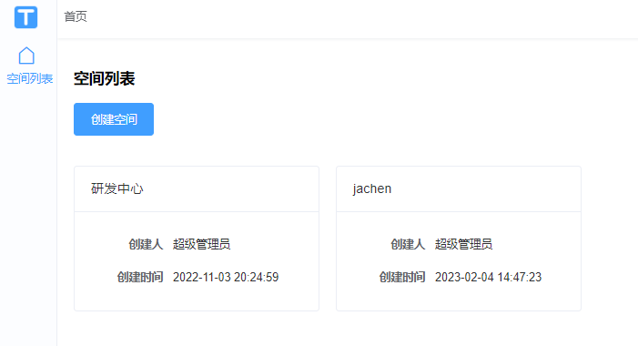

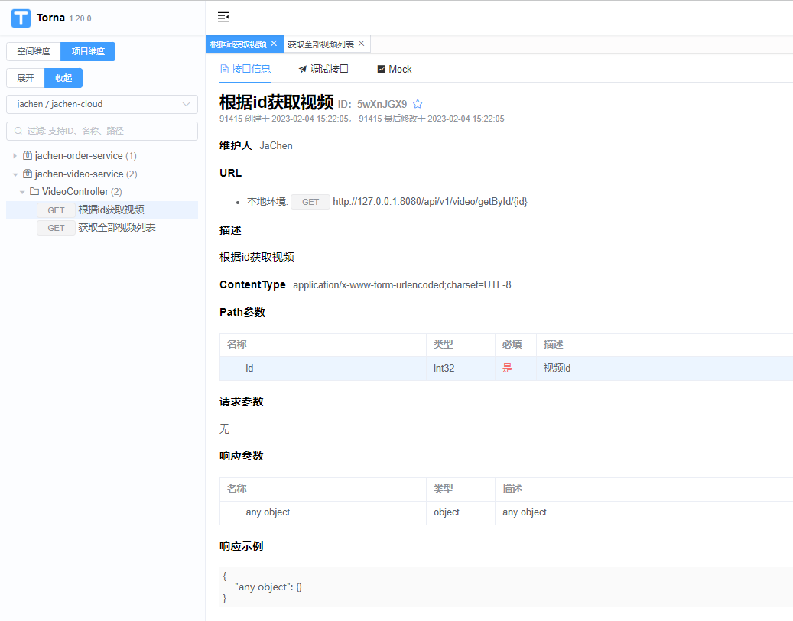

超级简洁 ，而且它是无侵入式的，不需要改动代码，只需要增加配置文件即可

官方仓库地址：https://gitee.com/durcframework/torna

## 为什么要用Torna？

接口文档解决方案，目标是让接口文档管理变得更加方便、快捷。Torna采用团队协作的方式管理和维护接口文档，将不同形式的文档纳入进来统一维护。

Torna弥补了传统文档生成工具（如swagger）的不如之处，在保持原有功能的前提下丰富并增强了一些实用的功能。

-   不满足swagger文档预览页面和调试页面的展现方式
-   不喜欢swagger这种侵入式注解
-   希望使用javadoc注释生成文档，并进行接口调试
-   希望把公司所有项目接口文档进行统一管理
-   希望把项目中的若干文档提供给第三方调用者查看
-   希望可以统一管理项目中的字典枚举

现在已经跟新到1.20.0 它也可以整合swagger使用，但是鉴于swagger侵入性高，官放推荐的是smart-doc+Torna这一技术路线。

## 如何使用？

我们以win为例进行部署。其他部署环境参照官网即可

### 1、下载zip本地运行

1.1、下载地址：https://gitee.com/durcframework/torna/releases

需要下载俩个jar包 


本地解压即可。

1.2、在资源包中找到mysql.sql脚本，导入mysql

1.3、在启动包中找到`application.properties`配置文件，修改数据库连接配置

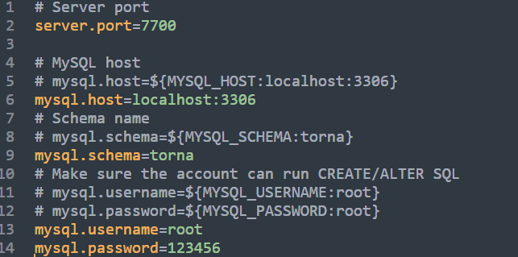

1.4、在启动目录用cmd运行startup.bat文件

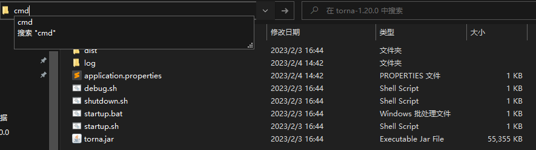

1.5、本地浏览器访问http://localhost:7700

1.6、登录文档管理平台  初始账户 ---> 用户名：`admin`，密码：`123456`

1.7、后续升级，只需要覆盖`torna.jar文件`和`dist文件夹`，然后重启即可

### 2、Torna整合smart-doc教程

通过这套组合您可以实现：只需要写完Java注释就能把接口信息推送到Torna平台，从而实现接口预览、接口调试。

官方地址：https://torna.cn/dev/smart-doc.html

#### 2.1、只需规范编写代码注释即可

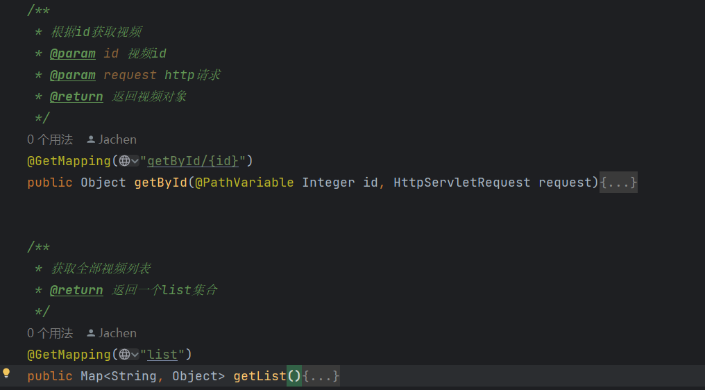

#### 2.2、Torna服务配置

全图形化操作 可以根据需求创建空间管理员和使用空间

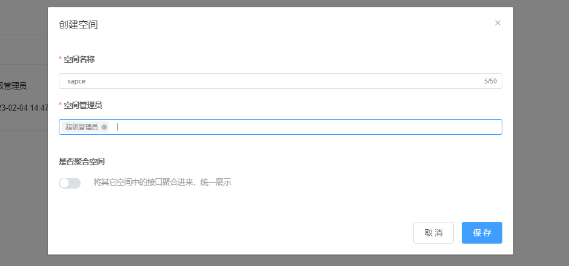

创建自己的项目文档名 ，创建好后如左侧样例。

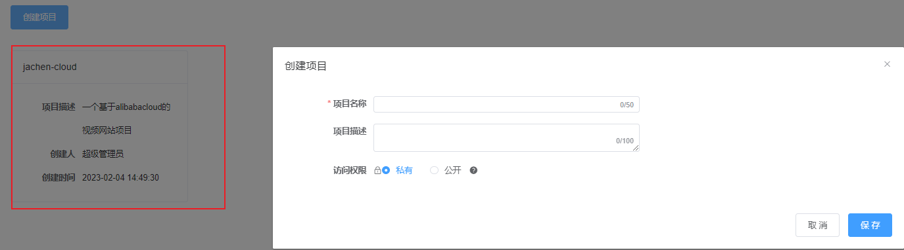

查看token是否生成，一会要在项目里配置

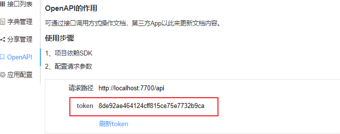

#### 2.3、cloud服务配置

我的demo项目结构是这样的

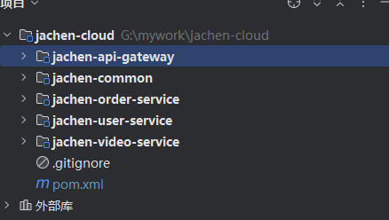

在跟目录的pom中添加smart-doc插件

```xml
		<!-- smart-doc插件 -->
            <plugin>
                <groupId>com.github.shalousun</groupId>
                <artifactId>smart-doc-maven-plugin</artifactId>
                <version>2.4.9</version>
                <configuration>
                    <!--指定生成文档的使用的配置文件-->
                    <configFile>./src/main/resources/smart-doc.json</configFile>
                    <!--指定项目名称-->
                    <projectName>视频项目</projectName>
                </configuration>
                <executions>
                    <execution>
                        <phase>package</phase>
                    </execution>
                </executions>
            </plugin>
```

在web中的resources下添加一个`smart-doc.json`文件

这里需要注意要在根目录下创建resources包，并标记为资源包

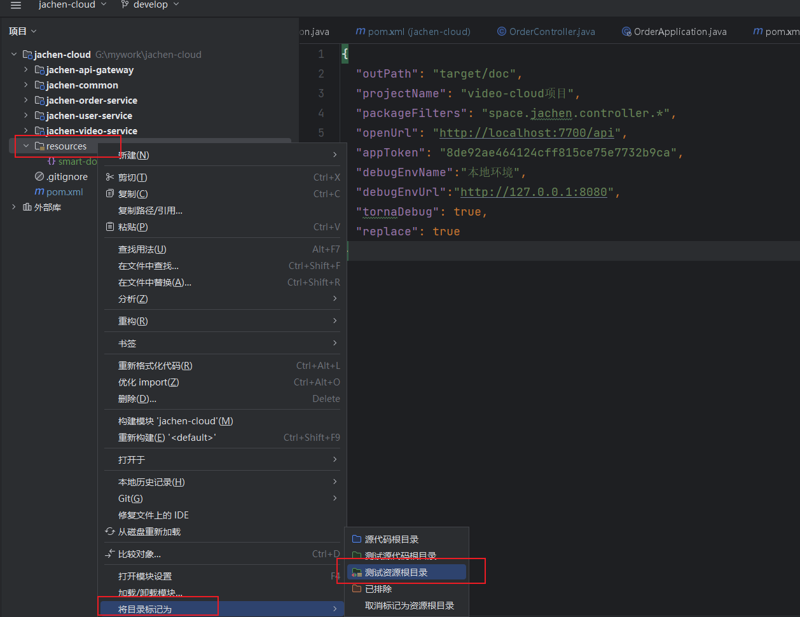

我们以video-service为例 其他模块一样

```json
{
  "outPath": "target/doc",
  "projectName": "video-cloud项目",
  "packageFilters": "space.jachen.controller.*",
  "openUrl": "http://localhost:7700/api",
  "appToken": "8de92ae464124cff815ce75e7732b9ca",
  "debugEnvName":"本地环境",
  "debugEnvUrl":"http://127.0.0.1:8080",
  "tornaDebug": true,
  "replace": true
}
```

参数说明:

-   outPath：固定填这个不用变
-   projectName：项目名称
-   packageFilters：Controller接口对应的package目录，多个用`;`隔开
-   openUrl：Torna中的OpenAPI接口
-   appToken：Torna中的OpenAPI token
-   debugEnvName：Torna中调试环境名称
-   debugEnvUrl：Torna中调试环境地址
-   tornaDebug：是否开启调试，初次使用建议开始，后面稳定了关闭
-   replace：是否替换文档，建议true

over，已经配置完成，接下来最后一步，推送到torna

#### 2.4、推送文档到Torna

在项目根目录输入maven命令：

```
mvn smart-doc:torna-rest -pl :jachen-cloud -am
```

其中`-pl :shop-web -am`表示推送哪个子模块

看到最后的

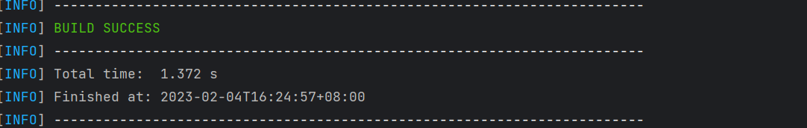

表示推送成功，即可前往Torna接口列表查看文档了
