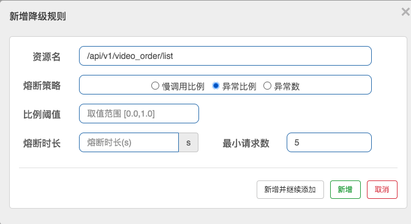

*随着微服务的流行，服务和服务之间的稳定性变得越来越重要。Sentinel 是面向分布式、多语言异构化服务架构的流量治理组件，主要以流量为切入点，从流量路由、流量控制、流量整形、熔断降级、系统自适应过载保护、热点流量防护等多个维度来帮助开发者保障微服务的稳定性。*<!--more-->

官方文档：https://sentinelguard.io/zh-cn/index.html


## 1、什么是Sentinel

-   阿里巴巴开源的分布式系统流控工具
-   以流量为切入点，从流量控制、熔断降级、系统负载保护等多个维度保护服务的稳定性
-   丰富的应用场景：消息削峰填谷、集群流量控制、实时熔断下游不可用应用等
-   完备的实时监控：Sentinel 同时提供实时的监控功能
-   提供开箱即用的与其它开源框架/库的整合模块，例如与 Spring Cloud、Dubbo、gRPC 的整合

在微服务中扮演者治理者的作用


-   核心概念：
    -   资源：是 Sentinel 中的核心概念之一，可以是java程序中任何内容，可以是服务或者方法甚至代码，总结起来就是我们要保护的东西
    -   规则：定义怎样的方式保护资源，主要包括流控规则、熔断降级规则等


## 2、整合微服务项目实操

### 2.1、安装

-   Sentinel 分为两个部分

    -   核心库（Java 客户端）不依赖任何框架/库，能够运行于所有 Java 运行时环境，同时对 Dubbo、Spring Cloud 等框架也有较好的支持。
    -   控制台（Dashboard）基于 Spring Boot 开发，打包后可以直接运行，不需要额外的 Tomcat 等应用容器。

-   微服务引入Sentinel依赖

    ```xml
     <dependency>
      		<groupId>com.alibaba.cloud</groupId>
             <artifactId>spring-cloud-starter-alibaba-sentinel</artifactId>
     </dependency>
    ```

-   Sentinel控制台搭建

-   文档：https://github.com/alibaba/Sentinel/wiki/控制台

-   控制台包含如下功能:

    -   查看机器列表以及健康情况：收集 Sentinel 客户端发送的心跳包，用于判断机器是否在线。
    -   监控 (单机和集群聚合)通过 Sentinel 客户端暴露的监控 API，定期拉取并且聚合应用监控信息，最终可以实现**秒级**的实时监控。
    -   规则管理和推送：统一管理推送规则。
    -   鉴权：生产环境中鉴权非常重要。这里每个开发者需要根据自己的实际情况进行定制。

    >   注意：Sentinel 控制台目前仅支持单机部署

```shell
//启动 Sentinel 控制台需要 JDK 版本为 1.8 及以上版本，
//-Dserver.port=8080 用于指定 Sentinel 控制台端口为 8080 
//默认用户名和密码都是 sentinel

给sentinel-dashboard-1.8.2.jar增加权限
chomd 777 sentinel-dashboard-1.8.2.jar

java -Dserver.port=8080 -Dcsp.sentinel.dashboard.server=localhost:8080 -Dproject.name=sentinel-dashboard -jar sentinel-dashboard-1.8.2.jar

守护进程启动
nohub java -Dserver.port=8080 -Dcsp.sentinel.dashboard.server=localhost:8080 -Dproject.name=sentinel-dashboard -jar sentinel-dashboard-1.8.2.jar

简化 默认端口8080
java -jar sentinel-dashboard-1.8.2.jar 
```

界面效果


### 2.2、限流

简单实操：

-   多个微服务接入Sentinel配置

    ```yml
    spring:
      cloud:
        sentinel:
          transport:
            dashboard: 127.0.0.1:8080 
            port: 9999 
    
    #dashboard: 8080 控制台端口
    #port: 9999 本地启的端口，随机选个不能被占用的，与dashboard进行数据交互，会在应用对应的机器上启动一个 Http Server，该 Server 会与 Sentinel 控制台做交互, 若被占用,则开始+1一次扫描 默认为 8719
    ```

-   微服务注册上去后，由于Sentinel是**懒加载**模式，所以需要访问微服务后才会在控制台出现


-   限流配置实操
    -   控制台配置


### 2.3、流量控制（flow control）

-   流控文档
    -   https://github.com/alibaba/Sentinel/wiki/流量控制#基于调用关系的限流

-   原理是监控应用流量的 QPS 或并发线程数等指标，当达到指定的阈值时对流量进行控制，以避免被瞬时的流量高峰冲垮，从而保障应用的高可用性。

-   两种规则

    -   基于统计并发线程数的流量控制

    ```
    并发数控制用于保护业务线程池不被慢调用耗尽
    Sentinel 并发控制不负责创建和管理线程池，而是简单统计当前请求上下文的线程数目（正在执行的调用数目）
    如果超出阈值，新的请求会被立即拒绝，效果类似于信号量隔离。
    流控规则会下发到微服务，微服务如果重启，则流控规则会消失可以持久化配置
    ```

    -   基于统计QPS的流量控制

    ```
    当 QPS 超过某个阈值的时候，则采取措施进行流量控制
    ```

-   控制面板
    -   资源名：默认是请求路径，可自定义
    -   针对来源：对哪个微服务进行限流，默认是不区分来源，全部限流，这个是针对 区分上游服务进行限流, 比如 视频服务 被 订单服务、用户服务调用，就可以针对来源进行限流
-   流控效果


-   流量控制的效果包括以下几种：

    -   直接拒绝：默认的流量控制方式，当QPS超过任意规则的阈值后，新的请求就会被立即拒绝

         

    -   Warm Up：冷启动/预热，如果系统在此之前长期处于空闲的状态，我们希望处理请求的数量是缓步的增多，经过预期的时间以后，到达系统处理请求个数的最大值

    

    -   匀速排队：严格控制请求通过的间隔时间，也即是让请求以均匀的速度通过，对应的是漏桶算法，主要用于处理间隔性突发的流量，如消息队列，想象一下这样的场景，在某一秒有大量的请求到来，而接下来的几秒则处于空闲状态，我们希望系统能够在接下来的空闲期间逐渐处理这些请求，而不是在第一秒直接拒绝多余的请求

        

        -   注意：
            -   匀速排队等待策略是 Leaky Bucket 算法结合虚拟队列等待机制实现的。
            -   匀速排队模式暂时不支持 QPS > 1000 的场景

### 2.4、熔断降级

-   文档：https://github.com/alibaba/Sentinel/wiki/熔断降级

-   熔断降级（虽然是两个概念，基本都是互相配合）

    -   对调用链路中不稳定的资源进行熔断降级也是保障高可用的重要措施之一
    -   对不稳定的**弱依赖服务调用**进行熔断降级，暂时切断不稳定调用，避免局部不稳定因素导致整体的雪崩
    -   熔断降级作为保护自身的手段，通常在客户端（调用端）进行配置

     

-   什么是Sentinel降级规则

    -   文档：https://github.com/alibaba/Sentinel/wiki/熔断降级
    -   就是配置一定规则，然后满足之后就对服务进行熔断降级

     

-   Sentinel 熔断策略

    -   慢调用比例(响应时间): 选择以慢调用比例作为阈值，需要设置允许的慢调用 RT（即最大的响应时间），请求的响应时间大于该值则统计为慢调用

        -   比例阈值：修改后不生效-目前已经反馈给官方那边的bug
        -   熔断时长：超过时间后会尝试恢复
        -   最小请求数：熔断触发的最小请求数，请求数小于该值时即使异常比率超出阈值也不会熔断

        

    -   异常比例：当单位统计时长内请求数目大于设置的最小请求数目，并且异常的比例大于阈值，则接下来的熔断时长内请求会自动被熔断

        -   比例阈值
        -   熔断时长：超过时间后会尝试恢复
        -   最小请求数：熔断触发的最小请求数，请求数小于该值时，即使异常比率超出阈值也不会熔断

        

    -   异常数：当单位统计时长内的异常数目超过阈值之后会自动进行熔断

        -   异常数:
        -   熔断时长：超过时间后会尝试恢复
        -   最小请求数：熔断触发的最小请求数，请求数小于该值时即使异常比率超出阈值也不会熔断

        

服务熔断一般有三种状态（如图）


-   熔断关闭（Closed）
    -   服务没有故障时，熔断器所处的状态，对调用方的调用不做任何限制
-   熔断开启（Open）
    -   后续对该服务接口的调用不再经过网络，直接执行本地的fallback方法
-   半熔断（Half-Open）
    -   所谓半熔断就是尝试恢复服务调用，允许有限的流量调用该服务，并监控调用成功率

-   熔断恢复：

    -   经过熔断时长后熔断器会进入探测恢复状态（HALF-OPEN 状态）尝试恢复服务调用，允许有限的流量调用该服务，并监控调用成功率。

    -   如果成功率达到预期，则说明服务已恢复，进入熔断关闭状态；如果成功率仍旧很低，则重新进入熔断状态

### 2.5、熔断框架比较

|                | Sentinel                                                   | Hystrix               | resilience4j                     |
| :------------- | :--------------------------------------------------------- | :-------------------- | :------------------------------- |
| 隔离策略       | 信号量隔离（并发线程数限流）                               | 线程池隔离/信号量隔离 | 信号量隔离                       |
| 熔断降级策略   | 基于响应时间、异常比率、异常数                             | 基于异常比率          | 基于异常比率、响应时间           |
| 实时统计实现   | 滑动窗口(LeapArray)                                        | 滑动窗口(RxJava)      | Ring Bit Buffer                  |
| 动态规则配置   | 支持多种数据源                                             | 支持多种数据源        | 有限支持                         |
| 扩展性         | 多个扩展点                                                 | 插件的形式            | 接口的形式                       |
| 基于注解支持   | 支持                                                       | 支持                  | 支持                             |
| 限流           | 基于QPS，支持基于调用关系的限流                            | 有限的支持            | Rate Limiter                     |
| 流量整形       | 支持预热模式、匀速器模式、预热排队模式                     | 不支持                | 简单的Rate Limiter模式           |
| 系统自适应保护 | 支持                                                       | 不支持                | 不支持                           |
| 控制台         | 提供开箱即用的控制台，可配置规则、查看秒级监控、机器发现等 | 简单的监控查看        | 不提供控制台，可对接其他监控系统 |
