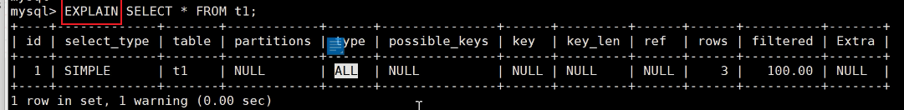
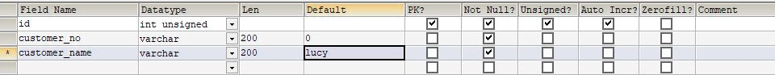

---
<!-- truncate -->
<!-- truncate -->
<!-- truncate -->
slug: product-management-system
title: SQL优化积累笔记
authors: [jiguanchen]
tags: [shujuku, mysql]
---

**背景**：*因为日常工作和学习中难免会与数据库打交道，其中如何快速的从庞大的数据库中精准的查找到我们想要的信息一直是很热的话题，所以写下此篇笔记，亦在不断地积累有关数据库查询优化方面的经验，从而能高效的使数据传递给外界，给用户更好的体验，这篇文章会一直更新下去*。<!--more-->

## or与union的执行效率比较

stackoverflow链接: [https://stackoverflow.com/questions/13750475/sql-performance-union-vs-or）](https://leetcode.cn/link/?target=https://stackoverflow.com/questions/13750475/sql-performance-union-vs-or）)

当SQL语句有多个or语句时，可以考虑使用union或者union all代替来提高速度。使用or的SQL语句往往无法进行优化，导致速度变慢。但这不是固定的，有时候使用or速度会更快些。具体情况还要经过测试为准。如果加索引的话，也可能实现速度优化。

  实验表格如下,实际数据有2,000,000条，从里面返回大约最多1000行左右的数据。

| X        | Y       | Inline | CDP  | T    |
| -------- | ------- | ------ | ---- | ---- |
| 12002400 | 5801000 | 300    | 300  | 3400 |
| 12002408 | 5801005 | 300    | 301  | 3402 |
| 12002416 | 5801010 | 300    | 302  | 3404 |
| 12002424 | 5801015 | 300    | 303  | 3406 |
| ...      | ...     | ...    | ...  | ...  |

or语句（部分节选）

SELECT * FROM tablename where (cdp= 300 and inline=301) or (cdp= 301 and inline=301) or (cdp= 302 and inline=301) or (cdp= 303 and inline=301) or (cdp= 304 and inline=301) or (cdp= 305 and inline=301) or (cdp= 306 and inline=301) or (cdp= 307 and inline=301)

union all语句（部分节选）

SELECT * FROM tablename where (inline= 300 and cdp=300) union all SELECT * FROM tablename where (inline= 301 and cdp=300) union all SELECT * FROM tablename where (inline= 302 and cdp=300) union all SELECT * FROM tablename where (inline= 303 and cdp=300)
返回不规则的900条数据，前者用了60多秒，后者用了8秒左右。

总结：

1.  Union：对两个结果集进行并集操作，不包括重复行，同时进行默认规则的排序； 即：去重+排序
2.  Union All：对两个结果集进行并集操作，包括重复行，不进行排序； 即：不去重+不排序
3.  对于单列来说，用or是没有任何问题的，但是or涉及到多个列的时候，每次select只能选取一个index，如果选择了area，population就需要进行table-scan，即全部扫描一遍，但是使用union就可以解决这个问题，分别使用area和population上面的index进行查询。 但是这里还会有一个问题就是，UNION会对结果进行排序去重，可能会降低一些performance(这有可能是方法一比方法二快的原因），所以最佳的选择应该是两种方法都进行尝试比较。 

2023/02/09

------

## shell脚本批量插入mock数据

shell脚本

```shell
#!/bin/bash
echo "请输入字段servnumber的值："
read serber
echo "请输入创建sql语句的数量："
read number
# char=`head /dev/urandom | tr -dc 0-9 | head -c 11`
for (( i=0;i<$number;i++ ))
        do
        pass=`head /dev/urandom | tr -dc a-z | head -c 8`
        let serber=serber+1
        echo "insert into test(id,username,servnumber,password,createtime) values('$i','user${i}','${serber}','$pass',now());" >>sql1.txt
   
     done
```

尽量避免使用select *from ，尽量精确到想要的结果字段。
尽量避免条件使用or。
记得加上limit 限制行数，避免数据量过大消耗性能。
使用模糊查询时，%放在前面是会使索引失效。
要小心条件字段类型的转换。

2023/02/11

------

## 线上调优-慢查询日志配置

最好 nginxi访问日志，流量重放在测试环境中；迫不得已再线上调

-   第一步：查看是否已经开启了慢查询日志

```
mysql> show variables like 'slow%';
+---------------------+--------------------------------------+
| Variable_name       | Value                                |
+---------------------+--------------------------------------+
| slow_launch_time    | 2                                    |
| slow_query_log      | OFF                                  |
| slow_query_log_file | /data/mydata/jachen-public-slow.log |
+---------------------+--------------------------------------+
```

-   第二步：开启慢查询日志

```
set global slow_query_log = on ;

日志路径也可以自定义：

set global slow_query_log_file = '路径';
```

-   第三步：查看慢查询的时间临界值

```
show variables like '%long%';
```

-   第四步：设置慢查询的时间标准

```
set long_query_time=0.4;
```

-   注意：假如运行时间正好等于long_query_time的情况，并不会被记录下来。也就是说，在mysql源码里是判断大于long_query_time，而非大于等于。

```
永久生效的设置方法：修改配置文件 vi /etc/my.cnf
[mysqld]
slow_query_log = 1
long_query_time = 0.1
slow_query_log_file =/usr/local/mysql/mysql_slow.log

最后重新连接才能生效，不必重启服务器！
```

**执行耗时sql：**

```
SELECT * FROM emp;
SELECT * FROM emp WHERE deptid > 1;
```

**查询慢查询记录数：**

```sql
SHOW GLOBAL STATUS LIKE '%Slow_queries%'; 
```

**查询日志：**

```shell
vim /var/lib/mysql/bogon-slow.log
```

**mysqldumpslow分析工具：**

在生产环境中，如果要手工分析日志，查找、分析SQL，显然是个体力活，MySQL提供了日志分析工具mysqldumpslow。退出mysql命令行，执行以下命令：

```sql
-- 查看mysqldumpslow的帮助信息
mysqldumpslow --help

-- 工作常用参考
-- 1.得到返回记录集最多的10个SQL
mysqldumpslow -s r -t 10 /var/lib/mysql/bogon-slow.log
-- 2.得到访问次数最多的10个SQL
mysqldumpslow -s c -t 10 /var/lib/mysql/bogon-slow.log
-- 3.得到按照时间排序的前10条里面含有左连接的查询语句
mysqldumpslow -s t -t 10 -g "left join" /var/lib/mysql/bogon-slow.log
-- 4.另外建议在使用这些命令时结合 | 和more 使用 ，否则有可能出现爆屏情况
mysqldumpslow -s r -t 10 /var/lib/mysql/bogon-slow.log | more
```

- -a: 将数字抽象成N，字符串抽象成S

- -s: 是表示按照何种方式排序

- - c: 访问次数
    - l: 锁定时间
    - r: 返回记录

- -  t: 查询时间
    -  al:平均锁定时间
    -  ar:平均返回记录数
    -  at:平均查询时间

- -t: 即为返回前面多少条的数据
- -g: 后边搭配一个正则匹配模式，大小写不敏感的

2023/02/15

------

## sql语句执行过程解析



介绍如何开启性能详情

-   第一步：查看性能详情是否开启

```
mysql> show variables like '%profiling%';
+------------------------+-------+
| Variable_name          | Value |
+------------------------+-------+
| have_profiling         | YES   |
| profiling              | OFF   |
| profiling_history_size | 15    |
+------------------------+-------+
```

-   第二步：开启性能记录功能

```
set profiling = on ;
```

-   第三步：查看性能的记录

```
mysql> show profiles;
+----------+------------+---------------------------------------------------+
| Query_ID | Duration   | Query                                             |
+----------+------------+---------------------------------------------------+
|        1 | 0.00177775 | show variables like '%profiling%'                 |
|        2 | 0.00037900 | select * from test where id='087878'              |
|        3 | 0.34618025 | select * from test where servnumber='1367008787'  |
|        4 | 0.31986825 | select * from test where servnumber='13670087879' |
+----------+------------+---------------------------------------------------+
```

-   第四步：查看语句的执行性能详情

```
mysql> show profile for query 4;
+----------------------+----------+
| Status               | Duration |
+----------------------+----------+
| starting             | 0.000100 |
| checking permissions | 0.000010 |
| Opening tables       | 0.000023 |
| init                 | 0.000045 |
| System lock          | 0.000015 |
| optimizing           | 0.000016 |
| statistics           | 0.000028 |
| preparing            | 0.000020 |
| executing            | 0.000006 |
| Sending data         | 0.319489 |
| end                  | 0.000037 |
| query end            | 0.000012 |
| closing tables       | 0.000012 |
| freeing items        | 0.000040 |
| cleaning up          | 0.000017 |
+----------------------+----------+
```

*性能线程的详细解释官方文档链接*：https://dev.mysql.com/doc/refman/5.7/en/general-thread-states.html

2023/02/16

------

## 设计表的NULL值问题

1、字段不添加null  都是not null，默认值 



2、把字段都设置为not null ，添加特殊字段，把数据存储j为JSON格式  { }

2023/02/18

------

## 关联查询优化

1、保证被驱动表的JOIN字段已经创建了索引
2、需要JOIN 的字段，数据类型保持绝对一致。
3、LEFT JOIN 时，选择小表作为驱动表，大表作为被驱动表 。减少外层循环的次数。
4、INNER JOIN 时，MySQL会自动将小结果集的表选为驱动表 。选择相信MySQL优化策略。
5、能够直接多表关联的尽量直接关联，不用子查询。(减少查询的趟数)
6、不建议使用子查询，建议将子查询SQL拆开结合程序多次查询，或使用 JOIN 来代替子查询。
7、衍生表建不了索引

2023/02/19

------

## 子查询优化

使用连接（JOIN）查询来替代子查询。**连接查询不需要建立临时表 ，其速度比子查询 要快 ，如果查询中使用索引的话，性能就会更好.
例如：尽量不要使用NOT IN 或者 NOT EXISTS，用LEFT JOIN xxx ON xx WHERE xx IS NULL替代

2023/02/22

------

## 数据库表设计

-   
    字段长度：能使用int就不要使用varchar、char，能用varchar(16)就不要使用varchar(256)
-   字段选择：固定长度的类型最好使用char,能使用tinyinti就不要使用int
-   默认值：最好给每个字段个默认值，最好不能为null,即not null default
-   适当索引：为每个表创建合理的索引，如唯一索引组合索引的场景以及普通索引的场景

2023/02/28

------

