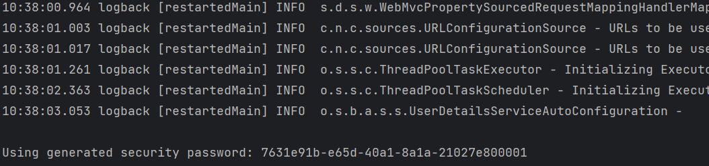
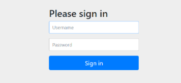

**起因**：*随着越来越多的业务转移到互联网上，安全性已经成为任何一个应用程序开发的重要考虑因素。而在 Java 应用程序开发中，Spring Security 是一个非常流行的安全框架，可以提供可靠的身份验证、授权和会话管理等安全特性。无论是开发 Web 应用程序、RESTful 服务、单页应用程序或者其他类型的应用程序，都可以使用 Spring Security 来保护应用程序的安全性。<!--more-->同时，Spring Security 还具有非常好的可扩展性，可以与 Spring 生态系统中的其他框架和库进行无缝集成，使开发人员能够构建出复杂的、高度可定制的安全解决方案。因此，使用 Spring Security 是保障应用程序安全的不二选择。*

## 技术选型

|          | Spring Security                                              | Apache Shiro                                                 | Apache Knox                                                  | Keycloak                                                     | Stormpath                                                    |
| -------- | ------------------------------------------------------------ | ------------------------------------------------------------ | ------------------------------------------------------------ | ------------------------------------------------------------ | ------------------------------------------------------------ |
| 概述     | Spring Security 是一个非常流行的 Java 应用程序安全框架，提供了完整的身份验证、授权和会话管理功能。它具有良好的可扩展性和灵活性，能够与 Spring 生态系统中的其他框架和库无缝集成 | Apache Shiro 是一个轻量级的安全框架，提供了身份验证、授权、加密和会话管理等功能。它易于使用和集成，能够与任何应用程序框架一起使用，支持多种数据源，如 LDAP、JDBC 和 Active Directory | Apache Knox 是一个开源网关，提供了 REST API 的认证、授权和审计功能。它可以保护 Hadoop 集群的 REST API，提供了单点登录和 OAuth2 支持 | Keycloak 是一个开源的身份认证和访问管理解决方案，基于 OpenID Connect 和 OAuth2 协议。它提供了可扩展的身份验证和授权功能，包括单点登录、多因素身份验证和基于角色的访问控制等 | Stormpath 是一个云身份认证和访问管理服务，提供了完整的身份验证、授权和用户管理功能。它可以与任何应用程序框架一起使用，包括 Java、Node.js 和 .NET |
| 优点     | 完整的安全特性、与 Spring 框架无缝集成、丰富的插件和扩展、良好的文档和社区支持 | 括轻量级、易于使用和集成、支持多种数据源、优秀的文档         | 保护 Hadoop 集群的 REST API、支持单点登录和 OAuth2、易于配置和使用 | 可扩展的身份验证和授权功能、多种身份验证方式、基于角色的访问控制、易于使用和部署 | 云身份认证和访问管理服务、易于使用和集成、提供完整的身份验证、授权和用户管理功能 |
| 缺点     | 配置复杂、上手较难                                           | 与 Spring 框架的深度集成、不够完整的安全特性                 | 仅适用于保护 Hadoop 集群的 REST API                          | 配置复杂、性能较差                                           | 需要使用云服务、需要支付服务费用，成本高                     |
| 适用场景 | 适用于基于 Spring 框架构建的应用程序                         | 适用于不依赖于 Spring 框架的应用程序                         | 适用于需要保护 Hadoop 集群的 REST API 的场景                 | 适用于需要单独部署一个身份认证和访问管理系统的场景           | 适用于需要使用云身份认证和访问管理服务的场景。               |

### 小结：

国内目前非常流行的就是Spring Security和Apache Shiro 。

Spring Security出现的时间较早，在springboot没火起来之前一直都是Shiro 的天下，但目前最能和spring全家桶整合起来的就是Spring Security，Spring Security 是最为完整、可扩展和灵活的安全框架，而且与 Spring 框架的深度集成使得使用和配置变得简单方便。Spring Security 提供了全面的身份验证、授权和会话管理特性，并且可以轻松地扩展到支持自定义的安全策略和特性。而且社区也是十分活跃的。所以此篇文章主要从实践流程出发，实现与spring项目整合的快速搭建解决方案。

相对于 Shiro，在 SSM 中整合 Spring Security 都是比较麻烦的操作，所以，Spring Security 虽然功能比 Shiro 强大，但是使用反而没有 Shiro 多（Shiro 虽然功能没有Spring Security 多，但是对于大部分项目而言，Shiro 也够用了）。自从有了 Spring Boot 之后，Spring Boot 对于 Spring Security 提供了自动化配置方案，可以使用更少的配置来使用 Spring Security。

因此，一般来说，常见的安全管理技术栈的组合是这样的：
• SSM + Shiro
• Spring Boot/Spring Cloud + Spring Security

如果还想了解shiro这一框架，我也在github开源了一个小demo，用于整合SpringBoot与shiro，实现快速上手，仓库地址：https://github.com/Jachen99/rbac_shiro

## 介绍

### Spring Security简介

Spring 是非常流行和成功的 Java 应用开发框架，Spring Security 正是 Spring 家族中的成员。Spring Security 基于 Spring 框架，提供了一套 Web 应用安全性的完整解决方案。

正如你可能知道的关于安全方面的两个核心功能是"**认证**"和"**授权**"，一般来说，Web 应用的安全性包括**用户认证（Authentication）和用户授权（Authorization）**两个部分，这两点也是 SpringSecurity 重要核心功能。

（1）用户认证指的是：验证某个用户是否为系统中的合法主体，也就是说用户能否访问该系统。用户认证一般要求用户提供用户名和密码，系统通过校验用户名和密码来完成认证过程。

**通俗点说就是系统认为用户是否能登录**

（2）用户授权指的是验证某个用户是否有权限执行某个操作。在一个系统中，不同用户所具有的权限是不同的。比如对一个文件来说，有的用户只能进行读取，而有的用户可以进行修改。一般来说，系统会为不同的用户分配不同的角色，而每个角色则对应一系列的权限。

**通俗点讲就是系统判断用户是否有权限去做某些事情。**

### 历史

"Spring Security 开始于 2003 年年底,""spring 的 acegi 安全系统"。 起因是 Spring开发者邮件列表中的一个问题,有人提问是否考虑提供一个基于 spring 的安全实现。

Spring Security 以"The Acegi Secutity System for Spring" 的名字始于 2013 年晚些时候。一个问题提交到 Spring 开发者的邮件列表，询问是否已经有考虑一个基于Spring 的安全性社区实现。那时候 Spring 的社区相对较小（相对现在）。实际上 Spring 自己在2013 年只是一个存在于 ScourseForge 的项目，这个问题的回答是一个值得研究的领域，虽然目前时间的缺乏组织了我们对它的探索。

考虑到这一点，一个简单的安全实现建成但是并没有发布。几周后，Spring 社区的其他成员询问了安全性，这次这个代码被发送给他们。其他几个请求也跟随而来。到 2014 年一月大约有 20 万人使用了这个代码。这些创业者的人提出一个 SourceForge 项目加入是为了，这是在 2004 三月正式成立。

在早些时候，这个项目没有任何自己的验证模块，身份验证过程依赖于容器管理的安全性和 Acegi 安全性。而不是专注于授权。开始的时候这很适合，但是越来越多的用户请求额外的容器支持。容器特定的认证领域接口的基本限制变得清晰。还有一个相关的问题增加新的容器的路径，这是最终用户的困惑和错误配置的常见问题。

Acegi 安全特定的认证服务介绍。大约一年后，Acegi 安全正式成为了 Spring 框架的子项目。1.0.0 最终版本是出版于 2006 -在超过两年半的大量生产的软件项目和数以百计的改进和积极利用社区的贡献。

Acegi 安全 2007 年底正式成为了 Spring 组合项目，更名为"Spring Security"。

## 流程介绍

要对Web资源进行保护，最好的办法莫过于Filter
要想对方法调用进行保护，最好的办法莫过于[AOP](https://so.csdn.net/so/search?q=AOP&spm=1001.2101.3001.7020)。

Spring Security进行认证和鉴权的时候,就是利用的一系列的Filter来进行拦截的。


如图所示，一个请求想要访问到API就会从左到右经过蓝线框里的过滤器，其中**绿色部分是负责认证的过滤器，蓝色部分是负责异常处理，橙色部分则是负责授权**。经过一系列拦截最终访问到我们的API。

这里面我们只需要重点关注两个过滤器即可：`UsernamePasswordAuthenticationFilter`负责登录认证，`FilterSecurityInterceptor`负责权限授权。

说明：**Spring Security的核心逻辑全在这一套过滤器中，过滤器里会调用各种组件完成功能，掌握了这些过滤器和组件你就掌握了Spring Security**！这个框架的使用方式就是对这些过滤器和组件进行扩展。

## 快速实践

### 搭建权限框架基本骨架

1、给spring-security创建单独的公共模块

2、导入相关jar包，如果是maven工程，直接引入

```xml
<!-- Spring Security依赖 -->
<dependency>
        <groupId>org.springframework.boot</groupId>
        <artifactId>spring-boot-starter-security</artifactId>
</dependency>
```

说明：依赖包（spring-boot-starter-security）导入后，Spring Security就默认提供了许多功能将整个应用给保护了起来：

-   要求经过身份验证的用户才能与应用程序进行交互
-   创建好了默认登录表单
-   生成用户名为`user`的随机密码并打印在控制台上
-   `CSRF`攻击防护、`Session Fixation`攻击防护

3、在需要使用权限框架的模块导入依赖

这里以医院预约挂号系统的order模块为例，仓库地址：https://github.com/Jachen99/yygh_parent

导入依赖到service-order模块

```xml
<dependency>
	<groupId>space.jachen</groupId>
	<artifactId>spring-security</artifactId>
	<version>1.0.1</version>
</dependency>
```

4、启动该order模块，会发现控制台显示Using generated security password



说明该模块已经被spring security保护。

5、此时我们通过浏览器去访问该模块下的api路径，会进入框架自带的登录页面：



默认用户名为user，密码为控制台输出的随机密码，认证成功后才可以登录。

### 实现用户认证功能

*目前，我们已经实现了自带的登录页面的访问，用户名和密码都来自于内存。那么要访问来自于mysql、redis甚至的用户名、密码怎么办呢？*

-   加密器PasswordEncoder
-   用户对象UserDetails
-   业务对象UserDetailsService

功能1：自带登录页面，访问真正的数据库，需要做什么？

1、访问基于内存的用户名和密码使用的是InMeoryUserDetailsManager（实现了UserDetailsServer），我们需要自定义UserDetailsServer的实现类。

```java
package space.jachen.yygh.order.security;

import org.springframework.security.core.GrantedAuthority;
import org.springframework.security.core.userdetails.UserDetails;
import org.springframework.security.core.userdetails.UserDetailsService;
import org.springframework.security.core.userdetails.UsernameNotFoundException;
import org.springframework.stereotype.Component;
import space.jachen.yygh.security.custom.CustomUser;
import space.jachen.yygh.user.PatientFeignClient;
import space.jachen.yygh.vo.user.LoginVo;

import javax.annotation.Resource;
import java.util.ArrayList;
import java.util.Collection;

/**
 * @author JaChen
 * @date 2022/12/23 22:35
 */
@Component
public class UserDetailsServiceImpl implements UserDetailsService {

    @Resource
    private PatientFeignClient userInfoFeignClient;

    @Override
    public UserDetails loadUserByUsername(String phone) throws UsernameNotFoundException {
        LoginVo login = userInfoFeignClient.loginSecurity(phone);
        if(login == null) {
            throw new UsernameNotFoundException("用户名不存在！");
        }
        // 这里不比较密码 ，后面通过PasswordEncoder比较
        // 返回数据、暂时不做授权
        Collection<GrantedAuthority> authorities = new ArrayList<>();
        return new CustomUser(login,authorities);
    }
}
```

2、访问数据库的方法loadUserByUsername，返回值为Userdetails，它封装了从数据库中返回的用户信息，但是和我们数据库表不一致，所以我们还需要自定义UserDetails实现类。

```java
package space.jachen.yygh.security.custom;

import lombok.Getter;
import lombok.Setter;
import org.springframework.security.core.GrantedAuthority;
import org.springframework.security.core.userdetails.User;
import space.jachen.yygh.vo.user.LoginVo;

import java.util.Collection;

/**
 * 访问数据库的方法loadUserByUsername，返回值为Userdetails，
 * 它封装了从数据库中返回的用户信息，但是和我们数据库表不一致，
 * 所以我们还需要自定义UserDetails实现类。
 *
 * @author JaChen
 * @date 2022/12/23 22:31
 */
@Getter
@Setter
public class CustomUser extends User {

    /**
     * 我们自己的用户实体对象，要调取用户信息时直接获取这个实体对象
     */
    private LoginVo loginVo;

    /**
     *
     * @param loginVo  从数据库中查询的用户信息
     * @param authorities  从数据库中查询的权限
     */
    public CustomUser(LoginVo loginVo,Collection<? extends GrantedAuthority> authorities) {
        super(loginVo.getPhone(), loginVo.getCode(), authorities);
        this.loginVo = loginVo;
    }
}
```

*现在数据都有了，我们需要进行密码的比较。*

3、使用PasswordEncoder接口，但是不同的数据库采用的加密算法不同，这里可以使用security自带的PasswordEncoder实现类，如果不合适，就自定义一下PasswordEncoder的实现类即可。

```java
package space.jachen.yygh.security.custom;

import org.springframework.beans.factory.annotation.Autowired;
import org.springframework.data.redis.core.StringRedisTemplate;
import org.springframework.security.crypto.password.PasswordEncoder;
import org.springframework.stereotype.Component;

/**
 *
 * 自定义密码组件 密码处理
 * 此项目不需要md5加密处理
 * 不需要开发者自己调用此类，SpringSecurity流程中进行密码比较时会自动调用。
 *
 * @author JaChen
 * @date 2022/12/23 22:25
 */
@Component  // 必须添加到IOC ,SpringSecurity才可以使用
public class CustomPasswordEncoder implements PasswordEncoder {


    @Autowired
    private StringRedisTemplate stringRedisTemplate;

    /**
     * 如果需要加密进行加密操作后返回，这里不需要处理，
     * 因为本项目没有对用户密码进行加密，
     * 采用的是手机号+验证码的方式进行登录
     * 验证码存在redis中，为了方便演示，特定此条验证码永不过期，当作密码使用，
     *
     * @param rawPassword  明文  用户输入的密码
     * @return  密文
     */
    public String encode(CharSequence rawPassword) {
        return rawPassword.toString();
    }

    /**
     *
     * @param rawPassword  用户输入的密码  即4位验证码
     * @param encodedPassword  从redis中查询出来的验证码
     * @return boolean
     */
    public boolean matches(CharSequence rawPassword, String encodedPassword) {
        // 写死
        encodedPassword = stringRedisTemplate.opsForValue().get("13243922402");
        return encodedPassword.equals(encode(encodedPassword));
    }
}
```

先来看看整个认证的流程图：


*现在，虽然已经实现了对真实数据库的访问，但是还是使用自带的登录页面，那么怎么才能通过前端项目的真实的用户登录页面访问呢？*

登录成功后，每次访问其他资源都要判断一下token是否正确,如果正确才能访问，如果不正确返回异常信息。

4、自定义用户认证接口（过滤器1）

```xml
// 不用加Component注解 不需要加入IOC  过滤器由tomcat进行管理 
```

```java
package space.jachen.yygh.security.filter;

/**
 * @author JaChen
 * @date 2022/12/23 22:45
 */

import com.fasterxml.jackson.databind.ObjectMapper;
import org.springframework.data.redis.core.RedisTemplate;
import org.springframework.security.authentication.AuthenticationManager;
import org.springframework.security.authentication.UsernamePasswordAuthenticationToken;
import org.springframework.security.core.Authentication;
import org.springframework.security.core.AuthenticationException;
import org.springframework.security.web.authentication.UsernamePasswordAuthenticationFilter;
import org.springframework.security.web.util.matcher.AntPathRequestMatcher;
import space.jachen.yygh.common.result.JsonData;
import space.jachen.yygh.common.result.ResultCodeEnum;
import space.jachen.yygh.common.utils.JwtHelper;
import space.jachen.yygh.common.utils.ResponseUtil;
import space.jachen.yygh.security.custom.CustomUser;
import space.jachen.yygh.vo.user.LoginVo;

import javax.annotation.Resource;
import javax.servlet.FilterChain;
import javax.servlet.ServletException;
import javax.servlet.http.HttpServletRequest;
import javax.servlet.http.HttpServletResponse;
import java.io.IOException;
import java.util.HashMap;
import java.util.Map;

/**
 * <p>
 * 登录过滤器，继承UsernamePasswordAuthenticationFilter，对用户名密码进行登录校验
 * </p>
 *
 */
public class TokenLoginFilter extends UsernamePasswordAuthenticationFilter {

    @Resource
    private RedisTemplate redisTemplate;
    public TokenLoginFilter(AuthenticationManager authenticationManager,
                            RedisTemplate redisTemplate ) {
        //设置认证管理器
        this.setAuthenticationManager(authenticationManager);
        //设置登录的地址和请求方式
        this.setRequiresAuthenticationRequestMatcher(
                new AntPathRequestMatcher("/yygh/user/loginSecurity", "POST"));
        this.redisTemplate = redisTemplate;
    }

    /**
     * 登录认证
     * 走这个登录认证流程 不走原先的登录接口了
     *
     * @param req
     * @param res
     * @return
     * @throws AuthenticationException
     */
    @Override
    public Authentication attemptAuthentication(HttpServletRequest req, HttpServletResponse res)
            throws AuthenticationException {
        try {
            // 获取用户名的方法  简单封装方法
            LoginVo loginVo = new ObjectMapper().readValue(req.getInputStream(), LoginVo.class);
            String pwd = (String) redisTemplate.opsForValue().get(loginVo.getPhone());
            // 将用户名和密码封装到Authentication
            Authentication authenticationToken =
                    new UsernamePasswordAuthenticationToken(loginVo.getPhone(), pwd);
            // 调取getAuthenticationManager认证
            return this.getAuthenticationManager().authenticate(authenticationToken);
        } catch (IOException e) {
            throw new RuntimeException(e);
        }
    }

    /**
     * 登录成功 认证成功调用的方法
     *
     * @param request
     * @param response
     * @param chain
     * @param auth
     * @throws IOException
     * @throws ServletException
     */
    @Override
    protected void successfulAuthentication(HttpServletRequest request, HttpServletResponse response, FilterChain chain,Authentication auth) throws IOException, ServletException {
        // 1、通过Authentication获取认证的对象
        CustomUser customUser = (CustomUser) auth.getPrincipal();
        // 2、通过JwtHelper生成token
        String token = JwtHelper.createToken(Long.parseLong(customUser.getLoginVo().getOpenid()), customUser.getLoginVo().getPhone());
        // 3、获取用户的权限
        // Collection<GrantedAuthority> authorities = customUser.getAuthorities();
        // 4、将权限保存到Redis中
        // redisTemplate.boundValueOps(customUser.getUsername()).set(authorities);

        // 5、保存登录日志
        // loginLogService.recordLoginLog(customUser.getUsername(), IpUtil.getIpAddress(request),1,"登录成功");

        // 创建一个Map
        Map<String, Object> map = new HashMap<>();
        map.put("token", token);
        // 6、通过ResponseUtil工具类响应到前端
        ResponseUtil.out(response, JsonData.ok(map));
    }

    /**
     * 登录失败
     *
     * @param request
     * @param response
     * @param e
     * @throws IOException
     * @throws ServletException
     */
    @Override
    protected void unsuccessfulAuthentication(HttpServletRequest request, HttpServletResponse response, AuthenticationException e) throws IOException, ServletException {
        if (e.getCause() instanceof RuntimeException){
            ResponseUtil.out(response, JsonData.build(null,204,e.getMessage()));
        }else {
            ResponseUtil.out(response,JsonData.build(null, ResultCodeEnum.LOGIN_MOBLE_ERROR));
        }
    }
}
```

```
// 如果想在里面加入@Autowired  则需要添加配置类
```

```java
package space.jachen.yygh.security.config;

import org.springframework.context.annotation.Configuration;
import org.springframework.data.redis.core.RedisTemplate;
import org.springframework.security.config.annotation.method.configuration.EnableGlobalMethodSecurity;
import org.springframework.security.config.annotation.web.builders.HttpSecurity;
import org.springframework.security.config.annotation.web.builders.WebSecurity;
import org.springframework.security.config.annotation.web.configuration.EnableWebSecurity;
import org.springframework.security.config.annotation.web.configuration.WebSecurityConfigurerAdapter;
import org.springframework.security.config.http.SessionCreationPolicy;
import space.jachen.yygh.security.filter.TokenLoginFilter;

import javax.annotation.Resource;

/**
 * @author JaChen
 * @date 2022/12/23 22:24
 */
@Configuration
@EnableWebSecurity //@EnableWebSecurity是开启SpringSecurity的默认行为
@EnableGlobalMethodSecurity(prePostEnabled = true)//开启注解功能，默认禁用注解
public class WebSecurityConfig extends WebSecurityConfigurerAdapter {


    @Resource
    private RedisTemplate redisTemplate;

    @Override
    protected void configure(HttpSecurity http) throws Exception {
        // 这是配置的关键，决定哪些接口开启防护，哪些接口绕过防护
        http
                //关闭csrf
                .csrf().disable()
                // 开启跨域以便前端调用接口
                .cors().and()
                .authorizeRequests()
                // 指定某些接口不需要通过验证即可访问。登陆接口肯定是不需要认证的
                .antMatchers("/yygh/user/login").permitAll()
                // 这里意思是其它所有接口需要认证才能访问
                .anyRequest().authenticated()
                .and()
                //TokenAuthenticationFilter放到UsernamePasswordAuthenticationFilter的前面，
                // 这样做就是为了除了登录的时候去查询数据库外，其他时候都用token进行认证。
//                .addFilterBefore(new TokenAuthenticationFilter(redisTemplate), UsernamePasswordAuthenticationFilter.class)
                .addFilter(new TokenLoginFilter(authenticationManager(), redisTemplate));

        //禁用session
        http.sessionManagement().sessionCreationPolicy(SessionCreationPolicy.STATELESS);
    }

    /**
     * 配置哪些请求不拦截
     * 排除swagger相关请求
     * @param web
     * @throws Exception
     */
    @Override
    public void configure(WebSecurity web) throws Exception {
        web.ignoring().antMatchers("/favicon.ico","/swagger-resources/**", "/webjars/**", "/v2/**", "/swagger-ui.html/**", "/doc.html");
    }
}
```

5、配置用户认证 （过滤器2）

```java
package space.jachen.yygh.security.filter;

/**
 * @author JaChen
 * @date 2022/12/23 23:04
 */

import org.springframework.data.redis.core.RedisTemplate;
import org.springframework.security.authentication.UsernamePasswordAuthenticationToken;
import org.springframework.security.core.GrantedAuthority;
import org.springframework.security.core.context.SecurityContextHolder;
import org.springframework.util.StringUtils;
import org.springframework.web.filter.OncePerRequestFilter;
import space.jachen.yygh.common.result.JsonData;
import space.jachen.yygh.common.result.ResultCodeEnum;
import space.jachen.yygh.common.utils.JwtHelper;
import space.jachen.yygh.common.utils.ResponseUtil;

import javax.annotation.Resource;
import javax.servlet.FilterChain;
import javax.servlet.ServletException;
import javax.servlet.http.HttpServletRequest;
import javax.servlet.http.HttpServletResponse;
import java.io.IOException;
import java.util.Collection;

/**
 * <p>
 * 认证解析token过滤器
 * </p>
 */
public class TokenAuthenticationFilter extends OncePerRequestFilter {

    @Resource
    private RedisTemplate redisTemplate;

    public TokenAuthenticationFilter(RedisTemplate redisTemplate) {
        this.redisTemplate = redisTemplate;
    }

    @Override
    protected void doFilterInternal(HttpServletRequest request, HttpServletResponse response, FilterChain chain)throws IOException, ServletException {
        logger.info("认证解析token过滤器的url:"+request.getRequestURI());
        //如果是登录接口，直接放行
        if("/yygh/user/login".equals(request.getRequestURI())) {
            chain.doFilter(request, response);
            return;
        }

        UsernamePasswordAuthenticationToken authentication = getAuthentication(request);
        if(null != authentication) {
            SecurityContextHolder.getContext().setAuthentication(authentication);
            //放行请求
            chain.doFilter(request, response);
        } else {
            ResponseUtil.out(response, JsonData.build(null, ResultCodeEnum.PERMISSION));//209  没有权限
        }
    }

    private UsernamePasswordAuthenticationToken getAuthentication(HttpServletRequest request) {
        // token置于header里
        String token = request.getHeader("token");
        logger.info("token:"+token);
        if (!StringUtils.isEmpty(token)) {
            String username = JwtHelper.getUserName(token);
            logger.info("username:"+username);
            if (!StringUtils.isEmpty(username)) {
                //从Redis中获取权限
                Collection<GrantedAuthority> authorities = (Collection<GrantedAuthority>) redisTemplate.boundValueOps(username).get();
                return new UsernamePasswordAuthenticationToken(username, null, authorities);
                //返回一个认证对象
                //return new UsernamePasswordAuthenticationToken(username, null, Collections.emptyList());
            }
        }
        return null;
    }
}
```

现在就可以通过swagger测试登录了。
