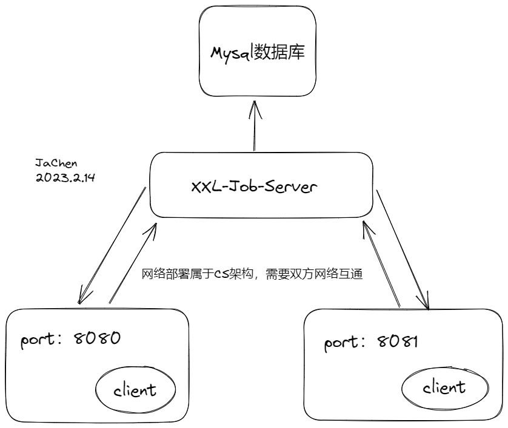
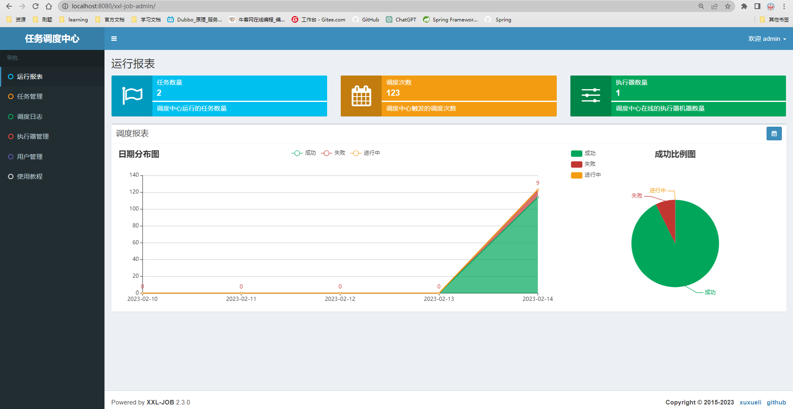
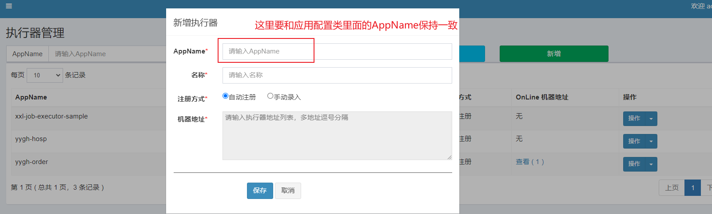
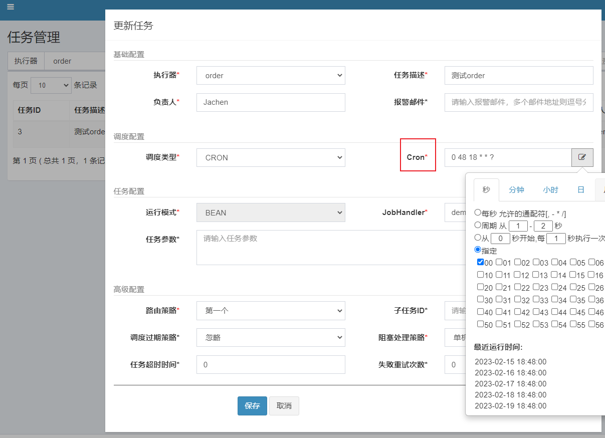
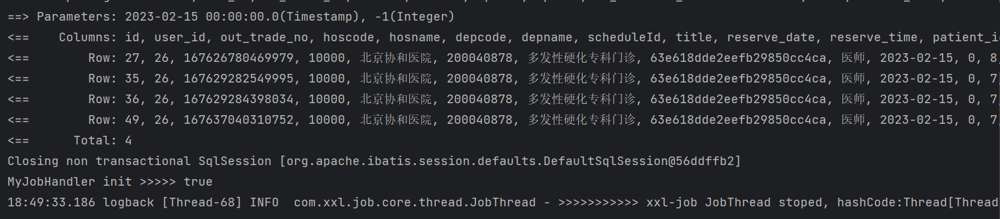
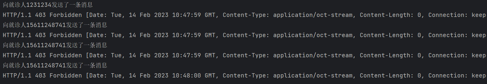
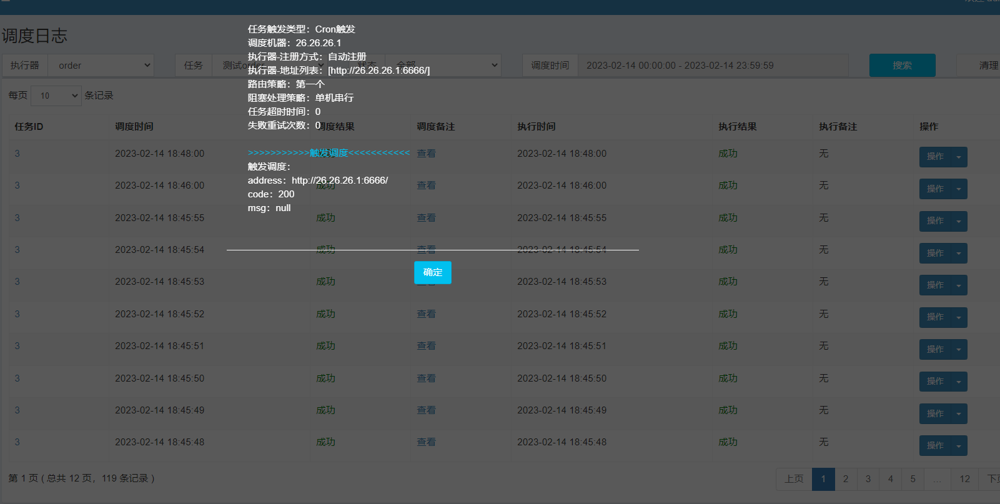
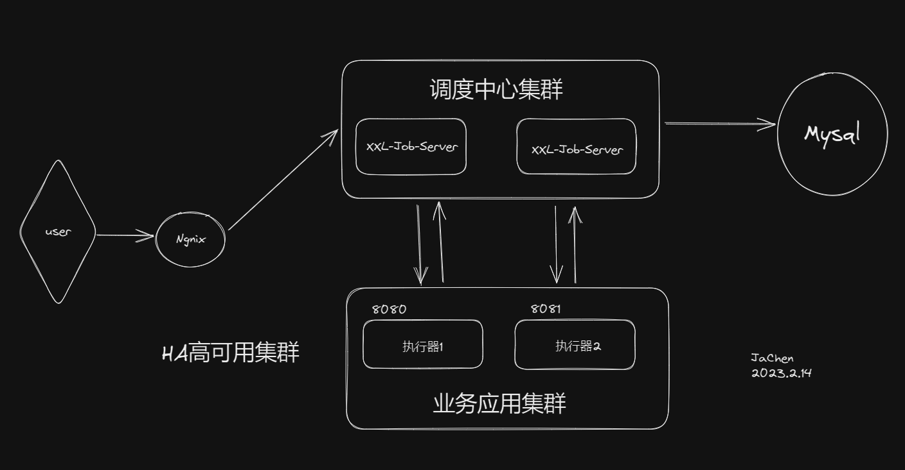
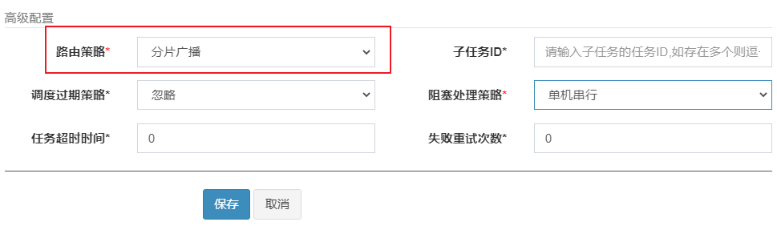

---
<!-- truncate -->
<!-- truncate -->
<!-- truncate -->
slug: product-xxl-job
title: xxl-job分布式调度实践
authors: [jiguanchen]
tags: [xxl-job]
---

**起因**：*传统的定时任务Timer、Quartz等存在很多缺陷，不支持集群、不支持统计、没有管理的平台、也没有报警、监控等等。因此我们要使用分布式的调度系统，去填补这一系列缺陷，之前我们的系统用到了rabbitMQ消息队列去用于分布式任务调度、事件驱动等场景。通过RabbitMQ，任务调度系统可以将任务分发到多个节点，<!--more-->并获取任务执行结果。但是它也有弊端，就是没有一个完整的任务调度平台，不能很好的对任务执行情况进行监控和管理，所以最后选择了XXL-Job去升级医院系统的定时给就诊人发送消息等功能。*

## 技术选型

### 官方文档

xxl-job：https://github.com/xuxueli/xxl-job

elastic-job：https://shardingsphere.apache.org/elasticjob/

###   XXL-JOB 与  elastic-job对比图

| 对比项       | XXL-JOB                                | elastic-job                                                  |
| ------------ | -------------------------------------- | ------------------------------------------------------------ |
| 并行调度     | 调度系统多线程并行                     | 任务分片的方式并行                                           |
| 弹性扩容     | 使用Quartz基于数据库分布式功能         | 通过zookeeper保证                                            |
| 高可用       | 通过DB锁保证                           | 通过zookeeper保证                                            |
| 阻塞策略     | 单机串行/丢弃后续的调度/覆盖之前的调度 | 执行超过zookeeper的session timeout时间的话，会被清除，重新进行分片 |
| 动态分片策略 | 以执行器为维度进行分片、支持动态的扩容 | 平均分配/作业名hash分配/自定义策略                           |
| 失败处理策略 | 失败告警/失败重试                      | 执行完毕后主动获取未分配分片任务 服务器下线后主动寻找可以用的服务器执行任务 |
| 监控         | 支持                                   | 支持                                                         |
| 日志         | 支持                                   | 支持                                                         |

-   XXL-Job和Elastic-Job都具有广泛的用户基础和完善的技术文档，都可以满足定时任务的基本功能需求
-   xxl-job侧重在业务实现简单和管理方便，容易学习，失败与路由策略丰富, 推荐使用在用户基数相对较少，服务器的数量在一定的范围内的场景下使用
-   elastic-job关注的点在数据，添加了弹性扩容和数据分片的思路，更方便利用分布式服务器的资源, 但是学习难度较大，推荐在数据量庞大，服务器数量多的时候使用

*综合考虑，最后我们选择了xxl-job这一解决方法，下面是一个小demo，用于整合xxl-job到spring微服务项目中得以应用的最佳实践。*

## 简介

### 什么是XXL-Job

-   XXL-JOB
    -   大众点评的员工徐雪里在15年发布的分布式任务调度平台，是轻量级的分布式任务调度框架，目标是开发迅速、简单、清理、易扩展; 老版本是依赖quartz的定时任务触发，在v2.1.0版本开始 移除quartz依赖
    -   官网地址：https://www.xuxueli.com/xxl-job/
    -   GitHub地址：https://github.com/xuxueli/xxl-job/
-   xxl-job的设计思想
    -   将调度行为抽象形成“调度中心”公共平台，而平台自身并不承担业务逻辑，“调度中心”负责发起调度请求。
    -   将任务抽象成分散的JobHandler，交由“执行器”统一管理
    -   “执行器”负责接收调度请求并执行对应的JobHandler中业务逻辑。
    -   因此，“调度”和“任务”两部分可以相互解耦，提高系统整体稳定性和扩展性

### 官网架构图

-   调度中心
    -   负责管理调度的信息，按照调度的配置来发出调度请求
    -   支持可视化、简单的动态管理调度信息，包括新建、删除、更新等，这些操作都会实时生效，同时也支持监控调度结果以及执行日志。
-   执行器
    -   负责接收请求并且执行任务的逻辑。任务模块专注于任务的执行操作等等，使得开发和维护更加的简单与高效


-   XXL-Job具有哪些特性
    -   调度中心HA（中心式）：调度采用了中心式进行设计，“调度中心”支持集群部署，可保证调度中心HA
    -   执行器HA（分布式）：任务分布式的执行，任务执行器支持集群部署，可保证任务执行HA
    -   触发策略：有Cron触发、固定间隔触发、固定延时触发、API事件触发、人工触发、父子任务触发
    -   路由策略：执行器在集群部署的时候提供了丰富的路由策略，如：第一个、最后一个、轮询、随机、一致性HASH、最不经常使用LFU、最久未使用LRU、故障转移等等
    -   故障转移：如果执行器集群的一台机器发生故障，会自动切换到一台正常的执行器发送任务调度
    -   Rolling实时日志的监控：支持rolling方式查看输入的完整执行日志
    -   脚本任务：支持GLUE模式开发和运行脚本任务，包括Shell、python、node.js、php等等类型脚本

## 快速部署

### 流程图：



### 环境：

Maven3+、jdk1.8+、mysql5.7+

### 下载链接：

https://github.com/xuxueli/xxl-job.git  版本：2.3.0

### 运行数据库脚本 

 `/xxl-job/doc/db/tables_xxl_job.sql`

### 调度中心  

`调度中心项目：xxl-job-admin` 修改该模块下的配置文件并启动server

```properties
### web
server.port=8080
server.servlet.context-path=/xxl-job-admin
......
### xxl-job, datasource
spring.datasource.url=jdbc:mysql://127.0.0.1:3306/xxl_job?useUnicode=true&characterEncoding=UTF-8&autoReconnect=true&serverTimezone=Asia/Shanghai
spring.datasource.username=root
spring.datasource.password=123456
spring.datasource.driver-class-name=com.mysql.cj.jdbc.Driver
......
### xxl-job, access token
xxl.job.accessToken=jiguanchen.space
```

### UI界面

-   运行报表
    -   以图形化来展示了整体的任务执行情况
        -   任务数量：能够看到调度中心运行的任务数量
        -   调度次数：调度中心所触发的调度次数
        -   执行器数量：在整个调度中心中，在线的执行器数量有多少



-   任务管理（配置执行任务）
    -   示例执行器：所用到的执行器
    -   任务描述：概述该任务是做什么的
    -   路由策略：
        -   第一个：选择第一个机器
        -   最后一个：选择最后一个机器
        -   轮询：依次选择执行
        -   随机：随机选择在线的机器
        -   一致性HASH：每个任务按照Hash算法固定选择某一台机器，并且所有的任务均匀散列在不同的机器上
        -   最不经常使用：使用频率最低的机器优先被使用
        -   最近最久未使用：最久未使用的机器优先被选举
        -   故障转移：按照顺序依次进行心跳检测，第一个心跳检测成功的机器选定为目标的执行器并且会发起任务调度
        -   忙碌转移：按照顺序来依次进行空闲检测，第一个空闲检测成功的机器会被选定为目标群机器，并且会发起任务调度
        -   分片广播：广播触发对于集群中的所有机器执行任务，同时会系统会自动传递分片的参数
    -   Cron：执行规则
    -   调度过期策略：调度中心错过调度时间的补偿处理策略，包括：忽略、立即补偿触发一次等
    -   JobHandler：定义执行器的名字
    -   阻塞处理策略：
        -   单机串行：新的调度任务在进入到执行器之后，该调度任务进入FIFO队列，并以串行的方式去进行
        -   丢弃后续调度：新的调度任务在进入到执行器之后，如果存在相同的且正在运行的调度任务，本次的调度任务请求就会被丢弃掉，并且标记为失败
        -   覆盖之前的调度：新的调度任务在进入到执行器之后，如果存在相同的且正在运行的调度任务，就会终止掉当前正在运行的调度任务，并且清空队列，运行新的调度任务。
    -   子任务ID：输入子任务的任务id，可填写多个
    -   任务超时时间：添加任务超时的时候，单位s，设置时间大于0的时候就会生效
    -   失败重试次数：设置失败重试的次数，设置时间大于0的时候就会生效
    -   负责人：填写该任务调度的负责人
    -   报警邮件：出现报警，则发送邮件



创建任务：



## 后台服务整合xxl-job

### yml配置

```yml
#  xxl-job任务调度配置
xxl:
  job:
    admin:
      addresses: http://127.0.0.1:8080/xxl-job-admin  #调度中心部署地址,多个配置逗号分隔 "http://address01,http://address02"
    accessToken: jiguanchen.space  #执行器token，非空时启用 xxl-job, access token
    executor:
      appname: yygh-order  # 执行器app名称,和控制台那边配置一样的名称，不然注册不上去
      port: 6666  # 执行器的端口
      logpath: ./data/logs/xxl-job/executor  # 执行器日志文件存储路径，需要对该路径拥有读写权限；为空则使用默认路径
      logretentiondays: 30  # 执行器日志保存天数
      # [选填]执行器IP ：默认为空表示自动获取IP（即springboot容器的ip和端口，可以自动获取，也可以指定），
      # 多网卡时可手动设置指定IP，该IP不会绑定Host仅作为通讯实用；地址信息用于 "执行器注册" 和 "调度中心请求并触发任务"，
      ip:
      # [选填]执行器注册：优先使用该配置作为注册地址，为空时使用内嵌服务 ”IP:PORT“ 作为注册地址。从而更灵活的支持容器类型执行器动态IP和动态映射端口问题
      address:
```

### 添加pom文件

```pom
        <!-- xxl_job分布式调度 -->
        <dependency>
            <groupId>com.xuxueli</groupId>
            <artifactId>xxl-job-core</artifactId>
            <version>2.3.0</version>
        </dependency>
```

### 添加config配置类

```java
package space.jachen.yygh.order.config;

import com.xxl.job.core.executor.impl.XxlJobSpringExecutor;
import org.springframework.beans.factory.annotation.Value;
import org.springframework.context.annotation.Bean;
import org.springframework.context.annotation.Configuration;

/**
 * @author JaChen
 * @date 2023/2/14 15:46
 */
@Configuration
public class XxlJobConfig {

    @Value("${xxl.job.admin.addresses}")
    private String adminAddresses;

    @Value("${xxl.job.executor.appname}")
    private String appName;

    @Value("${xxl.job.executor.ip}")
    private String ip;

    @Value("${xxl.job.executor.port}")
    private int port;

    @Value("${xxl.job.accessToken}")
    private String accessToken;

    @Value("${xxl.job.executor.logpath}")
    private String logPath;

    @Value("${xxl.job.executor.logretentiondays}")
    private int logRetentionDays;

    @Bean
    public XxlJobSpringExecutor xxlJobExecutor() {

        XxlJobSpringExecutor xxlJobSpringExecutor = new XxlJobSpringExecutor();
        xxlJobSpringExecutor.setAdminAddresses(adminAddresses);
        xxlJobSpringExecutor.setAppname(appName);
        xxlJobSpringExecutor.setIp(ip);
        xxlJobSpringExecutor.setPort(port);
        xxlJobSpringExecutor.setAccessToken(accessToken);
        xxlJobSpringExecutor.setLogPath(logPath);
        xxlJobSpringExecutor.setLogRetentionDays(logRetentionDays);

        return xxlJobSpringExecutor;
    }
}
```

添加hander处理器

```java
package space.jachen.yygh.order.handler;

/**
 * @author JaChen
 * @date 2024/2/14 15:53
 */
@Component
public class MyJobHandler {

    @Autowired
    private RabbitService rabbitService;
    @Autowired
    private OrderInfoMapper orderInfoMapper;

    /**
     * 就诊提醒的handler方法
     *
     * @param param  null
     * @return  ReturnT<String>
     */
    @XxlJob(value = "demoJobHandler1",init = "init",destroy = "destroy")
    public ReturnT<String> execute(String param){
        System.out.println("execute方法执行了 ====》 ");
        // 获取查询的时间
        DateTime dateTime = new DateTime().plusDays(1);
        String dateString = dateTime.toString("yyyy-MM-dd");
        Date date = new DateTime(dateString).toDate();
        LambdaQueryWrapper<OrderInfo> queryWrapper = new LambdaQueryWrapper<OrderInfo>(){{
            eq(OrderInfo::getReserveDate,date);  // 查询就诊日期
            ne(OrderInfo::getOrderStatus, OrderStatusEnum.CANCLE.getStatus());  // 查询没有取消的订单
        }};
        List<OrderInfo> orderInfoList = orderInfoMapper.selectList(queryWrapper);
        for(OrderInfo orderInfo : orderInfoList) {
            // 短信提示
            MsmVo msmVo = new MsmVo();
            msmVo.setPhone(orderInfo.getPatientPhone());
            // 结合mq快速响应其他模块 发送消息
            rabbitService.sendMessage(MqConst.EXCHANGE_DIRECT_MSM, MqConst.ROUTING_MSM_ITEM, msmVo);
        }
        return ReturnT.SUCCESS;
    }
    private void init(){
        System.out.println("MyJobHandler init >>>>> " + true);
        String jobParam = XxlJobHelper.getJobParam();
        System.out.println("jobParam = " + jobParam);
    }
}
```

### 效果图

完成规则内的定时任务，到指定时间向就诊人发送消息





调度日志



## XXL-Job集群部署和高可用案例配置

### 集群架构图



执行器配置调度中心集群

```yml
#调度中心部署地址,多个配置逗号分隔 "http://address01,http://address02"
xxl:
  job:
    admin:
      addresses: http://127.0.0.1:8080/xxl-job-admin,http://127.0.0.1:8081/xxl-job-admin
```

## XXL-Job处理海量数据-分片任务实操

我们的需求：

-   有一个任务需要处理100W条数据，每条数据的业务逻辑处理要0.1s
-   对于普通任务来说，只有一个线程来处理 可能需要10万秒才能处理完，业务则严重受影响
-   案例：双十一大促，给1000万用户发营销短信

解决思路：

-   如果将100W数据均匀分给集群里的10台机器同时处理，
-   每台机器耗时，1万秒即可，耗时会大大缩短，也能充分利用集群资源
-   在xxl-job里，可以配置执行器集群有10个机器，那么分片总数是10，分片序号0~9 分别对应那10台机器。
-   分片方式
    -   id % 分片总数 余数是0 的，在第1个执行器上执行
    -   id % 分片总数 余数是1 的，在第2个执行器上执行
    -   id % 分片总数 余数是2 的，在第3个执行器上执行
    -   ...
    -   id % 分片总数 余数是9 的，在第10个执行器上执行

其他解决方式

-   也可以启动多个job，使用同个jobHandler,通过命令行参数控制

### 选用分片广播的路由策略实操



主要参数

```java
// 分片广播任务	    
// 当前分片数，从0开始，即执行器的序号
int shardIndex = XxlJobHelper.getShardIndex();
//总分片数，执行器集群总机器数量
int shardTotal = XxlJobHelper.getShardTotal();
// 业务逻辑
......
```

