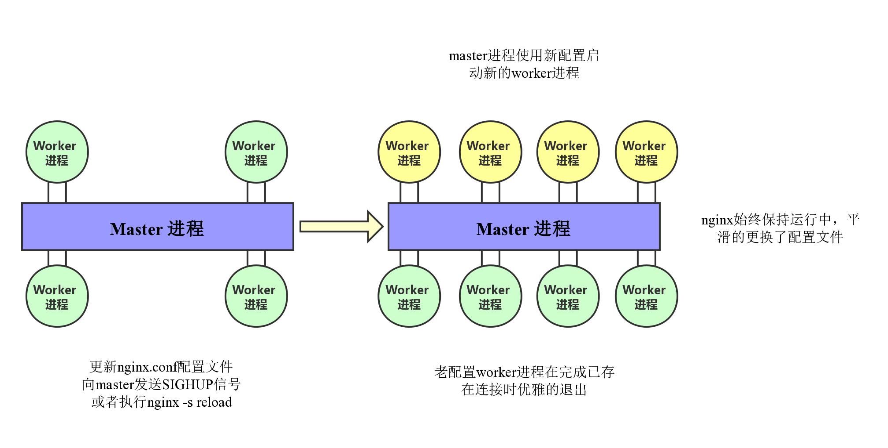

---
<!-- truncate -->
<!-- truncate -->
<!-- truncate -->
slug: product-nginx-reload
title: 探究Nginx优雅reload的细节
authors: [jiguanchen]
tags: [nginx]
---

**背景**：*我们知道在Ngnix的conf配置文件之后,不能kill掉matser重新启动Ngnix服务器，而是需要执行 nginx -s reload命令，在 不停止服务始终在处理新的请求的同时把 nginx 的配置文件平滑的把旧的 nginx.conf 配置更新为新的 nginx.conf 配置。那么这是为什么呢？*<!--more-->

这样一个功能对于 nginx 非常有必要，但是有时候我们会发现在执行 `nginx -s reload` 命令后，worker 子进程的数量会变多了，这是因为老的配置运行的 worker 进程长时间没有退出，当使用 stream 做四层反向代理的时候，可能这种场景会更多。

那么下面我们通过分析 nginx 的 reload 流程，来探究下 nginx 到底做了些什么？所谓优雅的退出和立即退出有什么区别？

## reload流程

第一步在修改好 nginx 的配置文件 nginx.conf 后，向 master 进程发送 HUP 信号，这实际上和我们在命令行执行 `nginx -s reload` 命令效果是一样的。

那么 master 进程在收到 HUP 信号以后，会在第二步检查我们的配置文件语法是否正确，也就是说我们并不一定非要在 nginx -s reload 前执行 nginx -t 检验下语法是否正确，因为在第二步 nginx 的 master 进程一定会执行这个步骤。

在 nginx 的配置语法全部正确以后，master 进程会打开新的监听端口，为什么要在 master 进程中打开新的监听端口？因为我们可能在 nginx.conf 中会引入新的例如 443 或者之前我们没有打开的的监听端口，而所有 worker 进程是 master 进程 的子进程，子进程会继承父进程所有已经打开的端口，这是 linux 操作系统定义的，所以第三步，我们 master 进程打开了可能引入的新的监听端口。

接下来 mster 进程会用新的 nginx.conf 配置文件来启动新的 worker 子进程，那么老的 worker 子进程会怎么样呢？

我们会在第五步在启动新的 worker 子进程以后，由 master 进程再向老 worker 子进程发送 QUIT 信号，QUIT 信号和 TERM，INT 信号是不一样的，QUIT 信号是请优雅地关闭子进程，这时候需要关注顺序，因为 nginx 需要保证平滑，所以要先启动新的 worker 子进程，再向老的 worker 子进程发送 QUIT 信号。

那么老的 master 子进程收到 QUIT 信号后，首先关闭监听句柄，也就是说这个时候新的连接只会到新的 worker 子进程，所以虽然他们之间有时间差，但是时间是非常快速的，那么关闭监听句柄后，处理完当前连接后就结束进程。

下面看 reload 不停机载入新配置的图示。

## reload 不停机载入新配置

master 进程上原先有四个绿色的 worker 子进程，它们使用了老的配置，当我们更改了 nginx.conf 配置文件后，向 master 发送 SIGHUP 信号或者执行 reload 命令， 然后 master 会用新的配置文件启动四个新的黄色 worker 子进程，此时是四个老的绿色 worker 子进程和四个新的黄色的 worker 子进程是并存的。那么老的 worker 子进程在正常的情况下会在处理已经建立好的连接上的请求之后关闭这个连接，哪怕这个连接是 keeplive 请求也会正常关闭。

但是异常情况，如果有一些请求出现问题，客户端长时间无法处理，那么就会导致这个请求长时间停留在这个 worker 子进程当中，那么这个 worker 子进程会长时间存在，因为新的连接已经跑在黄色的 worker 子进程中，所以影响并不会很大，唯一会影响的就是绿色的 worker 子进程会长时间存在，但也只影响已存在的连接，不会影响新的连接。

我们有什么办法处理呢？在新版本中提供了一个新的配置 worker_shutdown_timeout，也就是说最长等待多长时间，这样 master 进程启动新的黄色 worker 进程之后，如果老的 worker 进程一直没有退出，时间到了之后会强制把老的 worker 进程退出掉。

## 总结

本文主要讲解了 Nginx 平滑升级新的配置文件的流程，在我们了解了优雅关闭 worker 子进程和启动新配置的 worker 子进程流程间的关系后，我们可以更好地处理罕见的异常场景。
