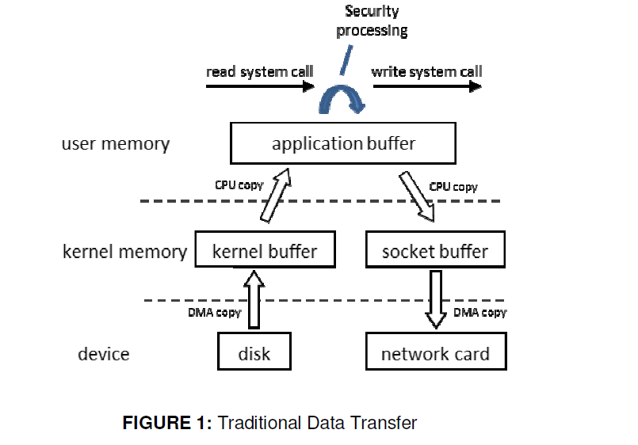
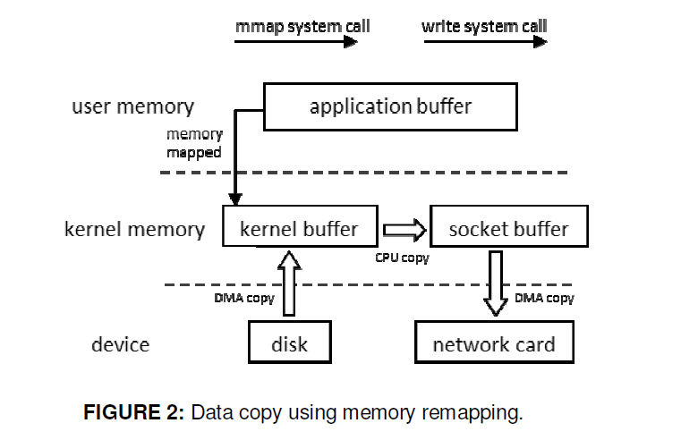

**背景**：*RocketMQ是阿里团队研发并开源的消息中间件，它延续了kafka的很多优点，例如高性能，为了研究RocketMQ究竟是如何做到高性能的呢？零拷贝技术就是一个重要的原因。*<!--more-->

高效原因：

-   CommitLog顺序写, 存储了MessagBody、message key、tag等信息

-   ConsumeQueue随机读 + 操作系统的PageCache + 零拷贝技术ZeroCopy

    -   零拷贝技术

        ```
        read(file, tmp_buf, len);
        write(socket, tmp_buf, len);
        ```

    -   例子：将一个File读取并发送出去（Linux有两个上下文，内核态，用户态）

        -   File文件的经历了4次copy
            -   调用read,将文件拷贝到了kernel内核态
            -   CPU控制 kernel态的数据copy到用户态
            -   调用write时，user态下的内容会copy到内核态的socket的buffer中
            -   最后将内核态socket buffer的数据copy到网卡设备中传送
        -   缺点：增加了上下文切换、浪费了2次无效拷贝(即步骤2和3)

    -   ZeroCopy：

        -   请求kernel直接把disk的data传输给socket，而不是通过应用程序传输。Zero copy大大提高了应用程序的性能，减少不必要的内核缓冲区跟用户缓冲区间的拷贝，从而减少CPU的开销和减少了kernel和user模式的上下文切换，达到性能的提升
        -   对应零拷贝技术有mmap及sendfile
            -   mmap:小文件传输快
                -   RocketMQ 选择这种方式，mmap+write 方式，小块数据传输，效果会比 sendfile 更好
            -   sendfile:大文件传输比mmap快
        -   Java中的TransferTo()实现了Zero-Copy
        -   应用：Kafka、Netty、RocketMQ等都采用了零拷贝技术

原始的拷贝技术：



零拷贝技术：



参考文章： https://github.com/0voice/linux_kernel_wiki/blob/main/%E6%96%87%E7%AB%A0/%E8%BF%9B%E7%A8%8B%E7%AE%A1%E7%90%86/%E4%B8%80%E6%96%87%E5%B8%A6%E4%BD%A0%EF%BC%8C%E5%BD%BB%E5%BA%95%E4%BA%86%E8%A7%A3%EF%BC%8C%E9%9B%B6%E6%8B%B7%E8%B4%9DZero-Copy%E6%8A%80%E6%9C%AF.md


