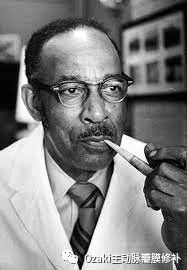
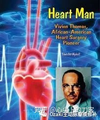
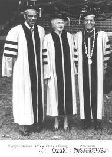
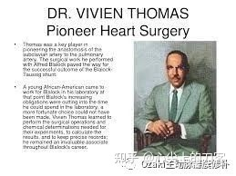

*饭后刷着抖音，一个上世纪黑人外科医生的励志故事*<!--more-->深深打动了我(来字抖音平台ID帽子电影 感动治愈系列第24集)

于是我又查了一些有关他的资料，维维安·托马斯（Vivien Thomas 1910－－1985）一位黑人，生于1910年8月29。生下不久居家从 路易斯安那州迁往 田纳西州 的 纳什维尔。并在这里完成高中学业。1929年，托马斯获得一个进入田纳西农业和工业大学的医科专业的预科生机会，工作之余他在一个私人诊所做护工来赚钱凑学费，但是由于银行倒闭使他不得不离开学校。1930年，他获得一个做实验室助理职位和著名的医学博士 Dr. Alfred Blalock在 Vanderbilt University 。由于他和博士的配合默契，在1941年他和博士一起到了[霍普金斯大学](https://baike.baidu.com/item/霍普金斯大学/5412771)并参加博士所带领的实验室团队，取得了解决了心血管和[肺部先天性疾病](https://baike.baidu.com/item/肺部先天性疾病/874498)一些办法，并且帮助博士训练外科医生的关于心肺手术的操作技巧。1976年获得霍普金斯的荣誉博士学位，1979退休，发表了“ Vivien Thomas and His Work with Alfred Blalock" 一书。

难道说8月份是上帝眷顾不幸的人民？接连降下两位心脏病外科大师，而且伟大的Michael Debakey是1908年9月7日降生的，如果早一周也可以归类到8月份啦。

上文书说到心血管外科领域传奇大师 Dr. Denton Cooley，1920年8月22日出生于德州的休斯顿。这次为大家介绍的是另一位更具有传奇色彩的心血管领域大师 维维恩.托马斯博士 （Dr. Vivien Thomas）。

我们称呼他为Doctor（博士），实际上他一直到1985年去世都没有医生的称号，1976年约翰霍普金斯大学才授予他荣誉博士学位，和医学院的指导教师身份；但是由于特定的原因，也没有给他Medical Doctor学位，而是doctor of law（法律博士)，而因为他一直没有医学学位，所以他一直不能在病人身上进行手术。

维维恩·托马斯是一位黑人，生于1910年8月29的路易斯安那州。1912年因经常性的密西西比河的洪水泛滥而居家从迁往田纳西州的纳什维尔。并在这里完成高中学业。他的父亲是一位木匠并将的手艺传给了儿子。1929年高中毕业后，维维恩·托马斯在Fisk University负责木工活，做些维修方面的工作，但是他已经计划接着下一段的高等教育并成为一位医生。

遗憾的是突如其来的大萧条打乱了他的计划，1930年他谋取到了范德堡大学（Vanderbilt University）为外科专家Dr. Alfred Blalock（阿尔弗雷德·布莱洛克医生）做外科研究助手，这也是两人之后三十多年合作的开始。（插播一句，Dr. Blalock对失血性休克和创伤性休克的类型和治疗方法展开了研究，他发现休克是由于失血导致的，并倡导使用血浆或全血治疗休克，这一研究成果具有里程碑式的意义，彻底改变了人们对创伤性休克的认知-----以前认为休克是血中的毒素引起，挽救了无数人的生命，这项研究也是在维维恩·托马斯作为助手的帮助下完成的）

维维恩·托马斯在范德堡大学的工作，分类为清洁工，拿一份微薄的薪水，而他的实际工作则是博士后的研究工作。他努力工作，省吃俭用，存钱以备进大学继续读书，可是他因储蓄的银行倒闭而损失了所有银行财产，不得不放弃继续高等教育的念头，只是希望多挣点钱让妻儿能过上好一些的生活。

1940年，阿尔弗雷德·布莱洛克受邀前往约翰·霍普金斯医院担任外科主任，并要求维维恩·托马斯和他一同前往。但是巴尔的摩的种族分离更加严重，以至于他从实验室到Blalock办公室要换上清洁工的衣服才能免受众人目光的注视。

在此期间，Blalock遇到了小儿心脏病学专家Dr. Helen Taussig(海伦·陶西格)，陶西格向他介绍了“青紫婴儿”的问题。这是由一种先天性的心脏畸形，即法洛四联症导致的现象，会导致婴儿血液中含氧量偏低，并且随口提了一句：也许可以考虑重新连接管路，增加肺部的供血。这句话点醒了二人，他们在范德堡的时候就做过类似的研究，增加肺部供血。于是受命创造一个病理特征的动物模型，然后通过锁骨下动脉与肺动脉吻合改善症状；其中一只狗狗名字叫做ANNA（安娜），创造了经历这个手术的最长生存时间并且也是唯一一个画像悬挂在约翰霍普金斯医院长廊的动物。

1944年11月29日，Blalock、陶西格二人在托马斯的协助下首次在18个月大的患儿艾琳·萨克森（Eileen Saxon）身上成功实施了这种手术，手术期间，维维恩·托马斯站在阿尔弗雷德·布莱洛克身后告诉他一步一步如何进行，虽然这次手术并没有完全成功，小艾琳只多生存了几个月，但是接下来的两例，一例11岁女孩和另一例6岁男孩都取得了完全的成功。

这种手术也以这两人的名字命名为“Blalock－陶西格分流术”。这一手术拯救了在医学史上有着重要的影响。这种手术也以这三人的名字命名为“布莱洛克-托马斯-陶西格分流术”。这一手术拯救了在医学史上有着重要的影响。

有一次，阿尔弗雷德·布莱洛克检查维维恩·托马斯的缝合线条，不由得赞叹道：这个看起来就是上帝制作的。

另一位心脏领域的传奇大师Dr. Denton Cooley在1989年的一次采访中提到：即便是你从来没有见过的手术，你也能做，因为托马斯会设计的如此简单明了。

1946年，在Blalock的力挺下，Thomas才拿到了约翰霍普金斯实验助理岗位最高的薪金，也是该机构薪酬最高的非裔美国人。

布莱洛克医生因肿瘤去世后的15年里，维维恩·托马斯继续作为外科研究实验室主管指导医学生们的工作，包括约翰霍普金斯的第一位黑人住院医生。

1968年，在他指导和训练过的很多学生，现下都是全美各大医院的顶级医生们的争取和安排下，维维恩·托马斯的画像挂在Alfred Blalock Clinical Sciences Building内，和Blalock并排。访问过JUH医院的医生们一定有印象，没有去过的将来有机会访问的时候也不要忘记到访一下，以资纪念。

1976年JUH授予维维恩·托马斯荣誉博士称呼并任命其为外科指导教师，3年后退休。

1985年11月26日，维维恩·托马斯因胰腺癌去世。

2003年，美国公共电视网的系列纪录片栏目《美国印象》中播出了纪录片《心之伙伴》（Partners of the Heart），介绍了Blalock与维维恩·托马斯在范德堡大学和约翰·霍普金斯大学的合作，获得了美国历史学家组织颁发的2004年埃里克·巴诺最佳历史纪录片奖。

2004年，美国HBO制作播出了文献纪录片《上帝之手》（*Something the Lord Made*）讲述了Blalock与托马斯之间的合作经历。获得包括“最佳电视电影”在内的三项黄金时段艾美奖和其他多个影视奖项。

[文章转载自百度百科]: https://baike.baidu.com/item/%E7%BB%B4%E7%BB%B4%E5%AE%89%C2%B7%E6%89%98%E9%A9%AC%E6%96%AF/5257302	"百度百科"
[知乎ID心尖上的刀客]: https://zhuanlan.zhihu.com/p/405426028	"知乎"

