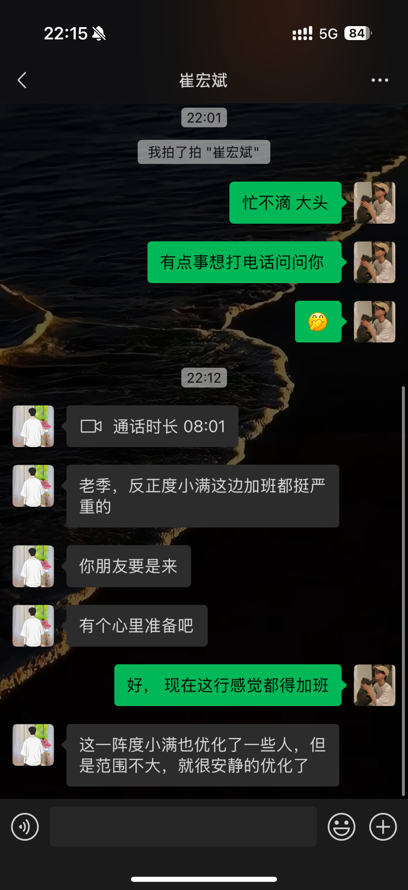

### 📆 每日复盘 - 第49周

---

### 🏆 **Top 5 Accomplishments：**

1. 完成阶段性工作
2. 投资理财产品有了小收益
3. 离职
4. 入手了m4 pro
5. 完成了多个技术博客撰写，并整理了项目文档 

---

### 2024-12-02 (星期一)

#### 🏆 今日成就：
  - 完成了阶段性的工作内容，明天开始新的需求开发
  - 一波小牛市，一天怒赚141元，继续加油！
#### 👏🏻 今日做得好的地方：
  - 健康饮食，按时喝水
#### 💪🏻 需要改进的地方：
  - 没有明确的学习目标，碎片化的时间充分利用
  - 遇到事一定要保持头脑冷静，思考片刻后慢速回答
  - 在领导面前不要太呆，懂得 _说话_
#### ✍🏻 今日学到的教训：
  - 学习目标不明确
  - 刷短时间的时间过长，浪费了很多时间
#### 🙏🏻 今日感恩的三件事：
  - 感谢辛苦工作一天的自己
  - 感谢芃祺给我介绍对象，虽然理智思考了之后没有加V，但还是特别感谢~
  - 感谢饺子馆李哥的店铺，让我每天都能吃上美味的午餐
#### 🗓️ 明日计划：
  - 开始新的需求开发，确定短期学习目标并投入学习
  - 确保每天都能有有效的时间进行深度工作

---

### 2024-12-03 (星期二)

#### 🏆 今日成就：
  - xx可调负荷和xx交易数据中心的BUG修复
  - 了解了大事务对数据库的影响
  - 了解ETL方法论，数据提取、转换、加载
#### 👏🏻 今日做得好的地方：
  - 认真处理工作内容，甚至没有午睡
#### 💪🏻 需要改进的地方：
  - 学习目标不明确，每日复盘中增加了明日计划
  - 今晚要早早睡
#### ✍🏻 今日学到的教训：
  - 昨天睡的太晚了，导致白天特别困
  - 忘记带钥匙，在门口冻了2个小时~
#### 🙏🏻 今日感恩的三件事：
  - 感谢朋友和同事对开发问题上支持探讨 （上清、芃祺、学委、俊杰、王锰）
  - 感谢辛苦一天的自己，晚上加餐吧
  - 再次感谢李哥的饺子🥟，真好吃
#### 🗓️ 明日计划：
  - 实现xx省侧需求 - 区县-明细报表模板下载明细报表上传的功能
  - 早起（8：00）吃早餐、读书
  - 绘制产品技术架构图

---

### 2024-12-04 (星期三)

#### 🏆 今日成就：
  - 完成了3篇技术博客撰写
  - 整理公司2个项目的技术文档
  - 处理评审前的紧急问题，修改xx需求列表分组层级展示
#### 👏🏻 今日做得好的地方：
  - 紧急情况下冷静处理工作问题
  - 卷到了公司最后才走，虽然只是晚上7点
#### 💪🏻 需要改进的地方：
  - 早上不仅要早醒，还要早起，拒绝懒床
#### ✍🏻 今日学到的教训：
  - 蛋白粉不能用超过40度的水冲泡，否则...
#### 🙏🏻 今日感恩的三件事：
  - 感谢老妈的14000红包，住院退费的💴给我了
  - 感谢苗新媛分享的短信积分兑花费的抖音，成功白嫖6块钱
  - 感谢同事赵阳，帮我讲了评审的功能，虽然内容不多
#### 🗓️ 明日计划：
  - 继续熟梳理产品技术架构图
  - 认真洗脸，记得去盒马买洗面奶
  - 胳膊不疼了，明天开始继续健身🏋️‍
  - 记得打水，或者买瓶装水，没水了~~~

---

### 2024-12-05 (星期四)

#### 🏆 今日成就：
  - 处理了xx省现场页面标签不展示的问题
  - 解决了产品S菜单缺失、缺少月累计电量的问题
#### 👏🏻 今日做得好的地方：
  - 帮助室友把厨房的垃圾桶扔掉了，净化空气
  - 积极配合解决工作中的问题
#### 💪🏻 需要改进的地方：
  - 再忙也要喝水，w_w，一天只喝了两杯水~
#### ✍🏻 今日学到的教训：
  - 一直盯着工作不放松，导致眼睛疼
#### 🙏🏻 今日感恩的三件事：
  - 感谢子繁协助解决工作中的问题
  - 感谢认真工作的自己，加鸡腿🍗
#### 🗓️ 明日计划：
  - 继续熟梳理产品技术架构图
  - 注意工作一段时间放松眼睛、喝口水
  - 最后一天确保完成目前全部工作不拖拉

---

### 2024-12-06 (星期五)

#### 🏆 今日成就：
  - 离职
  - 跟同事吃了散伙饭
#### 👏🏻 今日做得好的地方：
  - 冷静的接受了裁员的事实
#### 💪🏻 需要改进的地方：
  - 今天做的很好了
#### ✍🏻 今日学到的教训：
  - 不要喝多，第二天真的头疼
#### 🙏🏻 今日感恩的三件事：
  - 感谢清软所有人两年来的陪伴
  - 感谢自己
#### 🗓️ 明日计划：
  - 没有计划了，头很蒙

---

### 2024-12-07 (星期六)

#### 🏆 今日成就：
  - 第一次体验微恐密室
  - 跟旭东和琪姐聚餐
#### 👏🏻 今日做得好的地方：
  - 破圈，保持良好的沟通交流
#### 💪🏻 需要改进的地方：
  - 不要懒床
#### ✍🏻 今日学到的教训：
  - 学会拒绝
#### 🙏🏻 今日感恩的三件事：
  - 感谢自己
  - 感谢旭东组局
#### 🗓️ 明日计划：
  - 跟滏哥打羽毛球
  - 跟旭东、俊杰吃饭

---

### 2024-12-08 (星期天)

#### 🏆 今日成就：
  - 完成了一场羽毛球🏸训练
  - 跟同事、朋友聚餐交流
#### 👏🏻 今日做得好的地方：
  - 准时邀约
  - 保持运动
#### 💪🏻 需要改进的地方：
  - 要按时吃早餐
#### ✍🏻 今日学到的教训：
  - 消费观，控制花销
#### 🙏🏻 今日感恩的三件事：
  - 感谢羽毛球的张哥对我羽毛球技术以及职业方向的指点
  - 感谢俊杰请客吃饭
  - 感谢旭东帮我弄国补，10999就入手了M4 pro
  - 感谢大头对度小满工作日常的解答
#### 🗓️ 明日计划：
  - 安装新电脑常用软件
  - 修改简历
  - 思考未来就业城市

---

### 📕 **本周总结：**

本周在工作上取得了不错的进展，完成了多个技术任务，尤其是技术博客的撰写和项目文档整理。不过也经历了公司裁员的打击，冷静接受了这一现实，虽然感到有些不舍，但也明白这是职场的一部分。除了工作上的挑战，投资理财也有所收获，顺利入手了M4 Pro。虽然时间管理和作息上还需改进，但整体来说，工作和生活都有一定的成就。感谢身边的人和事，让我能够保持动力。

---

### 🍃 **下周如何做得更好？**

- **工作目标明确**：设定清晰的学习与工作目标，避免碎片化时间浪费
- **保持良好作息**：确保每天按时休息，避免熬夜影响工作效率
- **更好管理时间**：更有效地安排工作和个人生活，避免拖延
- **加强锻炼**：恢复健身计划，保持身体健康
- **控制消费**：理性消费，做好财务规划
- **简历完善**：完成简历更新，并针对目标岗位准备面试题目
- **积极应聘**：开始主动应聘，寻找新的职业机会，准备面试过程中的各种挑战

---

### 📸 图片记录
#### 星期一 17:33 明天要接新的需求咯！
#### 星期五 13:20 虽有不舍，终会离开～ 
#### 星期六 19:00 给旭东和琪姐买了烤红薯🍠 
#### 星期天 17:00 北京语言大学羽毛球🏸场。 
#### 星期天 22:00 帮芃祺询问大头度小满的工作状态。 