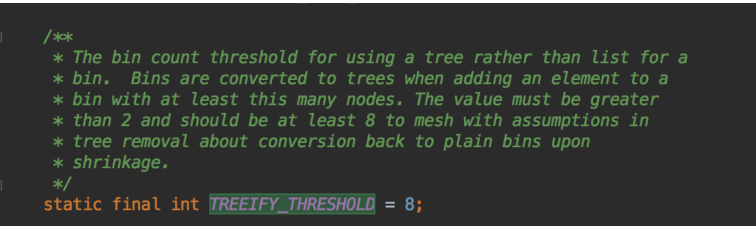

---
<!-- truncate -->
<!-- truncate -->
<!-- truncate -->
slug: product-map
title: 集合Map
authors: [jiguanchen]
---

*记录了Map常见API和面试题*<!--more-->

```java
Map<String,String> map = new HashMap<>();

//往map里面放key - value;
map.put("小明","广东广州");
map.put("小东","广东深圳");

//根据key获取value
map.get("小东");

//判断是否包含某个key
map.containsKey("小明");

//返回map的元素数量
map.size();

//清空容器器
map.clear();

//获取所有value集合
map.values();

//返回所有key的集合
map.keySet()
    
//返回一个Set集合，集合的类型为Map.Entry,是Map声明的一个内部接口，接⼝为泛型，定义为Entry<K,V>，
    
//它表示Map中一个实体(一个key-value对),主要有getKey(),getValue方法
Set<Map.Entry<String,String>> entrySet =  map.entrySet();

//判断map是否为空
map.isEmpty();
```

**Map面试题**
		1、HashMap和TreeMap应该怎么选择？
		HashMap可实现快速存储和检索，但缺点是包含的元素是无序的，适用于在Map中插⼊、删除和定位元素.
		TreeMap能便便捷的实现对其内部元素的各种排序，但其⼀般性能比HashMap差,适用于按⾃然顺序或自定义顺序遍历键(key)
		eg：微信支付

 2、jdk1.7和jdk1.8中HashMap的主要区别。
		底层实现由之前的 “数组+链表” 改为 “数组+链表+红黑树”

3、什么时候开始转变？
		当链表节点较少时仍然是以链表存在，当链表节点较多时，默认是大于8时会转为红黑树

- [x] *Typora 换行间距最小  shift+enter*

